04 CSI online spoken: Spoken - Plotting and analysis
================
Kirsten Stark
16 März, 2022

## Load packages

``` r
#library(dplyr)
library(tidyr)
library(lme4)
```

    ## Lade nötiges Paket: Matrix

    ## 
    ## Attache Paket: 'Matrix'

    ## Die folgenden Objekte sind maskiert von 'package:tidyr':
    ## 
    ##     expand, pack, unpack

``` r
library(lmerTest)
```

    ## 
    ## Attache Paket: 'lmerTest'

    ## Das folgende Objekt ist maskiert 'package:lme4':
    ## 
    ##     lmer

    ## Das folgende Objekt ist maskiert 'package:stats':
    ## 
    ##     step

``` r
library(Rmisc)
```

    ## Lade nötiges Paket: lattice

    ## Lade nötiges Paket: plyr

``` r
library(Cairo)
#library(strengejacke)
library(ggplot2)
library(sjPlot)
library(dplyr)
```

    ## 
    ## Attache Paket: 'dplyr'

    ## Die folgenden Objekte sind maskiert von 'package:plyr':
    ## 
    ##     arrange, count, desc, failwith, id, mutate, rename, summarise,
    ##     summarize

    ## Die folgenden Objekte sind maskiert von 'package:stats':
    ## 
    ##     filter, lag

    ## Die folgenden Objekte sind maskiert von 'package:base':
    ## 
    ##     intersect, setdiff, setequal, union

``` r
options(scipen=999)

rm(list = ls())
options( "encoding" = "UTF-8" )
set.seed(99)
```

## Load and preprocess data

``` r
# input 
#input = "data_long_final.csv"
input = "data_long_anonymous.csv"

# load data
df <- read.csv2(here::here("data", input), sep=",") #%>% select(-"X")
```

Check amount of participants and trials

``` r
# no. of participants: 
length(unique(df$subject))
```

    ## [1] 7

``` r
# no. of trials is 160 per participant? 
nrow(df) == 3*160 * length(unique(df$subject))
```

    ## [1] TRUE

``` r
table(df$subject, df$session)
```

    ##    
    ##       1   2   3
    ##   1 160 160 160
    ##   2 160 160 160
    ##   3 160 160 160
    ##   4 160 160 160
    ##   5 160 160 160
    ##   6 160 160 160
    ##   7 160 160 160

``` r
# how many non-responses
df %>% filter(VOT==0) %>% dplyr::group_by(subject, session) %>% 
  dplyr::summarise(length(VOT))
```

    ## `summarise()` has grouped output by 'subject'. You can override using the `.groups` argument.

    ## # A tibble: 12 × 3
    ## # Groups:   subject [6]
    ##    subject session `length(VOT)`
    ##      <int>   <int>         <int>
    ##  1       1       3             1
    ##  2       2       1             2
    ##  3       2       2             1
    ##  4       3       2             1
    ##  5       4       1             4
    ##  6       4       2             7
    ##  7       4       3             6
    ##  8       5       1            38
    ##  9       5       2            24
    ## 10       5       3            15
    ## 11       7       1             1
    ## 12       7       3            32

``` r
# table(df$VOT==0, df$subject, df$session)
```

## Drop filler trials

``` r
df <- df %>% filter(category!="Filler") %>% droplevels()
```

## Add ordinal position

``` r
      # add position number
df <- df %>% group_by(subject, session, category) %>% 
      add_count() %>% 
      dplyr::mutate(PosOr = seq(1:n)) %>% dplyr::select(-n)
table(df$PosOr)
```

    ## 
    ##   1   2   3   4   5 
    ## 504 504 504 504 504

``` r
#table(df$PosOr,df$session, df$subject)
```

## Factorize columns

``` r
# factorize columns
df$VOT <- as.numeric(as.character(df$VOT))
```

    ## Warning: NAs durch Umwandlung erzeugt

``` r
is.numeric(df$VOT)
```

    ## [1] TRUE

``` r
df$PosOr <- as.factor(df$PosOr)
df$subject <- as.factor(df$subject)
df$session <- as.factor(df$session)

# define contrasts of sessin: compare 1 to 2 and 1 to 3, intercept is the grand mean => simple coding (https://stats.oarc.ucla.edu/r/library/r-library-contrast-coding-systems-for-categorical-variables/#SIMPLE)
c<-contr.treatment(3)
my.coding<-matrix(rep(1/3, 6), ncol=2)
my.simple<-c-my.coding
my.simple
```

    ##            2          3
    ## 1 -0.3333333 -0.3333333
    ## 2  0.6666667 -0.3333333
    ## 3 -0.3333333  0.6666667

``` r
contrasts(df$session)<-my.simple
levels(df$session)
```

    ## [1] "1" "2" "3"

## Classified errors and correct responses

Correct responses start with 1.

1 - exakt korrekt 1.1 - alternative response 1.2 - correct with
phonematic paraphasia ≤25% 1.3 - correct with correct article \[\*\]

\[\*\] Bei 1.3 wollten wir schauen wie oft die Artikel mitgenannt
wurden, aber das können wir ja erstmal vernachlässigen. Für die exakten
Ergebnisse wollten wir dann ja nochmal besprechen, weil die Bestimmung
der VOT nicht 100% möglich ist mit Artikel.

``` r
table(df$correct)
```

    ## 
    ##    0    1  1.1  1.2  1.3  1.4 
    ##  588 1473  253   43    6   37

Errors

``` r
table(df$error)
```

    ## 
    ##    1    2    3    4    5    6    7    8    9 KORR 
    ##    5  108   35  310   12   16   32    7   62    1

Show amount of incorrect trials per ordinal position (excluding
fillers):

``` r
## How many incorrect (correct) non-filler trials per ordinal position?
table(df$PosOr[df$category != "Filler" & df$correct == 0],
      df$correct[df$category != "Filler" & df$correct == 0])
```

    ##    
    ##       0
    ##   1 115
    ##   2 104
    ##   3 105
    ##   4 125
    ##   5 139

``` r
table(df$PosOr[df$category != "Filler" & startsWith("1", df$correct)],
      df$correct[df$category != "Filler" & startsWith("1", df$correct)])
```

    ##    
    ##       1
    ##   1 295
    ##   2 303
    ##   3 308
    ##   4 298
    ##   5 269

# REACTION TIMES

Drop incorrect trials:

``` r
df_correct <- df %>% dplyr::filter(correct != 0)
sum(!is.na(df_correct$error))
```

    ## [1] 0

### Plotting

Make plots suitable for APA format, font sizes can be adjusted

``` r
apatheme <- theme_bw()+
  theme(plot.title=element_text(family="Arial",size=22,hjust = .5),
        panel.grid.major=element_blank(), panel.grid.minor=element_blank(),
        panel.border=element_blank(),axis.line=element_line(),
        text=element_text(family="Arial",size=16))
```

### Descriptives

``` r
(means_final<- df_correct %>% 
   filter(category != "Filler") %>% 
   Rmisc::summarySEwithin(.,"VOT",idvar = "subject",
                          withinvars = c("session", "PosOr"), na.rm = T))
```

    ##    session PosOr   N      VOT       sd       se        ci
    ## 1        1     1 129 1410.563 452.7834 39.86535  78.88041
    ## 2        1     2 127 1482.643 559.7995 49.67417  98.30373
    ## 3        1     3 123 1471.436 457.3364 41.23663  81.63204
    ## 4        1     4 118 1494.650 494.3876 45.51207  90.13427
    ## 5        1     5 113 1598.187 598.9889 56.34814 111.64661
    ## 6        2     1 125 1264.454 425.2607 38.03648  75.28484
    ## 7        2     2 136 1275.384 465.6785 39.93160  78.97242
    ## 8        2     3 132 1339.762 441.5868 38.43520  76.03399
    ## 9        2     4 133 1414.373 481.2927 41.73337  82.55273
    ## 10       2     5 122 1400.989 466.8759 42.26896  83.68256
    ## 11       3     1 111 1254.408 418.6117 39.73286  78.74121
    ## 12       3     2 113 1264.434 466.3525 43.87076  86.92428
    ## 13       3     3 120 1355.484 517.4882 47.23999  93.53991
    ## 14       3     4 104 1265.547 504.6910 49.48902  98.14981
    ## 15       3     5 106 1433.482 582.1221 56.54069 112.10975

``` r
(means_final_cat<- df_correct %>% 
   filter(category != "Filler") %>% 
   Rmisc::summarySEwithin(.,"VOT",idvar = "category",
                          withinvars = c("session", "PosOr"), na.rm = T))
```

    ##    session PosOr   N      VOT       sd       se        ci
    ## 1        1     1 129 1414.134 550.7775 48.49325  95.95219
    ## 2        1     2 127 1475.067 645.4744 57.27659 113.34869
    ## 3        1     3 123 1446.660 571.5794 51.53758 102.02379
    ## 4        1     4 118 1457.088 621.5950 57.22246 113.32609
    ## 5        1     5 113 1542.147 651.0900 61.24940 121.35783
    ## 6        2     1 125 1243.690 445.9805 39.88970  78.95290
    ## 7        2     2 136 1278.255 526.3839 45.13705  89.26720
    ## 8        2     3 132 1339.197 530.1996 46.14795  91.29166
    ## 9        2     4 133 1387.451 567.7303 49.22846  97.37876
    ## 10       2     5 122 1383.618 585.3367 52.99390 104.91540
    ## 11       3     1 111 1305.888 477.3847 45.31135  89.79647
    ## 12       3     2 113 1299.641 527.6483 49.63697  98.34930
    ## 13       3     3 120 1394.263 600.2295 54.79321 108.49603
    ## 14       3     4 104 1307.883 592.8443 58.13317 115.29343
    ## 15       3     5 106 1466.920 638.7406 62.03997 123.01381

``` r
(means_final_wo_session <- df_correct %>% 
   filter(category != "Filler") %>% 
   Rmisc::summarySEwithin(.,"VOT",idvar = "subject",
                          withinvars = c("PosOr"), na.rm = T))
```

    ##   PosOr   N      VOT       sd       se       ci
    ## 1     1 365 1313.037 473.6048 24.78961 48.74883
    ## 2     2 376 1342.098 549.8690 28.35733 55.75930
    ## 3     3 375 1387.982 512.8402 26.48296 52.07416
    ## 4     4 355 1397.457 540.3158 28.67698 56.39868
    ## 5     5 341 1476.437 599.9254 32.48778 63.90236

``` r
# Export as word file
library(flextable)
huxt_word <- huxtable::huxtable(means_final)
huxt_word <- huxtable::set_number_format(huxt_word, round(2))
huxtable::quick_docx(huxt_word, 
                     file = here::here("results", "tables",
                                       "CSI_online_subject_RT_by_session.docx"), 
                                       open = FALSE)
```

### RTs by ordinal position

Line graph (only correct trials, without fillers)

``` r
(plot_vot <- means_final_wo_session %>% 
    ggplot(., aes(x=PosOr, y=VOT)) +
    geom_point(size = 2)+
    geom_errorbar(aes(ymin=VOT-se, ymax=VOT+se), width =.1) +
    stat_summary(fun=mean,  geom="line", size = 0.5, group=1, linetype="dashed")+
    apatheme+
    #scale_y_continuous(limits = c(1120, 1340), breaks =seq(1120,1340, by = 20)) +
                       #breaks = c(1100, 1150, 1200, 1250, 1300, 1350)) + 
    labs(x="Ordinal Position ",y ="VOT (ms)") + #+
  # annotate(geom="text", x=1.5, y=1330, label="n = 30", 
  #         color="black", size = 8))
    theme(
    axis.title.y = element_text(margin = margin(0,10,0,0)),
    axis.title.x = element_text(margin = margin(10,0,0,0))))
```

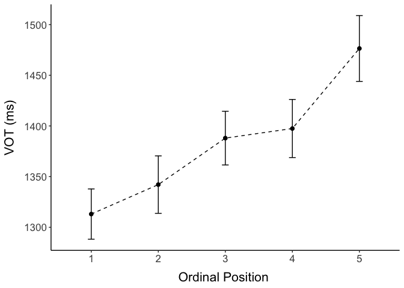<!-- -->

``` r
filename <- "CSI_online_aphasia_spoken_plot_rt_Teap.pdf"
ggsave(plot_vot, filename = 
         here::here("results", "figures", filename),
       width = 18, height = 13, units = "cm", 
       dpi = 300, device = cairo_pdf)
#embedFonts(file = here::here("results", "figures", filename))
```

Line graph by repetition (only correct trials, without fillers)

``` r
(plot_rt_repetition <- means_final %>% 
    ggplot(., aes(x=PosOr, y=VOT, group=session, color = session)) +
    geom_point(size = 2)+
    stat_summary(aes(linetype=session),fun=mean,  geom="line", size = 0.5) +
    scale_linetype_manual(values=c("solid", "dashed", "dotted"))+
    scale_color_manual(values=c("#0072B2", "#E69F00", "#000000"))+
    geom_errorbar(aes(ymin=VOT-se, ymax=VOT+se, group = session), width =.1) +
    apatheme+
    #scale_y_continuous(limits = c(1120, 1340), breaks =seq(1120,1340, by = 20)) +
                       #breaks = c(1100, 1150, 1200, 1250, 1300, 1350)) + 
    labs(x="Ordinal Position ",y ="RT (ms)", colour="Session", linetype="Session") + #+
  # annotate(geom="text", x=1.5, y=1330, label="n = 30", 
  #         color="black", size = 8))
    theme(
    axis.title.y = element_text(margin = margin(0,10,0,0)),
    axis.title.x = element_text(margin = margin(10,0,0,0))))
```

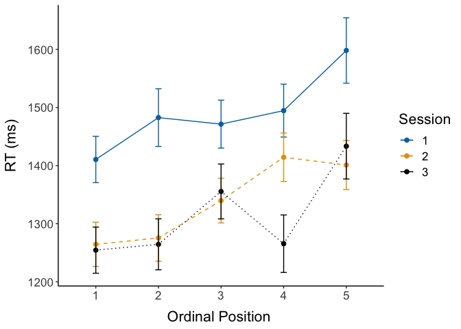<!-- -->

``` r
filename <- "CSI_online_aphasia_spoken_plot_rt_by_repetition_TeaP.pdf"
ggsave(plot_rt_repetition, filename = 
         here::here("results", "figures", filename),
       width = 18, height = 13, units = "cm", 
       dpi = 300, device = cairo_pdf)
#embedFonts(file = here::here("results", "figures", filename))
```

Normalized boxplot

``` r
means_subject <- df_correct %>% 
   filter(category != "Filler") %>% 
   summarySEwithin(.,"VOT",withinvars = c("subject","session", "PosOr"))
(means_subject <- means_subject %>%
  group_by(subject) %>%
  dplyr::mutate(VOT_norm = VOT - first(VOT)))
```

    ## # A tibble: 100 × 9
    ## # Groups:   subject [7]
    ##    subject session PosOr     N   VOT    sd    se    ci VOT_norm
    ##    <fct>   <fct>   <fct> <dbl> <dbl> <dbl> <dbl> <dbl>    <dbl>
    ##  1 1       1       1        13 1415.  546. 151.   330.      0  
    ##  2 1       1       2        17 1251.  444. 108.   228.   -164. 
    ##  3 1       1       3        15 1594.  561. 145.   311.    179. 
    ##  4 1       1       4         9 1267.  259.  86.5  199.   -149. 
    ##  5 1       1       5        16 1544.  531. 133.   283.    128. 
    ##  6 1       2       1        14 1179   306.  81.7  177.   -236. 
    ##  7 1       2       2        14 1200.  453. 121.   262.   -215. 
    ##  8 1       2       3        17 1251.  326.  79.2  168.   -165. 
    ##  9 1       2       4        18 1532.  564. 133.   281.    117. 
    ## 10 1       2       5        16 1360.  601. 150.   320.    -54.9
    ## # … with 90 more rows

``` r
(boxplot <- 
  ggplot() + 
  ## boxplot
  geom_boxplot(data=means_subject, aes(x = PosOr,y =VOT_norm),
               colour = "grey", width = 0.3,fatten = 1)+
  ### individual means
  geom_jitter(data=means_subject, aes(x = PosOr,y =VOT_norm),
              position = position_dodge(0.6),
              shape=19,color = "dark grey", size=2)+
  ### group means
  stat_summary(data=means_subject, aes(x = PosOr,y =VOT_norm),
               fun=mean, geom="point",colour = "black", shape=18, size=5)+
  ### line
  stat_summary(data=means_subject, aes(x = PosOr,y =VOT_norm),
               fun=mean, geom="line",colour = "black", linetype = "longdash", group = 1)+
  
  ## other stuff
  #scale_y_continuous(breaks = seq(600, 1300, by = 50))+
  labs(x="Ordinal Position",y ="Normalized RTs (ms)")+
  apatheme +
  theme(
    axis.title.y = element_text(margin = margin(0,10,0,0)),
    axis.title.x = element_text(margin = margin(10,0,0,0))) +
  coord_equal(ratio = 1/100))
```

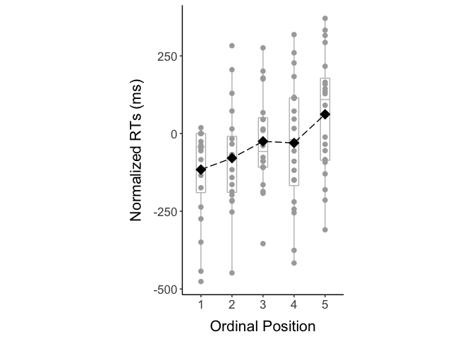<!-- -->

``` r
filename <- "CSI_online_aphasia_spoken_boxplot.pdf"
ggsave(boxplot, filename = 
         here::here("results", "figures", filename),
       width = 13, height = 18, units = "cm", 
       dpi = 300, device = cairo_pdf)
#embedFonts(file = here::here("results", "figures", filename))
```

### Export plot grid

``` r
# cowplot::plot_grid(plot_rt, boxplot,
#           nrow = 1, labels = c("A", "B"), label_fontfamily = "Arial") %>%
#   ggsave(filename = here::here("results", "figures",
#                                "CSI_online_aphasia_typing_RTs_and_normalized_RTs"),
#          width = 18, height = 13, units = "cm", dpi = 300, 
#          device = cairo_pdf)
#embedFonts(file = here::here("results", "figures", "CSI_online_typing_RTs_and_normalized_RTs"))
```

### … with fillers for control

``` r
# (plot_rt_fillers <- df %>% 
#     mutate(kind = case_when(category == "Filler" ~"Filler",
#                           category != "Filler" ~"Experimental")) %>%
#     ggplot(., aes(x=PosOr, y=timing.01, group=kind, color=kind)) +
#     stat_summary(fun=mean,  geom="point", size = 2)+
#     stat_summary(fun=mean,  geom="line", size = 1) +
#     apatheme+
#     labs(x="Ordinal Position ",y ="RT (ms)", color = "Trial type")+
#   annotate(geom="text", x=1.5, y=1350, label="n = 30", 
#            color="black", size = 8))
# 
# filename <- "CSI_online_typing_plot_rt_with_fillers.pdf"
# ggsave(plot_rt_fillers, filename = 
#          here::here("results", "figures", filename),
#        width = 18, height = 13, units = "cm", 
#        dpi = 300, device = cairo_pdf)
# embedFonts(file = here::here("results", "figures", filename))
```

### Control: Plot RTs accross the experiment

All correct trials (Excluding filler)

``` r
(plot_RTs_all <- ggplot(data=df_correct, aes(x=trial, y=VOT, group=session, color=session)) +
  stat_summary(fun=mean,  geom="point", size = 2)+
  stat_summary(fun=mean,  geom="line", size = 1) +
  apatheme+
  labs(x="Trial ",y ="VOT (ms)")+
  annotate(geom="text", x=20, y=200, label="n = 30", 
           color="black", size = 8))
```

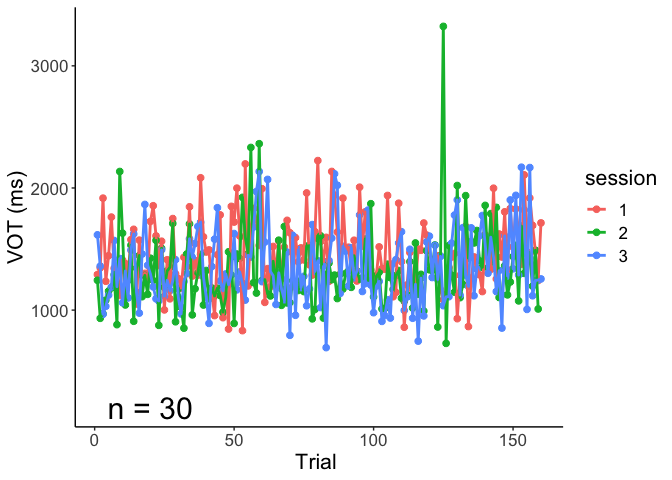<!-- -->

``` r
filename <- "CSI_online_aphasia__spoken_plot_rts_across_experiment.pdf"
ggsave(plot_RTs_all, filename = 
         here::here("results", "figures", filename),
       width = 18, height = 13, units = "cm", 
       dpi = 300, device = cairo_pdf)
#embedFonts(file = here::here("results", "figures", filename))
```

### Check distribution of data

Are the data normally distributed or does a gamma distribution fit the
data better?

*Center predictor variable*

``` r
df_correct$PosOr.cont <- scale(as.numeric(as.character(df_correct$PosOr)),
                                        center = T, scale = F)
# table(df_valid$PosOr.cont)
# mean(df_valid$PosOr.cont)
```

*Histogram of the reaction time data*

``` r
hist(df_correct$VOT)
```

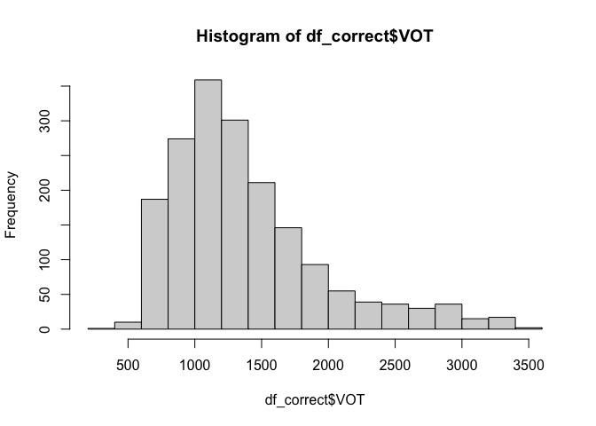<!-- -->

*Exclude unrealistically short reaction times \< 200 ms*

``` r
sum(df_correct$VOT < 200)
```

    ## [1] 0

``` r
df_correct <- df_correct %>% filter(VOT >=200)
```

*Check fit of normal vs gamma distribution in histograms, q-q-plots and
using objective criteria:*  
1) Fit normal and gamma distributions to the reaction time data

``` r
library(fitdistrplus)
```

    ## Lade nötiges Paket: MASS

    ## 
    ## Attache Paket: 'MASS'

    ## Das folgende Objekt ist maskiert 'package:dplyr':
    ## 
    ##     select

    ## Lade nötiges Paket: survival

``` r
fit.normal<- fitdist(df_correct$VOT, distr = "norm", method = "mle")
summary(fit.normal)
```

    ## Fitting of the distribution ' norm ' by maximum likelihood 
    ## Parameters : 
    ##       estimate Std. Error
    ## mean 1381.8670  13.379658
    ## sd    569.5643   9.461039
    ## Loglikelihood:  -14068.02   AIC:  28140.05   BIC:  28151.05 
    ## Correlation matrix:
    ##      mean sd
    ## mean    1  0
    ## sd      0  1

``` r
#plot(fit.normal)
```

``` r
fit.gamma <- fitdist(df_correct$VOT, distr = "gamma", method = "mle")
summary(fit.gamma)
```

    ## Fitting of the distribution ' gamma ' by maximum likelihood 
    ## Parameters : 
    ##          estimate   Std. Error
    ## shape 6.828770327 0.1668844322
    ## rate  0.004941364 0.0001199079
    ## Loglikelihood:  -13841.86   AIC:  27687.73   BIC:  27698.73 
    ## Correlation matrix:
    ##          shape     rate
    ## shape 1.000000 0.935057
    ## rate  0.935057 1.000000

``` r
#plot(fit.gamma)
```

2.  Compare the fit of the two distributions  
    Visually compare fit of both distributions in histogram

``` r
denscomp(list(fit.gamma, fit.normal))
```

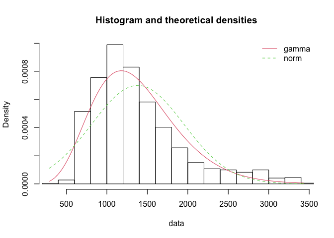<!-- -->

Visually compare fit of both distributions in Q-Q-plots

``` r
qqcomp(list(fit.gamma, fit.normal))
```

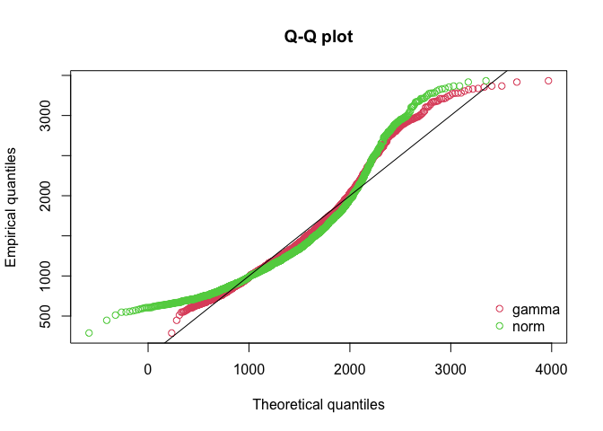<!-- -->

Compare information criteria

``` r
gofstat(list(fit.gamma, fit.normal),
        fitnames = c("Gamma", "Normal"))
```

    ## Goodness-of-fit statistics
    ##                                    Gamma     Normal
    ## Kolmogorov-Smirnov statistic  0.06590224  0.1159689
    ## Cramer-von Mises statistic    2.28574420  8.3640690
    ## Anderson-Darling statistic   15.10650515 51.8869809
    ## 
    ## Goodness-of-fit criteria
    ##                                   Gamma   Normal
    ## Akaike's Information Criterion 27687.73 28140.05
    ## Bayesian Information Criterion 27698.73 28151.05

**Conclusion:** .

### Inferential analyses: GLMM (Gamma distribution) with ordinal position as a continuous predictor

``` r
m1 <- glmer(VOT ~ PosOr.cont*session + 
               (PosOr.cont*session|subject) +
              (PosOr.cont*session|category),
             data = df_correct, 
            family =Gamma(link ="identity"), 
            control=glmerControl(optimizer = "bobyqa"))
```

    ## Warning in commonArgs(par, fn, control, environment()): maxfun < 10 *
    ## length(par)^2 is not recommended.

    ## Warning in optwrap(optimizer, devfun, start, rho$lower, control = control, :
    ## convergence code 1 from bobyqa: bobyqa -- maximum number of function evaluations
    ## exceeded

    ## Warning in commonArgs(par, fn, control, environment()): maxfun < 10 *
    ## length(par)^2 is not recommended.

    ## boundary (singular) fit: see ?isSingular

``` r
## This function provides a better convergence check for lme4 v>1.0 models, which have a nasty habit of throwing up false nonconvergence warnings.  It implements Ben Bolker's suggestion here (https://github.com/lme4/lme4/issues/120), referred to again here (http://stats.stackexchange.com/questions/97929/lmer-model-fails-to-converge).
didLmerConverge = function(lmerModel){
  relativeMaxGradient=signif(max(abs(with(
    lmerModel@optinfo$derivs,solve(Hessian,gradient)))),3)
  if (relativeMaxGradient < 0.001) {
    cat(sprintf("\tThe relative maximum gradient of %s is less than our 0.001 criterion.\n\tYou can safely ignore any warnings about a claimed convergence failure.\n\n", relativeMaxGradient))
  }
  else {
    cat(sprintf("The relative maximum gradient of %s exceeds our 0.001 criterion.\nThis looks like a real convergence failure; maybe try simplifying your model?\n\n", relativeMaxGradient))
  }
}

didLmerConverge(m1)
```

    ##  The relative maximum gradient of 0.0000667 is less than our 0.001 criterion.
    ##  You can safely ignore any warnings about a claimed convergence failure.

``` r
summary(m1)
```

    ## Generalized linear mixed model fit by maximum likelihood (Laplace
    ##   Approximation) [glmerMod]
    ##  Family: Gamma  ( identity )
    ## Formula: VOT ~ PosOr.cont * session + (PosOr.cont * session | subject) +  
    ##     (PosOr.cont * session | category)
    ##    Data: df_correct
    ## Control: glmerControl(optimizer = "bobyqa")
    ## 
    ##      AIC      BIC   logLik deviance df.resid 
    ##  26699.1  26968.7 -13300.5  26601.1     1763 
    ## 
    ## Scaled residuals: 
    ##     Min      1Q  Median      3Q     Max 
    ## -2.6064 -0.5988 -0.2536  0.3793  5.4888 
    ## 
    ## Random effects:
    ##  Groups   Name                Variance    Std.Dev. Corr                   
    ##  category (Intercept)          7705.56705  87.7814                        
    ##           PosOr.cont            487.94368  22.0894  0.08                  
    ##           session2             2221.94641  47.1375 -0.87  0.41            
    ##           session3             2504.34200  50.0434 -0.55 -0.34  0.34      
    ##           PosOr.cont:session2  3925.00625  62.6499 -0.65  0.05  0.62  0.27
    ##           PosOr.cont:session3  3432.61959  58.5886 -0.21  0.17  0.28  0.50
    ##  subject  (Intercept)         17560.62281 132.5165                        
    ##           PosOr.cont             86.49681   9.3004  1.00                  
    ##           session2             4328.11772  65.7884 -0.59 -0.59            
    ##           session3             8859.39188  94.1243 -0.47 -0.47  0.99      
    ##           PosOr.cont:session2   428.46539  20.6994 -0.05 -0.05  0.80  0.86
    ##           PosOr.cont:session3   387.22295  19.6780 -0.13 -0.13  0.68  0.70
    ##  Residual                         0.09875   0.3142                        
    ##       
    ##       
    ##       
    ##       
    ##       
    ##       
    ##   0.70
    ##       
    ##       
    ##       
    ##       
    ##       
    ##   0.91
    ##       
    ## Number of obs: 1812, groups:  category, 24; subject, 7
    ## 
    ## Fixed effects:
    ##                        Estimate  Std. Error t value            Pr(>|z|)    
    ## (Intercept)         1428.750822    0.002415  591668 <0.0000000000000002 ***
    ## PosOr.cont            40.887403    0.002415   16931 <0.0000000000000002 ***
    ## session2            -163.173014    0.002415  -67573 <0.0000000000000002 ***
    ## session3            -190.820242    0.002415  -79022 <0.0000000000000002 ***
    ## PosOr.cont:session2    2.468693    0.002415    1022 <0.0000000000000002 ***
    ## PosOr.cont:session3   -4.236620    0.002415   -1754 <0.0000000000000002 ***
    ## ---
    ## Signif. codes:  0 '***' 0.001 '**' 0.01 '*' 0.05 '.' 0.1 ' ' 1
    ## 
    ## Correlation of Fixed Effects:
    ##             (Intr) PsOr.c sessn2 sessn3 PsO.:2
    ## PosOr.cont  0.000                             
    ## session2    0.000  0.000                      
    ## session3    0.000  0.000  0.000               
    ## PsOr.cnt:s2 0.000  0.000  0.000  0.000        
    ## PsOr.cnt:s3 0.000  0.000  0.000  0.000  0.000 
    ## optimizer (bobyqa) convergence code: 0 (OK)
    ## boundary (singular) fit: see ?isSingular
    ## maxfun < 10 * length(par)^2 is not recommended.

``` r
# save model output
tab_model(m1,transform = NULL,
          show.re.var = F, show.stat = T,show.r2 = F,show.icc = F,
          title = "GLMM (Gamma distribution) of VOTs Predicted by Ordinal Position and Session",
          pred.labels = c("(Intercept)", "Ordinal Position", "Session 2 vs 1", 
                          "Session 3 vs 1", "Ord.Pos. x Session2-1",
                          "Ord.Pos. x Session3-1"),
          dv.labels = "Vocal Onset Time",
          #string.pred = "",
          string.stat = "t-Value",
          file = here::here("results", "tables", "CSI_online_aphasia_spoken_glmm_cont.html"))
```

<table style="border-collapse:collapse; border:none;">
<caption style="font-weight: bold; text-align:left;">
GLMM (Gamma distribution) of VOTs Predicted by Ordinal Position and
Session
</caption>
<tr>
<th style="border-top: double; text-align:center; font-style:normal; font-weight:bold; padding:0.2cm;  text-align:left; ">
 
</th>
<th colspan="4" style="border-top: double; text-align:center; font-style:normal; font-weight:bold; padding:0.2cm; ">
Vocal Onset Time
</th>
</tr>
<tr>
<td style=" text-align:center; border-bottom:1px solid; font-style:italic; font-weight:normal;  text-align:left; ">
Predictors
</td>
<td style=" text-align:center; border-bottom:1px solid; font-style:italic; font-weight:normal;  ">
Estimates
</td>
<td style=" text-align:center; border-bottom:1px solid; font-style:italic; font-weight:normal;  ">
CI
</td>
<td style=" text-align:center; border-bottom:1px solid; font-style:italic; font-weight:normal;  ">
t-Value
</td>
<td style=" text-align:center; border-bottom:1px solid; font-style:italic; font-weight:normal;  ">
p
</td>
</tr>
<tr>
<td style=" padding:0.2cm; text-align:left; vertical-align:top; text-align:left; ">
(Intercept)
</td>
<td style=" padding:0.2cm; text-align:left; vertical-align:top; text-align:center;  ">
1428.75
</td>
<td style=" padding:0.2cm; text-align:left; vertical-align:top; text-align:center;  ">
1428.75 – 1428.76
</td>
<td style=" padding:0.2cm; text-align:left; vertical-align:top; text-align:center;  ">
591667.86
</td>
<td style=" padding:0.2cm; text-align:left; vertical-align:top; text-align:center;  ">
<strong>\<0.001</strong>
</td>
</tr>
<tr>
<td style=" padding:0.2cm; text-align:left; vertical-align:top; text-align:left; ">
Ordinal Position
</td>
<td style=" padding:0.2cm; text-align:left; vertical-align:top; text-align:center;  ">
40.89
</td>
<td style=" padding:0.2cm; text-align:left; vertical-align:top; text-align:center;  ">
40.88 – 40.89
</td>
<td style=" padding:0.2cm; text-align:left; vertical-align:top; text-align:center;  ">
16931.33
</td>
<td style=" padding:0.2cm; text-align:left; vertical-align:top; text-align:center;  ">
<strong>\<0.001</strong>
</td>
</tr>
<tr>
<td style=" padding:0.2cm; text-align:left; vertical-align:top; text-align:left; ">
Session 2 vs 1
</td>
<td style=" padding:0.2cm; text-align:left; vertical-align:top; text-align:center;  ">
-163.17
</td>
<td style=" padding:0.2cm; text-align:left; vertical-align:top; text-align:center;  ">
-163.18 – -163.17
</td>
<td style=" padding:0.2cm; text-align:left; vertical-align:top; text-align:center;  ">
-67572.72
</td>
<td style=" padding:0.2cm; text-align:left; vertical-align:top; text-align:center;  ">
<strong>\<0.001</strong>
</td>
</tr>
<tr>
<td style=" padding:0.2cm; text-align:left; vertical-align:top; text-align:left; ">
Session 3 vs 1
</td>
<td style=" padding:0.2cm; text-align:left; vertical-align:top; text-align:center;  ">
-190.82
</td>
<td style=" padding:0.2cm; text-align:left; vertical-align:top; text-align:center;  ">
-190.82 – -190.82
</td>
<td style=" padding:0.2cm; text-align:left; vertical-align:top; text-align:center;  ">
-79022.18
</td>
<td style=" padding:0.2cm; text-align:left; vertical-align:top; text-align:center;  ">
<strong>\<0.001</strong>
</td>
</tr>
<tr>
<td style=" padding:0.2cm; text-align:left; vertical-align:top; text-align:left; ">
Ord.Pos. x Session2-1
</td>
<td style=" padding:0.2cm; text-align:left; vertical-align:top; text-align:center;  ">
2.47
</td>
<td style=" padding:0.2cm; text-align:left; vertical-align:top; text-align:center;  ">
2.46 – 2.47
</td>
<td style=" padding:0.2cm; text-align:left; vertical-align:top; text-align:center;  ">
1022.31
</td>
<td style=" padding:0.2cm; text-align:left; vertical-align:top; text-align:center;  ">
<strong>\<0.001</strong>
</td>
</tr>
<tr>
<td style=" padding:0.2cm; text-align:left; vertical-align:top; text-align:left; ">
Ord.Pos. x Session3-1
</td>
<td style=" padding:0.2cm; text-align:left; vertical-align:top; text-align:center;  ">
-4.24
</td>
<td style=" padding:0.2cm; text-align:left; vertical-align:top; text-align:center;  ">
-4.24 – -4.23
</td>
<td style=" padding:0.2cm; text-align:left; vertical-align:top; text-align:center;  ">
-1754.43
</td>
<td style=" padding:0.2cm; text-align:left; vertical-align:top; text-align:center;  ">
<strong>\<0.001</strong>
</td>
</tr>
<tr>
<td style=" padding:0.2cm; text-align:left; vertical-align:top; text-align:left; padding-top:0.1cm; padding-bottom:0.1cm;">
N <sub>subject</sub>
</td>
<td style=" padding:0.2cm; text-align:left; vertical-align:top; padding-top:0.1cm; padding-bottom:0.1cm; text-align:left;" colspan="4">
7
</td>
<tr>
<td style=" padding:0.2cm; text-align:left; vertical-align:top; text-align:left; padding-top:0.1cm; padding-bottom:0.1cm;">
N <sub>category</sub>
</td>
<td style=" padding:0.2cm; text-align:left; vertical-align:top; padding-top:0.1cm; padding-bottom:0.1cm; text-align:left;" colspan="4">
24
</td>
<tr>
<td style=" padding:0.2cm; text-align:left; vertical-align:top; text-align:left; padding-top:0.1cm; padding-bottom:0.1cm; border-top:1px solid;">
Observations
</td>
<td style=" padding:0.2cm; text-align:left; vertical-align:top; padding-top:0.1cm; padding-bottom:0.1cm; text-align:left; border-top:1px solid;" colspan="4">
1812
</td>
</tr>
</table>

### Comparison with transformed RTs

*Box-cox test*  
(common transformations: -2 -> 1/(Y^2), -1 -> 1/y, -0.5 -> 1/(sqrt(y))),
0 -> log(y), 0.5 -> sqrt(y), *1 -> y*, 2 -> y^2, 3 -> y^3)

``` r
boxcox(df_correct$VOT ~ df_correct$PosOr*df_correct$session)
```

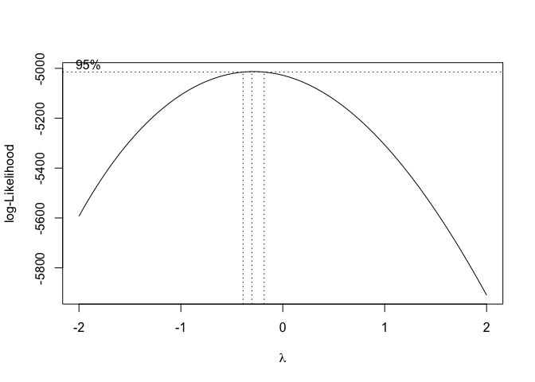<!-- -->

``` r
#boxcox(df$rt1 ~ df$experiment/(df$task*df$naming))

## Box-Cox suggests idoesn't really suggest a transformation, inversely transformed data seem to fit equally well as the raw RTs --> compute LMM with raw RTs
## for the main analyses we will use a GLMM
boxcox((1000/df_correct$VOT)~  df_correct$PosOr*df_correct$session)
```

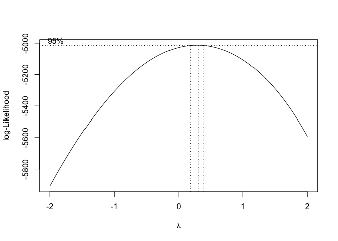<!-- -->

``` r
#boxcox((1000/df$rt1)~ df$experiment*df$task*df$naming)
boxcox(1/sqrt(df_correct$VOT)~ df_correct$PosOr*df_correct$session)
```

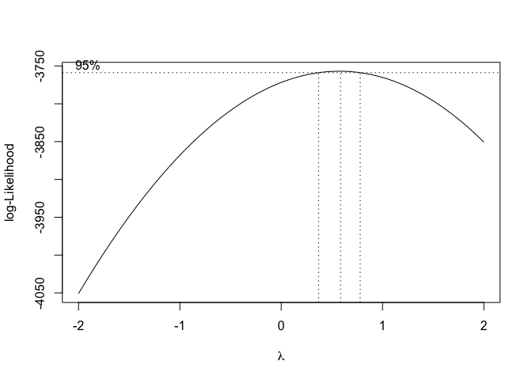<!-- -->

``` r
library(lmerTest)
m1_lmm <- lmer(VOT ~ PosOr.cont*session + 
               (PosOr.cont*session|subject) +
              (PosOr.cont*session|category),
             data = df_correct, 
            control=lmerControl(optimizer = "bobyqa"))
```

    ## Warning in commonArgs(par, fn, control, environment()): maxfun < 10 *
    ## length(par)^2 is not recommended.

    ## boundary (singular) fit: see ?isSingular

``` r
didLmerConverge(m1_lmm)
```

    ##  The relative maximum gradient of 0.00000562 is less than our 0.001 criterion.
    ##  You can safely ignore any warnings about a claimed convergence failure.

``` r
summary(m1_lmm)
```

    ## Linear mixed model fit by REML. t-tests use Satterthwaite's method [
    ## lmerModLmerTest]
    ## Formula: VOT ~ PosOr.cont * session + (PosOr.cont * session | subject) +  
    ##     (PosOr.cont * session | category)
    ##    Data: df_correct
    ## Control: lmerControl(optimizer = "bobyqa")
    ## 
    ## REML criterion at convergence: 27319.1
    ## 
    ## Scaled residuals: 
    ##     Min      1Q  Median      3Q     Max 
    ## -2.9038 -0.6148 -0.2271  0.3265  4.3917 
    ## 
    ## Random effects:
    ##  Groups   Name                Variance Std.Dev. Corr                         
    ##  category (Intercept)          17507.8 132.32                                
    ##           PosOr.cont             331.2  18.20    0.37                        
    ##           session2              6816.9  82.56   -0.68  0.36                  
    ##           session3              2877.6  53.64   -0.39  0.00  0.68            
    ##           PosOr.cont:session2   4793.6  69.24   -0.89  0.03  0.94  0.64      
    ##           PosOr.cont:session3   1839.1  42.88   -0.34  0.40  0.85  0.90  0.71
    ##  subject  (Intercept)         110306.0 332.12                                
    ##           PosOr.cont             601.1  24.52    0.67                        
    ##           session2             12235.0 110.61   -0.79 -0.15                  
    ##           session3             17051.0 130.58   -0.62  0.07  0.97            
    ##           PosOr.cont:session2    476.0  21.82    0.45  0.88  0.19  0.42      
    ##           PosOr.cont:session3    474.3  21.78    0.18  0.85  0.33  0.52  0.82
    ##  Residual                     200806.4 448.11                                
    ## Number of obs: 1812, groups:  category, 24; subject, 7
    ## 
    ## Fixed effects:
    ##                     Estimate Std. Error       df t value  Pr(>|t|)    
    ## (Intercept)         1422.472    128.885    6.559  11.037 0.0000178 ***
    ## PosOr.cont            39.285     12.603    7.317   3.117    0.0160 *  
    ## session2            -166.887     51.825    6.504  -3.220    0.0162 *  
    ## session3            -192.815     57.745    5.818  -3.339    0.0164 *  
    ## PosOr.cont:session2    2.324     24.440   20.181   0.095    0.9252    
    ## PosOr.cont:session3   -1.373     22.645   13.708  -0.061    0.9525    
    ## ---
    ## Signif. codes:  0 '***' 0.001 '**' 0.01 '*' 0.05 '.' 0.1 ' ' 1
    ## 
    ## Correlation of Fixed Effects:
    ##             (Intr) PsOr.c sessn2 sessn3 PsO.:2
    ## PosOr.cont   0.504                            
    ## session2    -0.667 -0.061                     
    ## session3    -0.531  0.052  0.826              
    ## PsOr.cnt:s2  0.039  0.218  0.234  0.198       
    ## PsOr.cnt:s3  0.038  0.312  0.212  0.246  0.562
    ## optimizer (bobyqa) convergence code: 0 (OK)
    ## boundary (singular) fit: see ?isSingular
    ## maxfun < 10 * length(par)^2 is not recommended.

``` r
tab_model(m1,transform = NULL,
          show.re.var = F, show.stat = T,show.r2 = F,show.icc = F,
          title = "LMM of VOTs Predicted by Ordinal Position and Session",
          pred.labels = c("(Intercept)", "Ordinal Position", "Session 2 vs 1", 
                          "Session 3 vs 1", "Ord.Pos. x Session2-1",
                          "Ord.Pos. x Session3-1"),
          dv.labels = "Vocal Onset Time",
          #string.pred = "",
          string.stat = "t-Value",
          file = here::here("results", "tables", "CSI_online_aphasia_spoken_control_lmm_VOT.html"))
```

<table style="border-collapse:collapse; border:none;">
<caption style="font-weight: bold; text-align:left;">
LMM of VOTs Predicted by Ordinal Position and Session
</caption>
<tr>
<th style="border-top: double; text-align:center; font-style:normal; font-weight:bold; padding:0.2cm;  text-align:left; ">
 
</th>
<th colspan="4" style="border-top: double; text-align:center; font-style:normal; font-weight:bold; padding:0.2cm; ">
Vocal Onset Time
</th>
</tr>
<tr>
<td style=" text-align:center; border-bottom:1px solid; font-style:italic; font-weight:normal;  text-align:left; ">
Predictors
</td>
<td style=" text-align:center; border-bottom:1px solid; font-style:italic; font-weight:normal;  ">
Estimates
</td>
<td style=" text-align:center; border-bottom:1px solid; font-style:italic; font-weight:normal;  ">
CI
</td>
<td style=" text-align:center; border-bottom:1px solid; font-style:italic; font-weight:normal;  ">
t-Value
</td>
<td style=" text-align:center; border-bottom:1px solid; font-style:italic; font-weight:normal;  ">
p
</td>
</tr>
<tr>
<td style=" padding:0.2cm; text-align:left; vertical-align:top; text-align:left; ">
(Intercept)
</td>
<td style=" padding:0.2cm; text-align:left; vertical-align:top; text-align:center;  ">
1428.75
</td>
<td style=" padding:0.2cm; text-align:left; vertical-align:top; text-align:center;  ">
1428.75 – 1428.76
</td>
<td style=" padding:0.2cm; text-align:left; vertical-align:top; text-align:center;  ">
591667.86
</td>
<td style=" padding:0.2cm; text-align:left; vertical-align:top; text-align:center;  ">
<strong>\<0.001</strong>
</td>
</tr>
<tr>
<td style=" padding:0.2cm; text-align:left; vertical-align:top; text-align:left; ">
Ordinal Position
</td>
<td style=" padding:0.2cm; text-align:left; vertical-align:top; text-align:center;  ">
40.89
</td>
<td style=" padding:0.2cm; text-align:left; vertical-align:top; text-align:center;  ">
40.88 – 40.89
</td>
<td style=" padding:0.2cm; text-align:left; vertical-align:top; text-align:center;  ">
16931.33
</td>
<td style=" padding:0.2cm; text-align:left; vertical-align:top; text-align:center;  ">
<strong>\<0.001</strong>
</td>
</tr>
<tr>
<td style=" padding:0.2cm; text-align:left; vertical-align:top; text-align:left; ">
Session 2 vs 1
</td>
<td style=" padding:0.2cm; text-align:left; vertical-align:top; text-align:center;  ">
-163.17
</td>
<td style=" padding:0.2cm; text-align:left; vertical-align:top; text-align:center;  ">
-163.18 – -163.17
</td>
<td style=" padding:0.2cm; text-align:left; vertical-align:top; text-align:center;  ">
-67572.72
</td>
<td style=" padding:0.2cm; text-align:left; vertical-align:top; text-align:center;  ">
<strong>\<0.001</strong>
</td>
</tr>
<tr>
<td style=" padding:0.2cm; text-align:left; vertical-align:top; text-align:left; ">
Session 3 vs 1
</td>
<td style=" padding:0.2cm; text-align:left; vertical-align:top; text-align:center;  ">
-190.82
</td>
<td style=" padding:0.2cm; text-align:left; vertical-align:top; text-align:center;  ">
-190.82 – -190.82
</td>
<td style=" padding:0.2cm; text-align:left; vertical-align:top; text-align:center;  ">
-79022.18
</td>
<td style=" padding:0.2cm; text-align:left; vertical-align:top; text-align:center;  ">
<strong>\<0.001</strong>
</td>
</tr>
<tr>
<td style=" padding:0.2cm; text-align:left; vertical-align:top; text-align:left; ">
Ord.Pos. x Session2-1
</td>
<td style=" padding:0.2cm; text-align:left; vertical-align:top; text-align:center;  ">
2.47
</td>
<td style=" padding:0.2cm; text-align:left; vertical-align:top; text-align:center;  ">
2.46 – 2.47
</td>
<td style=" padding:0.2cm; text-align:left; vertical-align:top; text-align:center;  ">
1022.31
</td>
<td style=" padding:0.2cm; text-align:left; vertical-align:top; text-align:center;  ">
<strong>\<0.001</strong>
</td>
</tr>
<tr>
<td style=" padding:0.2cm; text-align:left; vertical-align:top; text-align:left; ">
Ord.Pos. x Session3-1
</td>
<td style=" padding:0.2cm; text-align:left; vertical-align:top; text-align:center;  ">
-4.24
</td>
<td style=" padding:0.2cm; text-align:left; vertical-align:top; text-align:center;  ">
-4.24 – -4.23
</td>
<td style=" padding:0.2cm; text-align:left; vertical-align:top; text-align:center;  ">
-1754.43
</td>
<td style=" padding:0.2cm; text-align:left; vertical-align:top; text-align:center;  ">
<strong>\<0.001</strong>
</td>
</tr>
<tr>
<td style=" padding:0.2cm; text-align:left; vertical-align:top; text-align:left; padding-top:0.1cm; padding-bottom:0.1cm;">
N <sub>subject</sub>
</td>
<td style=" padding:0.2cm; text-align:left; vertical-align:top; padding-top:0.1cm; padding-bottom:0.1cm; text-align:left;" colspan="4">
7
</td>
<tr>
<td style=" padding:0.2cm; text-align:left; vertical-align:top; text-align:left; padding-top:0.1cm; padding-bottom:0.1cm;">
N <sub>category</sub>
</td>
<td style=" padding:0.2cm; text-align:left; vertical-align:top; padding-top:0.1cm; padding-bottom:0.1cm; text-align:left;" colspan="4">
24
</td>
<tr>
<td style=" padding:0.2cm; text-align:left; vertical-align:top; text-align:left; padding-top:0.1cm; padding-bottom:0.1cm; border-top:1px solid;">
Observations
</td>
<td style=" padding:0.2cm; text-align:left; vertical-align:top; padding-top:0.1cm; padding-bottom:0.1cm; text-align:left; border-top:1px solid;" colspan="4">
1812
</td>
</tr>
</table>

# ERROR RATES

### Descriptives

``` r
df %>% mutate(errors = case_when(correct == "0" ~ 1,
                                 #is.na(correct) ~ NA, # these are the trials were the audio recordings are missing 
                                 correct != "0" ~ 0)) -> df
#df$VOT[is.na(df$correct)]

(means_final_errors<- df %>% 
   filter(category != "Filler") %>% 
   Rmisc::summarySEwithin(.,"errors",idvar = "subject",
                          withinvars = c("session", "PosOr"),
                          na.rm = T))
```

    ##    session PosOr   N    errors        sd         se         ci
    ## 1        1     1 168 0.2390476 0.4177586 0.03223077 0.06363228
    ## 2        1     2 168 0.2509524 0.4211152 0.03248974 0.06414356
    ## 3        1     3 168 0.2747619 0.4232800 0.03265676 0.06447330
    ## 4        1     4 168 0.3045238 0.4141996 0.03195619 0.06309018
    ## 5        1     5 168 0.3342857 0.4455446 0.03437451 0.06786459
    ## 6        2     1 168 0.2628571 0.4138337 0.03192796 0.06303445
    ## 7        2     2 168 0.1973810 0.3836225 0.02959712 0.05843273
    ## 8        2     3 168 0.2211905 0.3873868 0.02988754 0.05900611
    ## 9        2     4 168 0.2152381 0.3875872 0.02990301 0.05903663
    ## 10       2     5 168 0.2807143 0.4196102 0.03237363 0.06391431
    ## 11       3     1 144 0.2130556 0.4060921 0.03384101 0.06689326
    ## 12       3     2 144 0.1991667 0.4019193 0.03349328 0.06620590
    ## 13       3     3 144 0.1505556 0.3760913 0.03134094 0.06195139
    ## 14       3     4 144 0.2616667 0.4353408 0.03627840 0.07171123
    ## 15       3     5 144 0.2477778 0.4224819 0.03520682 0.06959306

``` r
(means_final_cat_errors <- df %>% 
   filter(category != "Filler") %>% 
   Rmisc::summarySEwithin(.,"errors",idvar = "category",
                          withinvars = c("session", "PosOr"),
                          na.rm = T))
```

    ##    session PosOr   N    errors        sd         se         ci
    ## 1        1     1 168 0.2321429 0.4256864 0.03284242 0.06483983
    ## 2        1     2 168 0.2440476 0.4231742 0.03264860 0.06445719
    ## 3        1     3 168 0.2678571 0.4418090 0.03408631 0.06729561
    ## 4        1     4 168 0.2976190 0.4884490 0.03768466 0.07439973
    ## 5        1     5 168 0.3273810 0.4828012 0.03724892 0.07353946
    ## 6        2     1 168 0.2559524 0.4373401 0.03374152 0.06661490
    ## 7        2     2 168 0.1904762 0.4015536 0.03098053 0.06116396
    ## 8        2     3 168 0.2142857 0.4108795 0.03170004 0.06258447
    ## 9        2     4 168 0.2083333 0.4180973 0.03225691 0.06368388
    ## 10       2     5 168 0.2738095 0.4500696 0.03472362 0.06855384
    ## 11       3     1 144 0.2291667 0.4260924 0.03550770 0.07018779
    ## 12       3     2 144 0.2152778 0.4154880 0.03462400 0.06844099
    ## 13       3     3 144 0.1666667 0.3940491 0.03283743 0.06490949
    ## 14       3     4 144 0.2777778 0.4450265 0.03708554 0.07330671
    ## 15       3     5 144 0.2638889 0.4320706 0.03600588 0.07117254

``` r
(means_final_wo_session_errors <- df %>% 
   filter(category != "Filler") %>% 
   Rmisc::summarySEwithin(.,"errors",idvar = "subject",
                          withinvars = c("PosOr"), na.rm = T))
```

    ##   PosOr   N    errors        sd         se         ci
    ## 1     1 480 0.2395833 0.4456298 0.02034013 0.03996690
    ## 2     2 480 0.2166667 0.4347976 0.01984570 0.03899540
    ## 3     3 480 0.2187500 0.4316322 0.01970122 0.03871150
    ## 4     4 480 0.2604167 0.4456949 0.02034310 0.03997274
    ## 5     5 480 0.2895833 0.4648617 0.02121794 0.04169174

``` r
# Export as word file
library(flextable)
huxt_word <- huxtable::huxtable(means_final_errors)
huxt_word <- huxtable::set_number_format(huxt_word, round(2))
huxtable::quick_docx(huxt_word, 
                     file = here::here("results", "tables",
                                       "CSI_online_subject_errors_by_session.docx"), 
                                       open = FALSE)
```

### Plotting

Errors by ordinal position

``` r
(plot_errors <- means_final_wo_session_errors %>% 
    ggplot(., aes(x=PosOr, y=errors*100)) +
    geom_point(size = 2)+
    geom_errorbar(aes(ymin=errors*100-se*100, ymax=errors*100+se*100),
                  width =.1) +
    stat_summary(fun=mean,  geom="line", size = 0.5, group=1, linetype="dashed")+
    apatheme+
    #scale_y_continuous(limits = c(1120, 1340), breaks =seq(1120,1340, by = 20)) +
                       #breaks = c(1100, 1150, 1200, 1250, 1300, 1350)) + 
    labs(x="Ordinal Position ",y ="Percentage of errors") + #+
  # annotate(geom="text", x=1.5, y=1330, label="n = 30", 
  #         color="black", size = 8))
    theme(
    axis.title.y = element_text(margin = margin(0,10,0,0)),
    axis.title.x = element_text(margin = margin(10,0,0,0))))
```

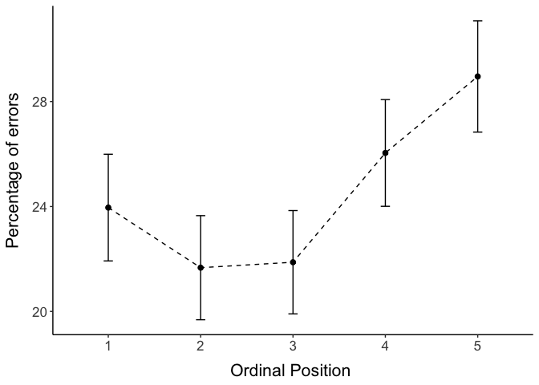<!-- -->

``` r
filename <- "CSI_online_aphasia_spoken_plot_errors_Teap.pdf"
ggsave(plot_errors, filename = 
         here::here("results", "figures", filename),
       width = 18, height = 13, units = "cm", 
       dpi = 300, device = cairo_pdf)
#embedFonts(file = here::here("results", "figures", filename))
```

Errors by ordinal position and repetition

``` r
(plot <- ggplot(data=means_final_errors, aes(x=PosOr, y=errors*100, group=session, color = session)) +
  geom_point( size = 2)+
  geom_errorbar(aes(ymin=errors*100-se*100, ymax=errors*100+se*100, group = session), width =.1) +
  stat_summary(fun=mean,  aes(linetype=session), geom="line", size = 0.5) +
  apatheme+
   scale_linetype_manual(values=c("solid", "dashed", "dotted"))+
  scale_color_manual(values=c("#0072B2", "#E69F00", "#000000"))+
 # scale_y_continuous(breaks = seq(6, 14, by = 2), limits = c(5.5, 15))+
  labs(x="Ordinal Position ",y ="Percentage of errors"))
```

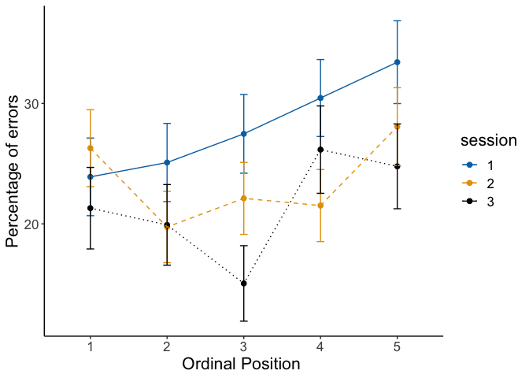<!-- -->

``` r
filename <- "CSI_online_spoken_plot_errors_by_repetition_TeaP.pdf"
ggsave(plot, filename = 
         here::here("results", "figures", filename),
       width = 18, height = 13, units = "cm", 
       dpi = 300, device = cairo_pdf)
#embedFonts(file = here::here("data", "verbal_CSI", "Plots", filename))
```

### GLMM with binomial distribution

*Center predictor variable*

``` r
df$PosOr.cont <- scale(as.numeric(as.character(df$PosOr)),
                                        center = T, scale = F)
```

*GLMM*

``` r
m1_error <- glmer(errors ~ PosOr.cont*session + 
                    (PosOr.cont*session|subject) +
                    (PosOr.cont*session|category) ,
                  data =df, family = "binomial",
                  control=glmerControl(optimizer = "bobyqa"))
```

    ## Warning in commonArgs(par, fn, control, environment()): maxfun < 10 *
    ## length(par)^2 is not recommended.

    ## Warning in optwrap(optimizer, devfun, start, rho$lower, control = control, :
    ## convergence code 1 from bobyqa: bobyqa -- maximum number of function evaluations
    ## exceeded

    ## Warning in commonArgs(par, fn, control, environment()): maxfun < 10 *
    ## length(par)^2 is not recommended.

    ## boundary (singular) fit: see ?isSingular

``` r
didLmerConverge(m1_error)
```

    ##  The relative maximum gradient of 0.000195 is less than our 0.001 criterion.
    ##  You can safely ignore any warnings about a claimed convergence failure.

``` r
summary(m1_error)
```

    ## Generalized linear mixed model fit by maximum likelihood (Laplace
    ##   Approximation) [glmerMod]
    ##  Family: binomial  ( logit )
    ## Formula: errors ~ PosOr.cont * session + (PosOr.cont * session | subject) +  
    ##     (PosOr.cont * session | category)
    ##    Data: df
    ## Control: glmerControl(optimizer = "bobyqa")
    ## 
    ##      AIC      BIC   logLik deviance df.resid 
    ##   2314.0   2591.6  -1109.0   2218.0     2352 
    ## 
    ## Scaled residuals: 
    ##     Min      1Q  Median      3Q     Max 
    ## -1.6693 -0.5575 -0.2798 -0.0902  7.0473 
    ## 
    ## Random effects:
    ##  Groups   Name                Variance  Std.Dev. Corr                         
    ##  category (Intercept)         0.3539114 0.59490                               
    ##           PosOr.cont          0.0116183 0.10779  -0.40                        
    ##           session2            0.0199348 0.14119   0.89 -0.75                  
    ##           session3            0.0202977 0.14247   0.95 -0.66  0.97            
    ##           PosOr.cont:session2 0.0430826 0.20756   0.60  0.39  0.19  0.38      
    ##           PosOr.cont:session3 0.1435670 0.37890   0.79 -0.07  0.66  0.62  0.42
    ##  subject  (Intercept)         1.5194991 1.23268                               
    ##           PosOr.cont          0.0009236 0.03039   0.90                        
    ##           session2            0.0313585 0.17708   0.99  0.96                  
    ##           session3            0.1131296 0.33635  -0.42  0.02 -0.27            
    ##           PosOr.cont:session2 0.0048603 0.06972  -1.00 -0.90 -0.99  0.42      
    ##           PosOr.cont:session3 0.0182811 0.13521  -0.17 -0.59 -0.33 -0.82  0.17
    ## Number of obs: 2400, groups:  category, 24; subject, 7
    ## 
    ## Fixed effects:
    ##                     Estimate Std. Error z value Pr(>|z|)    
    ## (Intercept)         -1.62210    0.48716  -3.330 0.000869 ***
    ## PosOr.cont           0.09107    0.05611   1.623 0.104585    
    ## session2            -0.41052    0.18158  -2.261 0.023768 *  
    ## session3            -0.37133    0.22868  -1.624 0.104421    
    ## PosOr.cont:session2 -0.09499    0.12749  -0.745 0.456233    
    ## PosOr.cont:session3 -0.10543    0.15154  -0.696 0.486626    
    ## ---
    ## Signif. codes:  0 '***' 0.001 '**' 0.01 '*' 0.05 '.' 0.1 ' ' 1
    ## 
    ## Correlation of Fixed Effects:
    ##             (Intr) PsOr.c sessn2 sessn3 PsO.:2
    ## PosOr.cont   0.125                            
    ## session2     0.403  0.027                     
    ## session3    -0.170 -0.045  0.228              
    ## PsOr.cnt:s2 -0.149  0.121 -0.147  0.047       
    ## PsOr.cnt:s3  0.046  0.066 -0.023 -0.168  0.369
    ## optimizer (bobyqa) convergence code: 0 (OK)
    ## boundary (singular) fit: see ?isSingular
    ## maxfun < 10 * length(par)^2 is not recommended.

``` r
# save model output
tab_model(m1_error,transform = NULL,
          show.re.var = F, show.stat = T,show.r2 = F,show.icc = F,
          title = "GLMM (Binomial distribution) of Errors Predicted by Ordinal Position and Session",
          pred.labels = c("(Intercept)", "Ordinal Position", "Session 2 vs 1", 
                          "Session 3 vs 1", "Ord.Pos. x Session2-1",
                          "Ord.Pos. x Session3-1"),
          dv.labels = "Error Rate",
          #string.pred = "",
          string.stat = "z-Value",
          file = here::here("results", "tables", "CSI_online_aphasia_spoken_glmm_errors.html"))
```

<table style="border-collapse:collapse; border:none;">
<caption style="font-weight: bold; text-align:left;">
GLMM (Binomial distribution) of Errors Predicted by Ordinal Position and
Session
</caption>
<tr>
<th style="border-top: double; text-align:center; font-style:normal; font-weight:bold; padding:0.2cm;  text-align:left; ">
 
</th>
<th colspan="4" style="border-top: double; text-align:center; font-style:normal; font-weight:bold; padding:0.2cm; ">
Error Rate
</th>
</tr>
<tr>
<td style=" text-align:center; border-bottom:1px solid; font-style:italic; font-weight:normal;  text-align:left; ">
Predictors
</td>
<td style=" text-align:center; border-bottom:1px solid; font-style:italic; font-weight:normal;  ">
Log-Odds
</td>
<td style=" text-align:center; border-bottom:1px solid; font-style:italic; font-weight:normal;  ">
CI
</td>
<td style=" text-align:center; border-bottom:1px solid; font-style:italic; font-weight:normal;  ">
z-Value
</td>
<td style=" text-align:center; border-bottom:1px solid; font-style:italic; font-weight:normal;  ">
p
</td>
</tr>
<tr>
<td style=" padding:0.2cm; text-align:left; vertical-align:top; text-align:left; ">
(Intercept)
</td>
<td style=" padding:0.2cm; text-align:left; vertical-align:top; text-align:center;  ">
-1.62
</td>
<td style=" padding:0.2cm; text-align:left; vertical-align:top; text-align:center;  ">
-2.58 – -0.67
</td>
<td style=" padding:0.2cm; text-align:left; vertical-align:top; text-align:center;  ">
-3.33
</td>
<td style=" padding:0.2cm; text-align:left; vertical-align:top; text-align:center;  ">
<strong>0.001</strong>
</td>
</tr>
<tr>
<td style=" padding:0.2cm; text-align:left; vertical-align:top; text-align:left; ">
Ordinal Position
</td>
<td style=" padding:0.2cm; text-align:left; vertical-align:top; text-align:center;  ">
0.09
</td>
<td style=" padding:0.2cm; text-align:left; vertical-align:top; text-align:center;  ">
-0.02 – 0.20
</td>
<td style=" padding:0.2cm; text-align:left; vertical-align:top; text-align:center;  ">
1.62
</td>
<td style=" padding:0.2cm; text-align:left; vertical-align:top; text-align:center;  ">
0.105
</td>
</tr>
<tr>
<td style=" padding:0.2cm; text-align:left; vertical-align:top; text-align:left; ">
Session 2 vs 1
</td>
<td style=" padding:0.2cm; text-align:left; vertical-align:top; text-align:center;  ">
-0.41
</td>
<td style=" padding:0.2cm; text-align:left; vertical-align:top; text-align:center;  ">
-0.77 – -0.05
</td>
<td style=" padding:0.2cm; text-align:left; vertical-align:top; text-align:center;  ">
-2.26
</td>
<td style=" padding:0.2cm; text-align:left; vertical-align:top; text-align:center;  ">
<strong>0.024</strong>
</td>
</tr>
<tr>
<td style=" padding:0.2cm; text-align:left; vertical-align:top; text-align:left; ">
Session 3 vs 1
</td>
<td style=" padding:0.2cm; text-align:left; vertical-align:top; text-align:center;  ">
-0.37
</td>
<td style=" padding:0.2cm; text-align:left; vertical-align:top; text-align:center;  ">
-0.82 – 0.08
</td>
<td style=" padding:0.2cm; text-align:left; vertical-align:top; text-align:center;  ">
-1.62
</td>
<td style=" padding:0.2cm; text-align:left; vertical-align:top; text-align:center;  ">
0.104
</td>
</tr>
<tr>
<td style=" padding:0.2cm; text-align:left; vertical-align:top; text-align:left; ">
Ord.Pos. x Session2-1
</td>
<td style=" padding:0.2cm; text-align:left; vertical-align:top; text-align:center;  ">
-0.09
</td>
<td style=" padding:0.2cm; text-align:left; vertical-align:top; text-align:center;  ">
-0.34 – 0.15
</td>
<td style=" padding:0.2cm; text-align:left; vertical-align:top; text-align:center;  ">
-0.75
</td>
<td style=" padding:0.2cm; text-align:left; vertical-align:top; text-align:center;  ">
0.456
</td>
</tr>
<tr>
<td style=" padding:0.2cm; text-align:left; vertical-align:top; text-align:left; ">
Ord.Pos. x Session3-1
</td>
<td style=" padding:0.2cm; text-align:left; vertical-align:top; text-align:center;  ">
-0.11
</td>
<td style=" padding:0.2cm; text-align:left; vertical-align:top; text-align:center;  ">
-0.40 – 0.19
</td>
<td style=" padding:0.2cm; text-align:left; vertical-align:top; text-align:center;  ">
-0.70
</td>
<td style=" padding:0.2cm; text-align:left; vertical-align:top; text-align:center;  ">
0.487
</td>
</tr>
<tr>
<td style=" padding:0.2cm; text-align:left; vertical-align:top; text-align:left; padding-top:0.1cm; padding-bottom:0.1cm;">
N <sub>subject</sub>
</td>
<td style=" padding:0.2cm; text-align:left; vertical-align:top; padding-top:0.1cm; padding-bottom:0.1cm; text-align:left;" colspan="4">
7
</td>
<tr>
<td style=" padding:0.2cm; text-align:left; vertical-align:top; text-align:left; padding-top:0.1cm; padding-bottom:0.1cm;">
N <sub>category</sub>
</td>
<td style=" padding:0.2cm; text-align:left; vertical-align:top; padding-top:0.1cm; padding-bottom:0.1cm; text-align:left;" colspan="4">
24
</td>
<tr>
<td style=" padding:0.2cm; text-align:left; vertical-align:top; text-align:left; padding-top:0.1cm; padding-bottom:0.1cm; border-top:1px solid;">
Observations
</td>
<td style=" padding:0.2cm; text-align:left; vertical-align:top; padding-top:0.1cm; padding-bottom:0.1cm; text-align:left; border-top:1px solid;" colspan="4">
2400
</td>
</tr>
</table>

# ———————————————

# Additional plots

### RTs by subject

Line graph for each participant:

``` r
modeloutput <- coef(m1)$subject
(means_final_subject <- df_correct %>% 
   summarySEwithin(.,"VOT",withinvars = c("subject","PosOr", "session")))
```

    ##     subject PosOr session  N       VOT       sd        se        ci
    ## 1         1     1       1 13 1415.3846 545.6661 151.34054 329.74272
    ## 2         1     1       2 14 1179.0000 305.8260  81.73543 176.57866
    ## 3         1     1       3 15 1389.8000 412.0535 106.39175 228.18760
    ## 4         1     2       1 17 1251.4118 443.7953 107.63617 228.17848
    ## 5         1     2       2 14 1200.2857 453.2525 121.13683 261.70021
    ## 6         1     2       3 20 1381.8500 485.9897 108.67059 227.45016
    ## 7         1     3       1 15 1594.2667 561.0347 144.85853 310.69066
    ## 8         1     3       2 17 1250.5294 326.4359  79.17233 167.83784
    ## 9         1     3       3 21 1306.2381 383.0499  83.58833 174.36220
    ## 10        1     4       1  9 1266.7778 259.3950  86.46500 199.38864
    ## 11        1     4       2 18 1532.1667 564.2488 132.99471 280.59431
    ## 12        1     4       3 12 1039.7500 106.4723  30.73591  67.64927
    ## 13        1     5       1 16 1543.5625 530.8195 132.70488 282.85377
    ## 14        1     5       2 16 1360.4375 600.9107 150.22767 320.20270
    ## 15        1     5       3 17 1631.8235 658.0612 159.60328 338.34384
    ## 16        2     1       1 21 1366.9524 602.8513 131.55294 274.41462
    ## 17        2     1       2 17 1017.5882 275.2557  66.75932 141.52343
    ## 18        2     1       3 18 1192.5556 451.6318 106.45064 224.59123
    ## 19        2     2       1 16 1381.9375 680.4379 170.10946 362.57974
    ## 20        2     2       2 20 1299.3500 480.7227 107.49286 224.98514
    ## 21        2     2       3 14 1149.3571 521.2174 139.30120 300.94196
    ## 22        2     3       1 14 1328.0000 339.0476  90.61427 195.76024
    ## 23        2     3       2 17 1567.7059 739.8102 179.43033 380.37532
    ## 24        2     3       3 17 1412.3529 475.4737 115.31930 244.46601
    ## 25        2     4       1 13 1248.7692 282.4503  78.33761 170.68299
    ## 26        2     4       2 17 1480.9412 683.9490 165.88201 351.65415
    ## 27        2     4       3 18 1383.3889 689.3486 162.48103 342.80500
    ## 28        2     5       1 14 1737.7143 847.0850 226.39299 489.09231
    ## 29        2     5       2 17 1355.6471 400.4409  97.12118 205.88771
    ## 30        2     5       3 17 1660.0588 714.4675 173.28381 367.34527
    ## 31        3     1       1 19 1153.6316 328.0952  75.27020 158.13682
    ## 32        3     1       2 22 1172.3636 364.7329  77.76131 161.71349
    ## 33        3     2       1 22 1283.1364 487.1744 103.86593 216.00102
    ## 34        3     2       2 23 1012.2609 170.1432  35.47732  73.57545
    ## 35        3     3       1 23 1168.2174 322.9282  67.33518 139.64462
    ## 36        3     3       2 22 1077.2273 251.7800  53.67968 111.63300
    ## 37        3     4       1 23 1200.3043 400.7411  83.56029 173.29344
    ## 38        3     4       2 23 1225.9130 325.3436  67.83882 140.68911
    ## 39        3     5       1 20 1289.5000 327.3748  73.20322 153.21610
    ## 40        3     5       2 19 1070.0000 141.3469  32.42720  68.12702
    ## 41        4     1       1 23 1507.6087 333.9624  69.63598 144.41618
    ## 42        4     1       2 22 1423.6818 321.9986  68.65034 142.76619
    ## 43        4     1       3 24 1460.6667 365.4621  74.59963 154.32109
    ## 44        4     2       1 21 1713.0476 537.2001 117.22668 244.53056
    ## 45        4     2       2 23 1439.8261 465.7718  97.12013 201.41483
    ## 46        4     2       3 23 1430.9565 252.5300  52.65614 109.20215
    ## 47        4     3       1 21 1683.1429 347.9082  75.91979 158.36590
    ## 48        4     3       2 24 1575.0417 404.4458  82.55716 170.78250
    ## 49        4     3       3 23 1552.9130 495.1134 103.23828 214.10309
    ## 50        4     4       1 23 1767.4348 492.0248 102.59426 212.76748
    ## 51        4     4       2 22 1691.0000 512.3379 109.23080 227.15789
    ## 52        4     4       3 21 1620.7143 589.8129 128.70773 268.47961
    ## 53        4     5       1 18 1840.0556 456.5514 107.61020 227.03768
    ## 54        4     5       2 23 1673.0435 543.7948 113.38906 235.15452
    ## 55        4     5       3 23 1598.6087 438.1342  91.35729 189.46342
    ## 56        5     1       1 16 1821.0000 577.7979 144.44949 307.88679
    ## 57        5     1       2 14 1765.3571 673.1318 179.90205 388.65475
    ## 58        5     1       3 22 1546.5455 535.3876 114.14502 237.37756
    ## 59        5     2       1 15 1893.5333 780.8872 201.62422 432.44094
    ## 60        5     2       2 18 1568.7222 743.1016 175.15072 369.53572
    ## 61        5     2       3 18 1634.5000 665.7922 156.92873 331.09068
    ## 62        5     3       1 13 1628.7692 469.7500 130.28522 283.86711
    ## 63        5     3       2 18 1466.7778 372.8637  87.88481 185.42074
    ## 64        5     3       3 21 1731.6667 740.6470 161.62243 337.13848
    ## 65        5     4       1 16 2139.4375 724.7435 181.18586 386.18853
    ## 66        5     4       2 17 1566.1765 360.5439  87.44475 185.37458
    ## 67        5     4       3 18 1404.3889 485.2354 114.37108 241.30188
    ## 68        5     5       1 14 1786.4286 702.1183 187.64902 405.39105
    ## 69        5     5       2 14 1979.7857 713.7496 190.75759 412.10673
    ## 70        5     5       3 17 1640.3529 676.2939 164.02536 347.71823
    ## 71        6     1       1 23  961.8261 209.2367  43.62888  90.48075
    ## 72        6     1       2 24  924.0833 364.5926  74.42216 153.95397
    ## 73        6     1       3 21  827.3333 173.5014  37.86110  78.97688
    ## 74        6     2       1 23  944.7826 252.0213  52.55007 108.98217
    ## 75        6     2       2 23  879.6957 188.4396  39.29238  81.48741
    ## 76        6     2       3 24  845.7917 192.5900  39.31226  81.32361
    ## 77        6     3       1 24  972.0833 452.1725  92.29932 190.93568
    ## 78        6     3       2 23  854.6087 197.2790  41.13551  85.30983
    ## 79        6     3       3 23  775.4783 152.6367  31.82695  66.00506
    ## 80        6     4       1 24  905.9167 274.5968  56.05185 115.95208
    ## 81        6     4       2 24  872.7083 331.2118  67.60832 139.85847
    ## 82        6     4       3 23  742.2174 121.3812  25.30974  52.48918
    ## 83        6     5       1 24 1106.3333 580.8671 118.56900 245.27866
    ## 84        6     5       2 24  869.5417 174.9144  35.70424  73.85985
    ## 85        6     5       3 22  832.1818 217.2991  46.32833  96.34503
    ## 86        7     1       1 14 1927.2143 467.9562 125.06654 270.18984
    ## 87        7     1       2 12 1451.1667 375.5883 108.42300 238.63740
    ## 88        7     1       3 11 1484.3636 410.6626 123.81944 275.88690
    ## 89        7     2       1 13 2209.9231 585.9967 162.52625 354.11427
    ## 90        7     2       2 15 1729.9333 569.3171 146.99704 315.27729
    ## 91        7     2       3 14 1478.8571 535.1929 143.03632 309.01118
    ## 92        7     3       1 13 2203.0000 567.8925 157.50505 343.17403
    ## 93        7     3       2 11 1838.8182 591.9653 178.48426 397.68770
    ## 94        7     3       3 15 1819.2000 665.8897 171.93199 368.75743
    ## 95        7     4       1 10 2154.4000 582.2172 184.11324 416.49308
    ## 96        7     4       2 12 1684.0000 440.4182 127.13779 279.82840
    ## 97        7     4       3 12 1777.2500 550.0643 158.78989 349.49419
    ## 98        7     5       1  7 2242.8571 763.5562 288.59711 706.17168
    ## 99        7     5       2  9 1713.1111 375.1694 125.05648 288.38076
    ## 100       7     5       3 10 1617.6000 581.4325 183.86509 415.93172

``` r
(means_final<- df_correct %>%  
   Rmisc::summarySEwithin(.,"VOT",idvar = "subject",
                          withinvars = c("PosOr", "session"),
                          na.rm = T))
```

    ##    PosOr session   N      VOT       sd       se        ci
    ## 1      1       1 129 1410.563 452.7834 39.86535  78.88041
    ## 2      1       2 125 1264.454 425.2607 38.03648  75.28484
    ## 3      1       3 111 1254.408 418.6117 39.73286  78.74121
    ## 4      2       1 127 1482.643 559.7995 49.67417  98.30373
    ## 5      2       2 136 1275.384 465.6785 39.93160  78.97242
    ## 6      2       3 113 1264.434 466.3525 43.87076  86.92428
    ## 7      3       1 123 1471.436 457.3364 41.23663  81.63204
    ## 8      3       2 132 1339.762 441.5868 38.43520  76.03399
    ## 9      3       3 120 1355.484 517.4882 47.23999  93.53991
    ## 10     4       1 118 1494.650 494.3876 45.51207  90.13427
    ## 11     4       2 133 1414.373 481.2927 41.73337  82.55273
    ## 12     4       3 104 1265.547 504.6910 49.48902  98.14981
    ## 13     5       1 113 1598.187 598.9889 56.34814 111.64661
    ## 14     5       2 122 1400.989 466.8759 42.26896  83.68256
    ## 15     5       3 106 1433.482 582.1221 56.54069 112.10975

``` r
(means_grand<- df_correct %>%  
   Rmisc::summarySEwithin(.,"VOT",idvar = "subject",
                          withinvars = c("PosOr", "session"),
                          na.rm = T))
```

    ##    PosOr session   N      VOT       sd       se        ci
    ## 1      1       1 129 1410.563 452.7834 39.86535  78.88041
    ## 2      1       2 125 1264.454 425.2607 38.03648  75.28484
    ## 3      1       3 111 1254.408 418.6117 39.73286  78.74121
    ## 4      2       1 127 1482.643 559.7995 49.67417  98.30373
    ## 5      2       2 136 1275.384 465.6785 39.93160  78.97242
    ## 6      2       3 113 1264.434 466.3525 43.87076  86.92428
    ## 7      3       1 123 1471.436 457.3364 41.23663  81.63204
    ## 8      3       2 132 1339.762 441.5868 38.43520  76.03399
    ## 9      3       3 120 1355.484 517.4882 47.23999  93.53991
    ## 10     4       1 118 1494.650 494.3876 45.51207  90.13427
    ## 11     4       2 133 1414.373 481.2927 41.73337  82.55273
    ## 12     4       3 104 1265.547 504.6910 49.48902  98.14981
    ## 13     5       1 113 1598.187 598.9889 56.34814 111.64661
    ## 14     5       2 122 1400.989 466.8759 42.26896  83.68256
    ## 15     5       3 106 1433.482 582.1221 56.54069 112.10975

``` r
for(i in 1:nrow(means_final_subject)) {
  means_final_subject$grandmean[i] <- means_grand$VOT[
    means_grand$PosOr == means_final_subject$PosOr[i]] - means_grand$VOT[means_grand$PosOr== 1]
  means_final_subject$normalizedRT[i] <- means_final_subject$VOT[i] -
    means_final_subject$VOT[
      means_final_subject$subject ==
        means_final_subject$subject[i] & 
        means_final_subject$PosOr == 1 &
        means_final_subject$session ==
        means_final_subject$session[i]]
  # prepare for ordering
  means_final_subject$effect[i] <- modeloutput$PosOr.cont[means_final_subject$subject[i]]
}
#means_final_subject$order <-order(means_final_subject$effect)-1
#means_final_subject$order <- means_final_subject$order %/% 5
means_final_subject <- means_final_subject[order(desc(means_final_subject$effect)),] 
means_final_subject$effect <- as.factor(round(means_final_subject$effect, 2))
means_final_subject$effect <- factor(means_final_subject$effect, levels=rev(levels(means_final_subject$effect )))

# add participant number
means_final_subject <- means_final_subject %>% 
  mutate(subject_en = paste0("Participant ",subject,"\n(",effect,")",sep='')) 
means_final_subject <- means_final_subject %>% 
  mutate(subject_en = as.factor(subject_en)) %>% 
  # mutate(subject_en = case_when(subject_en=="Participant 23\n(25.1)" ~
  #                                   "Participant 23\n(25.10)",
  #                                 subject_en=="Participant 19\n(37.5)" ~
  #                                   "Participant 19\n(37.50)",
  #                                 subject_en=="Participant 12\n(38.3)" ~
  #                                   "Participant 12\n(38.30)",
  #                                 TRUE~subject_en)) %>%
  mutate(subject_en=factor(subject_en,levels=c(
    "Participant 7\n(67.44)","Participant 5\n(58.82)",
    "Participant 4\n(51.99)","Participant 1\n(37.85)",
    "Participant 2\n(36.36)","Participant 3\n(21.43)",
    "Participant 6\n(3.51)")))

# Plotting
(plot_rt_subject <- means_final_subject %>% 
    ggplot(., aes(x=PosOr,y=normalizedRT, 
                  group=session, color = session, na.rm=T)) +
    geom_point(size =1) +
    geom_line(aes(x=PosOr,y=normalizedRT,
                  color=session, linetype=session),
              #group = 1,
              size = 0.5) +
    geom_line(aes(x=PosOr,y=grandmean, color="b", linetype="d"), 
              group = 1,size = 0.8)+
    geom_errorbar(aes(ymin=normalizedRT-se, ymax=normalizedRT+se,
                       group=session, color=session), width =.1) +
    scale_color_manual(name="",
                       values=c("1"="#000000", "2"="#E69F00",
                                "3"="#0072B2", "b"="dark gray"),
                       labels=c("Session 1", "Session 2", 
                                "Session 3",  
                                "Mean across participants"))+
    scale_linetype_manual(name="",
                          values=c("1"="dashed", "2"="dotted", 
                                   "3" = "longdash","d"="solid"),
                          labels=c("Session 1", "Session 2", 
                                "Session 3", 
                                   "Mean across participants"))+
    apatheme+
    labs(x="Ordinal Position",y ="Normalized RTs (ms)") +
    facet_wrap(means_final_subject$subject_en, scales='free',  ncol=4)+
    scale_y_continuous(limits = c(-450, 800),
                       breaks = c(-400,-200, 0,200,400,600)) +
    # scale_x_discrete(breaks=c(1,2,3,4,5))+
    theme(legend.position = "bottom"))
```

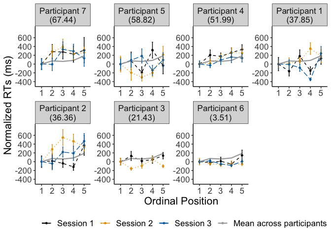<!-- -->

``` r
#plot_rt <- lemon::reposition_legend(plot_rt, "bott1.1.om right",panel='panel-5-5')

filename <- "CSI_online_aphasia_RT_effect_by_participant.pdf"
ggsave(plot_rt_subject, filename = 
         here::here("results", "figures", filename),
       width = 18, height = 13, units = "cm", 
       dpi = 300, device = cairo_pdf)
     #embedFonts(file = here::here("results", "figures", filename))
```

### RTs by category

Line graph for each category:

``` r
modeloutput <- coef(m1)$category
(means_final_category <- df_correct %>% 
   summarySEwithin(.,"VOT",withinvars = c("category","PosOr", "session")))
```

    ## Automatically converting the following non-factors to factors: category

    ##         category PosOr session N       VOT         sd        se         ci
    ## 1   Aufbewahrung     1       1 6 1470.0000  735.25810 300.16786  771.60606
    ## 2   Aufbewahrung     1       2 4 1067.2500  224.36000 112.18000  357.00683
    ## 3   Aufbewahrung     1       3 2 1337.0000  560.80801 396.55115 5038.66008
    ## 4   Aufbewahrung     2       1 5 1701.0000  788.99220 352.84804  979.66321
    ## 5   Aufbewahrung     2       2 5 1125.2000  168.72100  75.45432  209.49479
    ## 6   Aufbewahrung     2       3 2 1296.5000  779.60811 551.26618 7004.50095
    ## 7   Aufbewahrung     3       1 5 1291.0000  266.58659 119.22115  331.01098
    ## 8   Aufbewahrung     3       2 5 1249.6000  444.79531 198.91851  552.28632
    ## 9   Aufbewahrung     3       3 5 1204.4000  248.10540 110.95611  308.06354
    ## 10  Aufbewahrung     4       1 5 1367.0000  623.90204 279.01748  774.67671
    ## 11  Aufbewahrung     4       2 4 1114.0000  271.03269 135.51634  431.27349
    ## 12  Aufbewahrung     4       3 5 1423.4000  755.40015 337.82522  937.95317
    ## 13  Aufbewahrung     5       1 4 1318.5000  281.58703 140.79351  448.06780
    ## 14  Aufbewahrung     5       2 5 1140.4000  215.63386  96.43439  267.74480
    ## 15  Aufbewahrung     5       3 5 1499.4000  686.67758 307.09155  852.62283
    ## 16     Bauernhof     1       1 7 1352.8571  298.00587 112.63563  275.60946
    ## 17     Bauernhof     1       2 7 1275.8571  269.28716 101.78098  249.04909
    ## 18     Bauernhof     1       3 6 1175.0000  363.16713 148.26236  381.12053
    ## 19     Bauernhof     2       1 7 1636.1429  653.04244 246.82684  603.96353
    ## 20     Bauernhof     2       2 7 1318.1429  760.90917 287.59663  703.72361
    ## 21     Bauernhof     2       3 5 1250.0000  295.18475 132.01064  366.52028
    ## 22     Bauernhof     3       1 7 1493.7143  768.50491 290.46755  710.74850
    ## 23     Bauernhof     3       2 6 1013.0000  256.02829 104.52311  268.68521
    ## 24     Bauernhof     3       3 6 1196.8333  477.50427 194.94030  501.11000
    ## 25     Bauernhof     4       1 5 1324.6000  380.33092 170.08916  472.24321
    ## 26     Bauernhof     4       2 5 1353.4000  555.20813 248.29662  689.38195
    ## 27     Bauernhof     4       3 5 1715.6000 1089.78221 487.36542 1353.14333
    ## 28     Bauernhof     5       1 6 1205.6667  404.39651 165.09418  424.38811
    ## 29     Bauernhof     5       2 5 1338.0000  419.10071 187.42753  520.38226
    ## 30     Bauernhof     5       3 6 1495.5000  821.34024 335.31075  861.94372
    ## 31        Blumen     1       1 3 1585.0000  537.67559 310.42715 1335.66021
    ## 32        Blumen     1       2 4  934.7500  212.09717 106.04858  337.49393
    ## 33        Blumen     1       3 4 1491.2500   75.85667  37.92833  120.70489
    ## 34        Blumen     2       1 5 1219.0000  474.37177 212.14551  589.01035
    ## 35        Blumen     2       2 5 1248.4000  191.68559  85.72440  238.00909
    ## 36        Blumen     2       3 5 1540.8000  956.10799 427.58449 1187.16487
    ## 37        Blumen     3       1 3 1677.3333  651.91631 376.38406 1619.44989
    ## 38        Blumen     3       2 4 1429.0000  369.91093 184.95546  588.61083
    ## 39        Blumen     3       3 4 1361.0000  327.52401 163.76201  521.16379
    ## 40        Blumen     4       1 5 1370.0000  497.99688 222.71097  618.34480
    ## 41        Blumen     4       2 5 1105.8000  398.00782 177.99451  494.19199
    ## 42        Blumen     4       3 2 1564.0000  240.75091 170.23660 2163.06115
    ## 43        Blumen     5       1 4 1308.7500  387.81960 193.90980  617.10752
    ## 44        Blumen     5       2 5 1251.4000  333.08404 148.95971  413.57847
    ## 45        Blumen     5       3 1 1283.0000         NA        NA        NaN
    ## 46          Büro     1       1 5 1079.0000  236.57338 105.79883  293.74465
    ## 47          Büro     1       2 5 1455.8000  849.44100 379.88156 1054.72030
    ## 48          Büro     1       3 6 1302.6667  618.56634 252.52865  649.14556
    ## 49          Büro     2       1 7 1526.7143  831.15714 314.14787  768.69215
    ## 50          Büro     2       2 6 1150.6667  398.24518 162.58291  417.93268
    ## 51          Büro     2       3 5 1389.8000   65.19591  29.15650   80.95142
    ## 52          Büro     3       1 5 1106.6000  258.45280 115.58361  320.91154
    ## 53          Büro     3       2 6  992.8333  206.71348  84.39042  216.93249
    ## 54          Büro     3       3 5 1472.2000  740.83517 331.31156  919.86836
    ## 55          Büro     4       1 4 1413.0000  736.99488 368.49744 1172.72331
    ## 56          Büro     4       2 6 1127.5000  349.76352 142.79036  367.05430
    ## 57          Büro     4       3 4  907.2500  288.85409 144.42704  459.63132
    ## 58          Büro     5       1 6 1102.8333  301.03804 122.89826  315.92004
    ## 59          Büro     5       2 3 1745.0000 1294.82669 747.56854 3216.52781
    ## 60          Büro     5       3 5 1181.0000  375.26548 167.82382  465.95363
    ## 61        Fische     1       1 6 1650.8333  795.78771 324.87897  835.12798
    ## 62        Fische     1       2 5 1317.0000  476.70772 213.19017  591.91081
    ## 63        Fische     1       3 6 1427.3333  588.75184 240.35693  617.85716
    ## 64        Fische     2       1 5 1592.6000  657.08228 293.85613  815.87541
    ## 65        Fische     2       2 6 1159.5000  242.26294  98.90343  254.23936
    ## 66        Fische     2       3 6 1363.8333  319.50357 130.43678  335.29843
    ## 67        Fische     3       1 5 1477.8000  473.21320 211.62738  587.57179
    ## 68        Fische     3       2 5 1277.2000  372.97670 166.80025  463.11174
    ## 69        Fische     3       3 5 1392.4000  973.73254 435.46643 1209.04864
    ## 70        Fische     4       1 5 1488.8000  273.34456 122.24340  339.40210
    ## 71        Fische     4       2 7 1261.1429  343.17480 129.70788  317.38376
    ## 72        Fische     4       3 5 1331.2000  401.96083 179.76235  499.10030
    ## 73        Fische     5       1 6 2243.3333 1029.97372 420.48501 1080.89113
    ## 74        Fische     5       2 6 1509.0000  500.06582 204.15102  524.78690
    ## 75        Fische     5       3 4 1207.0000  201.17427 100.58713  320.11315
    ## 76       Gebäude     1       1 4 1524.2500  445.04280 222.52140  708.16240
    ## 77       Gebäude     1       2 5 1478.6000  459.12454 205.32674  570.07841
    ## 78       Gebäude     1       3 5 1512.2000  751.15946 335.92872  932.68766
    ## 79       Gebäude     2       1 6 1667.5000  745.98426 304.54680  782.86247
    ## 80       Gebäude     2       2 7 1211.4286  175.25296  66.23939  162.08196
    ## 81       Gebäude     2       3 4 1678.2500  412.32330 206.16165  656.09838
    ## 82       Gebäude     3       1 5 1407.2000  213.20640  95.34880  264.73071
    ## 83       Gebäude     3       2 7 1368.4286  249.09095  94.14753  230.37071
    ## 84       Gebäude     3       3 6 1367.8333  411.88179 168.15004  432.24343
    ## 85       Gebäude     4       1 5 1749.2000  899.29761 402.17812 1116.62546
    ## 86       Gebäude     4       2 4 1345.7500  284.28168 142.14084  452.35559
    ## 87       Gebäude     4       3 4 1240.0000  192.65453  96.32726  306.55634
    ## 88       Gebäude     5       1 4 1301.7500  359.49675 179.74837  572.03955
    ## 89       Gebäude     5       2 4 1140.0000  221.64038 110.82019  352.67930
    ## 90       Gebäude     5       3 4 1629.7500  917.51367 458.75684 1459.96900
    ## 91        Gemüse     1       1 6 1616.8333  850.30710 347.13642  892.34257
    ## 92        Gemüse     1       2 7 1126.0000  305.28876 115.38830  282.34501
    ## 93        Gemüse     1       3 4 1149.7500  185.62137  92.81068  295.36502
    ## 94        Gemüse     2       1 5 1070.4000  247.96693 110.89418  307.89161
    ## 95        Gemüse     2       2 6 1397.0000  856.79330 349.78440  899.14942
    ## 96        Gemüse     2       3 5 1201.2000  281.80097 126.02523  349.90212
    ## 97        Gemüse     3       1 7 1390.4286  579.02267 218.85000  535.50665
    ## 98        Gemüse     3       2 7 1132.2857  373.48724 141.16491  345.41809
    ## 99        Gemüse     3       3 5 1270.8000  421.36491 188.44012  523.19364
    ## 100       Gemüse     4       1 5 1375.8000  614.55048 274.83533  763.06520
    ## 101       Gemüse     4       2 7 1453.7143  591.73520 223.65488  547.26378
    ## 102       Gemüse     4       3 6 1073.1667  334.89297 136.71948  351.44862
    ## 103       Gemüse     5       1 5 1174.8000  515.75245 230.65151  640.39125
    ## 104       Gemüse     5       2 6 1160.1667  451.54550 184.34268  473.86794
    ## 105       Gemüse     5       3 6 1515.3333  705.15864 287.87981  740.01861
    ## 106   Heimwerker     1       1 5 1208.2000  381.84318 170.76546  474.12093
    ## 107   Heimwerker     1       2 5 1044.2000  394.57022 176.45717  489.92364
    ## 108   Heimwerker     1       3 4 1044.7500  316.97319 158.48660  504.37508
    ## 109   Heimwerker     2       1 4  979.0000  286.66753 143.33377  456.15201
    ## 110   Heimwerker     2       2 6 1473.8333  672.65758 274.61131  705.91084
    ## 111   Heimwerker     2       3 5 1307.0000  655.18081 293.00577  813.51442
    ## 112   Heimwerker     3       1 4 1239.0000  480.81060 240.40530  765.07695
    ## 113   Heimwerker     3       2 6 1541.1667  715.50306 292.10290  750.87442
    ## 114   Heimwerker     3       3 5 1246.4000  390.96534 174.84501  485.44758
    ## 115   Heimwerker     4       1 7 1241.8571  340.32514 128.63081  314.74826
    ## 116   Heimwerker     4       2 5 1619.8000  836.68139 374.17529 1038.87716
    ## 117   Heimwerker     4       3 4 1311.2500  557.28833 278.64416  886.77009
    ## 118   Heimwerker     5       1 6 1697.0000  796.14111 325.02325  835.49886
    ## 119   Heimwerker     5       2 6 1315.3333  268.02203 109.41954  281.27187
    ## 120   Heimwerker     5       3 4 1193.7500  377.78216 188.89108  601.13572
    ## 121     Huftiere     1       1 6 1183.8333  348.92170 142.44669  366.17086
    ## 122     Huftiere     1       2 7 1078.1429  352.41661 133.20096  325.93101
    ## 123     Huftiere     1       3 6 1061.6667  223.95533  91.42938  235.02670
    ## 124     Huftiere     2       1 7 1402.7143  692.73292 261.82843  640.67110
    ## 125     Huftiere     2       2 7 1128.8571  334.02205 126.24847  308.91887
    ## 126     Huftiere     2       3 5 1058.0000  203.76785  91.12775  253.01120
    ## 127     Huftiere     3       1 6 1474.5000  767.05219 313.14774  804.97190
    ## 128     Huftiere     3       2 6 1246.6667  439.52347 179.43471  461.25159
    ## 129     Huftiere     3       3 5 1036.8000  241.57671 108.03639  299.95711
    ## 130     Huftiere     4       1 6 1587.6667  861.70044 351.78773  904.29915
    ## 131     Huftiere     4       2 6 1311.0000  550.67226 224.81101  577.89509
    ## 132     Huftiere     4       3 5 1082.6000  138.21855  61.81321  171.62100
    ## 133     Huftiere     5       1 4 1675.7500  179.54888  89.77444  285.70233
    ## 134     Huftiere     5       2 6  992.8333  296.08188 120.87492  310.71888
    ## 135     Huftiere     5       3 5 1323.2000  662.97370 296.49085  823.19058
    ## 136     Insekten     1       1 6 1103.5000  296.85465 121.19040  311.52985
    ## 137     Insekten     1       2 3 1054.3333  326.65844 188.59634  811.46456
    ## 138     Insekten     1       3 4 1226.5000  207.43157 103.71578  330.06991
    ## 139     Insekten     2       1 4 1337.2500  538.91341 269.45670  857.53149
    ## 140     Insekten     2       2 5 1352.2000  317.45652 141.97087  394.17433
    ## 141     Insekten     2       3 4 1090.5000  304.89543 152.44772  485.15667
    ## 142     Insekten     3       1 4 1572.2500  701.90558 350.95279 1116.88842
    ## 143     Insekten     3       2 7 1490.5714  394.48857 149.10267  364.84108
    ## 144     Insekten     3       3 6 1946.8333  923.87680 377.17112  969.54924
    ## 145     Insekten     4       1 4 1546.2500  562.52874 281.26437  895.10875
    ## 146     Insekten     4       2 6 1300.6667  464.16067 189.49280  487.10675
    ## 147     Insekten     4       3 5 1214.2000  315.53727 141.11256  391.79126
    ## 148     Insekten     5       1 6 1534.3333  367.40608 149.99291  385.56904
    ## 149     Insekten     5       2 5 1343.6000  457.55420 204.62446  568.12857
    ## 150     Insekten     5       3 4 1548.0000  561.16612 280.58306  892.94052
    ## 151  Instrumente     1       1 7 1682.8571  660.78971 249.75503  611.12855
    ## 152  Instrumente     1       2 5  944.8000  170.04564  76.04672  211.13955
    ## 153  Instrumente     1       3 5 1050.4000  192.53902  86.10607  239.06877
    ## 154  Instrumente     2       1 7 1417.8571  817.58461 309.01794  756.13965
    ## 155  Instrumente     2       2 7 1303.1429  688.72570 260.31385  636.96504
    ## 156  Instrumente     2       3 6 1092.0000  319.60372 130.47767  335.40354
    ## 157  Instrumente     3       1 5 1204.6000  388.56492 173.77151  482.46707
    ## 158  Instrumente     3       2 6 1639.0000  887.20216 362.19876  931.06156
    ## 159  Instrumente     3       3 5 1215.6000  361.24617 161.55420  448.54637
    ## 160  Instrumente     4       1 2  911.0000  160.02855 113.15727 1437.79947
    ## 161  Instrumente     4       2 5 1375.6000  805.34148 360.15966  999.96352
    ## 162  Instrumente     4       3 4 1271.0000  887.57326 443.78663 1412.32712
    ## 163  Instrumente     5       1 5 1600.2000  708.06947 316.65829  879.18437
    ## 164  Instrumente     5       2 7 1507.8571  598.13063 226.07213  553.17857
    ## 165  Instrumente     5       3 4 1029.2500  230.07380 115.03690  366.09876
    ## 166       Jacken     1       1 5 1441.2000  517.09568 231.25222  642.05909
    ## 167       Jacken     1       2 6 1618.1667  856.95302 349.84961  899.31704
    ## 168       Jacken     1       3 4 1517.0000  316.63939 158.31969  503.84392
    ## 169       Jacken     2       1 2 1198.0000  219.50819 155.21573 1972.20281
    ## 170       Jacken     2       2 5 1392.0000  321.65883 143.85020  399.39219
    ## 171       Jacken     2       3 4 1050.2500  290.30505 145.15252  461.94011
    ## 172       Jacken     3       1 3 1502.3333  807.33566 466.11546 2005.53295
    ## 173       Jacken     3       2 6 1453.3333  569.41559 232.46294  597.56502
    ## 174       Jacken     3       3 3 1562.3333  857.15939 494.88121 2129.30198
    ## 175       Jacken     4       1 6 1725.6667  667.65808 272.57027  700.66418
    ## 176       Jacken     4       2 3 1183.0000  194.55628 112.32712  483.30458
    ## 177       Jacken     4       3 3 1805.3333 1044.32697 602.94246 2594.25202
    ## 178       Jacken     5       1 3 2251.3333 1020.82664 589.37453 2535.87394
    ## 179       Jacken     5       2 3 1632.6667  936.11245 540.46477 2325.43224
    ## 180       Jacken     5       3 4 2014.7500  338.68799 169.34399  538.92817
    ## 181       Kochen     1       1 5 1242.6000  527.51899 235.91367  655.00134
    ## 182       Kochen     1       2 6 1145.0000  369.55400 150.86979  387.82314
    ## 183       Kochen     1       3 5 1465.2000  527.97256 236.11650  655.56451
    ## 184       Kochen     2       1 5 1269.8000  572.18233 255.88772  710.45821
    ## 185       Kochen     2       2 6 1471.5000  804.19399 328.31082  843.94983
    ## 186       Kochen     2       3 2  979.0000  474.42092 335.46625 4262.50285
    ## 187       Kochen     3       1 5 1597.4000  628.69487 281.16089  780.62778
    ## 188       Kochen     3       2 6 1269.1667  430.96320 175.93999  452.26814
    ## 189       Kochen     3       3 5 1215.2000  364.19175 162.87150  452.20379
    ## 190       Kochen     4       1 4 1057.2500  468.58814 234.29407  745.62830
    ## 191       Kochen     4       2 6 1707.8333  554.12480 226.22050  581.51832
    ## 192       Kochen     4       3 4 1002.5000  359.99118 179.99559  572.82630
    ## 193       Kochen     5       1 5 1323.4000  202.09962  90.38170  250.93982
    ## 194       Kochen     5       2 6 1529.8333  835.56707 341.11883  876.87387
    ## 195       Kochen     5       3 6 1899.5000  957.32819 390.82760 1004.65433
    ## 196  Körperteile     1       1 6 1201.3333  429.50237 175.34361  450.73510
    ## 197  Körperteile     1       2 7 1204.1429  491.25469 185.67682  454.33481
    ## 198  Körperteile     1       3 5 1136.8000  355.64736 159.05034  441.59453
    ## 199  Körperteile     2       1 7 1093.7143  143.27803  54.15401  132.51008
    ## 200  Körperteile     2       2 6  969.5000  210.90628  86.10213  221.33257
    ## 201  Körperteile     2       3 6 1162.8333  448.98925 183.29909  471.18532
    ## 202  Körperteile     3       1 5 1323.2000  847.77216 379.13524 1052.64817
    ## 203  Körperteile     3       2 6 1044.5000  295.85442 120.78206  310.48017
    ## 204  Körperteile     3       3 5 1128.2000  284.08693 127.04754  352.74051
    ## 205  Körperteile     4       1 5 1357.0000  703.73124 314.71818  873.79775
    ## 206  Körperteile     4       2 5 1766.8000 1057.42905 472.89665 1312.97158
    ## 207  Körperteile     4       3 4  902.2500  293.15007 146.57504  466.46718
    ## 208  Körperteile     5       1 3 1215.3333  684.67840 395.29926 1700.83544
    ## 209  Körperteile     5       2 6 1704.3333  912.85959 372.67337  957.98738
    ## 210  Körperteile     5       3 6 1332.0000  804.33519 328.36847  844.09801
    ## 211        Küche     1       1 4 1438.7500  366.44954 183.22477  583.10299
    ## 212        Küche     1       2 4 1620.2500  599.57610 299.78805  954.05938
    ## 213        Küche     1       3 5 1462.4000  401.54912 179.57822  498.58908
    ## 214        Küche     2       1 5 2109.6000  925.60177 413.94169 1149.28639
    ## 215        Küche     2       2 6 1831.1667  899.03869 367.03101  943.48324
    ## 216        Küche     2       3 4 1547.0000  843.92438 421.96219 1342.87201
    ## 217        Küche     3       1 3 1523.0000  458.65384 264.80392 1139.35929
    ## 218        Küche     3       2 2 1460.0000  883.69747 624.86848 7939.70679
    ## 219        Küche     3       3 4 1685.5000 1090.19775 545.09888 1734.74791
    ## 220        Küche     4       1 6 2212.5000  986.75437 402.84078 1035.53520
    ## 221        Küche     4       2 5 1360.4000  487.68119 218.09766  605.53618
    ## 222        Küche     4       3 2 1063.0000  463.09146 327.45512 4160.71173
    ## 223        Küche     5       1 6 1769.8333  611.18393 249.51479  641.39820
    ## 224        Küche     5       2 5 1591.6000  738.58588 330.30565  917.07550
    ## 225        Küche     5       3 3 1374.6667  411.39697 237.52015 1021.96672
    ## 226         Obst     1       1 6 1417.8333  670.30489 273.65083  703.44184
    ## 227         Obst     1       2 7  968.7143  223.08626  84.31868  206.32038
    ## 228         Obst     1       3 4  955.2500  230.87004 115.43502  367.36575
    ## 229         Obst     2       1 7 1339.4286  800.74948 302.65486  740.56975
    ## 230         Obst     2       2 6 1104.1667  378.32599 154.45094  397.02877
    ## 231         Obst     2       3 6 1086.8333  311.90255 127.33368  327.32165
    ## 232         Obst     3       1 7 1558.4286  602.59213 227.75842  557.30477
    ## 233         Obst     3       2 7 1664.7143  898.85363 339.73474  831.30096
    ## 234         Obst     3       3 4 1166.5000  593.25935 296.62968  944.00801
    ## 235         Obst     4       1 5 1027.2000  304.21996 136.05130  377.73897
    ## 236         Obst     4       2 6 1267.0000  614.12543 250.71566  644.48511
    ## 237         Obst     4       3 6 1118.1667  442.48892 180.64535  464.36364
    ## 238         Obst     5       1 6 1443.3333  845.63055 345.22723  887.43484
    ## 239         Obst     5       2 6 1387.5000  260.80807 106.47445  273.70128
    ## 240         Obst     5       3 4 1241.7500  436.51829 218.25914  694.59801
    ## 241    Raubtiere     1       1 4 1513.7500  461.40252 230.70126  734.19437
    ## 242    Raubtiere     1       2 4 1383.2500  600.17957 300.08978  955.01963
    ## 243    Raubtiere     1       3 4 1353.7500  232.91259 116.45629  370.61590
    ## 244    Raubtiere     2       1 6 1824.5000  410.61496 167.63286  430.91397
    ## 245    Raubtiere     2       2 3 1981.6667 1245.32132 718.98660 3093.54965
    ## 246    Raubtiere     2       3 4 1182.5000  203.78671 101.89336  324.27014
    ## 247    Raubtiere     3       1 6 1794.8333  772.65808 315.43634  810.85492
    ## 248    Raubtiere     3       2 3 1206.6667  318.56590 183.92411  791.36157
    ## 249    Raubtiere     3       3 5 2076.6000  881.84548 394.37329 1094.95578
    ## 250    Raubtiere     4       1 4 1220.5000  357.26959 178.63479  568.49564
    ## 251    Raubtiere     4       2 7 1661.5714  520.90114 196.88213  481.75321
    ## 252    Raubtiere     4       3 4 1469.7500  760.13987 380.06993 1209.55216
    ## 253    Raubtiere     5       1 5 1883.8000  605.38975 270.73853  751.69065
    ## 254    Raubtiere     5       2 5 1532.2000  738.09042 330.08407  916.46030
    ## 255    Raubtiere     5       3 4 1638.5000  662.58017 331.29008 1054.31290
    ## 256      Schmuck     1       1 4 1250.5000  238.67391 119.33696  379.78346
    ## 257      Schmuck     1       2 4 1727.2500  193.88486  96.94243  308.51407
    ## 258      Schmuck     1       3 3 1433.6667  294.01097 169.74731  730.36374
    ## 259      Schmuck     2       1 1 1227.0000         NA        NA        NaN
    ## 260      Schmuck     2       2 5 1668.4000  797.31026 356.56799  989.99144
    ## 261      Schmuck     2       3 5 1519.6000 1039.25572 464.76929 1290.40641
    ## 262      Schmuck     3       1 5 1759.6000  732.93383 327.77797  910.05755
    ## 263      Schmuck     3       2 4 1234.0000  235.15158 117.57579  374.17864
    ## 264      Schmuck     3       3 6 1642.3333  951.40835 388.41083  998.44183
    ## 265      Schmuck     4       1 6 1868.6667  754.57902 308.05560  791.88212
    ## 266      Schmuck     4       2 6 1368.0000  309.49195 126.34956  324.79189
    ## 267      Schmuck     4       3 4 1747.2500  723.11183 361.55592 1150.63229
    ## 268      Schmuck     5       1 3 1908.0000 1106.29050 638.71712 2748.17794
    ## 269      Schmuck     5       2 3 1463.6667  836.68207 483.05862 2078.43347
    ## 270      Schmuck     5       3 2 1535.0000  876.61656 619.86152 7876.08735
    ## 271       Sitzen     1       1 5 1745.2000  815.51401 364.70895 1012.59438
    ## 272       Sitzen     1       2 4 1129.2500  363.81854 181.90927  578.91648
    ## 273       Sitzen     1       3 4 1243.0000  467.97257 233.98629  744.64879
    ## 274       Sitzen     2       1 5 1324.2000  610.75804 273.13930  758.35627
    ## 275       Sitzen     2       2 6 1198.5000  329.28878 134.43158  345.56738
    ## 276       Sitzen     2       3 4 1267.5000  463.07378 231.53689  736.85372
    ## 277       Sitzen     3       1 6 1347.6667  486.54892 198.63276  510.60178
    ## 278       Sitzen     3       2 6 1693.6667  926.13738 378.09400  971.92158
    ## 279       Sitzen     3       3 6 1367.8333  331.96004 135.52212  348.37070
    ## 280       Sitzen     4       1 4 1788.2500  917.79342 458.89671 1460.41414
    ## 281       Sitzen     4       2 5 1462.6000  440.03256 196.78855  546.37259
    ## 282       Sitzen     4       3 4 1802.7500 1084.36209 542.18104 1725.46206
    ## 283       Sitzen     5       1 3 1252.0000  103.20167  59.58351  256.36716
    ## 284       Sitzen     5       2 4 1547.0000 1032.73809 516.36905 1643.31676
    ## 285       Sitzen     5       3 3 2213.6667  615.18419 355.17676 1528.20225
    ## 286      Strasse     1       1 5 1354.2000  910.93095 407.38070 1131.07016
    ## 287      Strasse     1       2 6 1339.0000  583.40642 238.17467  612.24749
    ## 288      Strasse     1       3 5 1031.2000  201.78902  90.24279  250.55416
    ## 289      Strasse     2       1 6 1440.3333  394.07008 160.87844  413.55119
    ## 290      Strasse     2       2 5 1084.4000  297.16510 132.89627  368.97921
    ## 291      Strasse     2       3 6 1506.6667  844.12224 344.61146  885.85196
    ## 292      Strasse     3       1 6 1243.5000  400.22900 163.39281  420.01458
    ## 293      Strasse     3       2 6 1171.0000  300.80116 122.80156  315.67146
    ## 294      Strasse     3       3 4 1382.7500  322.93126 161.46563  513.85569
    ## 295      Strasse     4       1 5 1588.4000  509.75003 227.96714  632.93826
    ## 296      Strasse     4       2 7 1487.5714  576.86334 218.03385  533.50961
    ## 297      Strasse     4       3 6 1338.6667  503.46516 205.53879  528.35429
    ## 298      Strasse     5       1 6 1445.5000  337.43114 137.75569  354.11227
    ## 299      Strasse     5       2 7 1171.4286  273.53267 103.38563  252.97552
    ## 300      Strasse     5       3 6 1439.1667  683.74205 279.13652  717.54327
    ## 301 Süssigkeiten     1       1 6 1539.8333  507.69020 207.26366  532.78819
    ## 302 Süssigkeiten     1       2 6 1207.5000  492.98254 201.25928  517.35345
    ## 303 Süssigkeiten     1       3 6 1506.1667  585.99251 239.23044  614.96142
    ## 304 Süssigkeiten     2       1 5 1603.8000  916.92946 410.06332 1138.51831
    ## 305 Süssigkeiten     2       2 6 1169.8333  201.71463  82.34965  211.68652
    ## 306 Süssigkeiten     2       3 5 1094.2000  446.42895 199.64910  554.31476
    ## 307 Süssigkeiten     3       1 5 1258.4000  550.16140 246.03966  683.11561
    ## 308 Süssigkeiten     3       2 6 1211.3333  376.95274 153.89031  395.58764
    ## 309 Süssigkeiten     3       3 5 1064.4000  274.70606 122.85229  341.09263
    ## 310 Süssigkeiten     4       1 6 1006.0000  170.44736  69.58484  178.87353
    ## 311 Süssigkeiten     4       2 6 1279.3333  360.24708 147.07026  378.05613
    ## 312 Süssigkeiten     4       3 5 1187.8000  438.52352 196.11368  544.49886
    ## 313 Süssigkeiten     5       1 3 1305.6667  535.50809 309.17574 1330.27584
    ## 314 Süssigkeiten     5       2 5 1132.8000  387.45995 173.27736  481.09507
    ## 315 Süssigkeiten     5       3 6 1514.3333  440.70326 179.91635  462.48971
    ## 316 Trinkgefässe     1       1 6 1419.3333  462.59214 188.85245  485.46068
    ## 317 Trinkgefässe     1       2 4 1030.7500  263.81859 131.90930  419.79426
    ## 318 Trinkgefässe     1       3 5 1393.2000  552.35785 247.02194  685.84286
    ## 319 Trinkgefässe     2       1 4 1606.0000  372.23858 186.11929  592.31465
    ## 320 Trinkgefässe     2       2 5 1030.8000  114.19248  51.06843  141.78869
    ## 321 Trinkgefässe     2       3 4 1198.2500  236.49866 118.24933  376.32214
    ## 322 Trinkgefässe     3       1 4 1063.0000  300.03342 150.01671  477.42013
    ## 323 Trinkgefässe     3       2 4 1437.0000  715.65635 357.82817 1138.76895
    ## 324 Trinkgefässe     3       3 5 1266.8000  462.83068 206.98417  574.68019
    ## 325 Trinkgefässe     4       1 5 1219.4000  163.77670  73.24317  203.35563
    ## 326 Trinkgefässe     4       2 5 1441.6000  720.55918 322.24386  894.69240
    ## 327 Trinkgefässe     4       3 4 1067.2500  319.41036 159.70518  508.25317
    ## 328 Trinkgefässe     5       1 4 1876.7500 1038.41910 519.20955 1652.35652
    ## 329 Trinkgefässe     5       2 5 1622.4000  764.72135 341.99378  949.52697
    ## 330 Trinkgefässe     5       3 3 1384.0000  710.87603 410.42447 1765.91396
    ## 331        Vögel     1       1 7 1225.2857  306.76915 115.94784  283.71415
    ## 332        Vögel     1       2 4 1058.5000  234.34208 117.17104  372.89055
    ## 333        Vögel     1       3 5 1550.6000 1081.92160 483.85005 1343.38309
    ## 334        Vögel     2       1 6  996.1667  223.17015  91.10883  234.20270
    ## 335        Vögel     2       2 6 1081.1667  233.21589  95.20999  244.74506
    ## 336        Vögel     2       3 6 1541.5000  634.95528 259.21941  666.34470
    ## 337        Vögel     3       1 7 1673.7143  638.10288 241.18022  590.14673
    ## 338        Vögel     3       2 6 1252.8333  343.19110 140.10718  360.15698
    ## 339        Vögel     3       3 5 1607.0000  753.11920 336.80514  935.12099
    ## 340        Vögel     4       1 4 1403.2500  881.76831 440.88415 1403.09015
    ## 341        Vögel     4       2 5 1492.6000  925.93349 414.09005 1149.69828
    ## 342        Vögel     4       3 6 1370.1667  747.44662 305.14380  784.39712
    ## 343        Vögel     5       1 5 1308.6000  378.65694 169.34053  470.16469
    ## 344        Vögel     5       2 7 1188.2857  279.22837 105.53840  258.24317
    ## 345        Vögel     5       3 5 1021.6000  216.45542  96.80180  268.76490
    ## 346       Wasser     1       1 5 1695.2000  366.03877 163.69751  454.49716
    ## 347       Wasser     1       2 6 1604.5000  252.72935 103.17632  265.22318
    ## 348       Wasser     1       3 4 1587.0000  606.21682 303.10841  964.62624
    ## 349       Wasser     2       1 6 2199.8333  762.94000 311.46895  800.65643
    ## 350       Wasser     2       2 4 1096.0000  149.84337  74.92169  238.43424
    ## 351       Wasser     2       3 5 1626.2000  442.67203 197.96895  549.64993
    ## 352       Wasser     3       1 5 1630.6000  435.58966 194.80162  540.85600
    ## 353       Wasser     3       2 5 1471.6000  370.06921 165.49998  459.50161
    ## 354       Wasser     3       3 6 1743.8333  573.16343 233.99299  601.49813
    ## 355       Wasser     4       1 5 1888.2000  519.05209 232.12715  644.48830
    ## 356       Wasser     4       2 7 1490.5714  348.41760 131.68948  322.23254
    ## 357       Wasser     4       3 3 1453.3333  619.04023 357.40304 1537.78118
    ## 358       Wasser     5       1 5 2074.0000 1029.27611 460.30627 1278.01509
    ## 359       Wasser     5       2 2 1463.0000  882.28129 623.86708 7926.98291
    ## 360       Wasser     5       3 6 1586.3333  811.31022 331.21601  851.41786

``` r
(means_final<- df_correct %>%  
   Rmisc::summarySEwithin(.,"VOT",idvar = "category",
                          withinvars = c("PosOr", "session"), na.rm = T))
```

    ##    PosOr session   N      VOT       sd       se        ci
    ## 1      1       1 129 1414.134 550.7775 48.49325  95.95219
    ## 2      1       2 125 1243.690 445.9805 39.88970  78.95290
    ## 3      1       3 111 1305.888 477.3847 45.31135  89.79647
    ## 4      2       1 127 1475.067 645.4744 57.27659 113.34869
    ## 5      2       2 136 1278.255 526.3839 45.13705  89.26720
    ## 6      2       3 113 1299.641 527.6483 49.63697  98.34930
    ## 7      3       1 123 1446.660 571.5794 51.53758 102.02379
    ## 8      3       2 132 1339.197 530.1996 46.14795  91.29166
    ## 9      3       3 120 1394.263 600.2295 54.79321 108.49603
    ## 10     4       1 118 1457.088 621.5950 57.22246 113.32609
    ## 11     4       2 133 1387.451 567.7303 49.22846  97.37876
    ## 12     4       3 104 1307.883 592.8443 58.13317 115.29343
    ## 13     5       1 113 1542.147 651.0900 61.24940 121.35783
    ## 14     5       2 122 1383.618 585.3367 52.99390 104.91540
    ## 15     5       3 106 1466.920 638.7406 62.03997 123.01381

``` r
(means_grand<- df_correct %>%  
   Rmisc::summarySEwithin(.,"VOT",idvar = "subject",
                          withinvars = c("PosOr", "session"),
                          na.rm = T))
```

    ##    PosOr session   N      VOT       sd       se        ci
    ## 1      1       1 129 1410.563 452.7834 39.86535  78.88041
    ## 2      1       2 125 1264.454 425.2607 38.03648  75.28484
    ## 3      1       3 111 1254.408 418.6117 39.73286  78.74121
    ## 4      2       1 127 1482.643 559.7995 49.67417  98.30373
    ## 5      2       2 136 1275.384 465.6785 39.93160  78.97242
    ## 6      2       3 113 1264.434 466.3525 43.87076  86.92428
    ## 7      3       1 123 1471.436 457.3364 41.23663  81.63204
    ## 8      3       2 132 1339.762 441.5868 38.43520  76.03399
    ## 9      3       3 120 1355.484 517.4882 47.23999  93.53991
    ## 10     4       1 118 1494.650 494.3876 45.51207  90.13427
    ## 11     4       2 133 1414.373 481.2927 41.73337  82.55273
    ## 12     4       3 104 1265.547 504.6910 49.48902  98.14981
    ## 13     5       1 113 1598.187 598.9889 56.34814 111.64661
    ## 14     5       2 122 1400.989 466.8759 42.26896  83.68256
    ## 15     5       3 106 1433.482 582.1221 56.54069 112.10975

``` r
for(i in 1:nrow(means_final_category)) {
  means_final_category$grandmean[i] <- means_grand$VOT[
    means_grand$PosOr == means_final_category$PosOr[i]] - means_grand$VOT[means_grand$PosOr== 1]
  means_final_category$normalizedRT[i] <- means_final_category$VOT[i] -
    means_final_category$VOT[
      means_final_category$category == means_final_category$category[i] & means_final_category$PosOr == 1 &
        means_final_category$session ==
        means_final_category$session[i]]
  # prepare for ordering
  means_final_category$effect[i] <- modeloutput$PosOr.cont[means_final_category$category[i]] 
}

#means_final_category$order <-order(means_final_category$effect)-1
#means_final_category$order <- means_final_category$order %/% 5
means_final_category <- means_final_category[
  order(desc(means_final_category$effect)),] 
means_final_category$effect <- as.factor(
  round(means_final_category$effect, 2))
means_final_category$effect <- factor(
  means_final_category$effect, levels=rev(levels(means_final_category$effect )))


# order category levels by effect size
means_final_category$category <- factor(
  means_final_category$category, levels=c( "Sitzen", "Heimwerker", "Kochen", "Obst", "Körperteile", "Schmuck", "Instrumente", "Jacken", "Raubtiere", "Trinkgefässe", "Insekten", "Huftiere", "Küche", "Fische", "Strasse",
                                           "Bauernhof", "Wasser", "Aufbewahrung", "Süssigkeiten", "Gebäude",
                                           "Blumen", "Gemüse", "Vögel", "Büro"))
# give categories English names and combine with effect size
means_final_category <- means_final_category %>% 
  mutate(category_en = case_when(
    category == "Aufbewahrung" ~ paste0(
      "Storage\n\n(", effect, ")", sep=''), 
    category == "Bauernhof" ~ paste0(
      "Farming\ntools\n(", effect, ")", sep=''), 
    category == "Blumen" ~ paste0(
      "Flowers\n\n(", effect, ")", sep=''),
    category == "Büro" ~ paste0(
      "Office\ntools\n(", effect, ")", sep=''),
    category == "Fische" ~ paste0(
      "Fish\n\n(", effect, ")", sep=''),
    category == "Gebäude" ~ paste0(
      "Buildings\n\n(", effect, ")", sep=''),
    category == "Gemüse" ~ paste0(
      "Vegetables\n\n(", effect, ")", sep=''),
    category == "Heimwerker" ~ paste0(
      "Carpenter.s\ntools\n(", effect, ")", sep=''),
    category == "Huftiere" ~ paste0(
      "Hoofed\nanimals\n(", effect, ")", sep=''),
    category == "Insekten" ~ paste0(
      "Insects\n\n(", effect, ")", sep=''),
    category == "Instrumente" ~ paste0(
      "Instruments\n\n(", effect, ")", sep=''),
    category == "Jacken" ~ paste0(
      "Jackets\n\n(", effect, ")", sep=''),
    category == "Kochen" ~ paste0(
      "Cooking\nequipment\n(", effect, ")", sep=''),
    category == "Körperteile" ~ paste0(
      "Body parts\n\n(", effect, ")", sep=''),
    category == "Küche" ~ paste0(
      "Kitchen\nfurniture\n(", effect, ")", sep=''),
    category == "Obst" ~ paste0(
      "Fruits\n\n(", effect, ")", sep=''),
    category == "Raubtiere" ~ paste0(
      "Predators\n\n(", effect, ")", sep=''),
    category == "Schmuck" ~ paste0(
      "Jewelry\n\n(", effect, ")", sep=''),
    category == "Sitzen" ~ paste0(
      "Seating\nfurniture\n(", effect, ")", sep=''),
    category == "Strasse" ~ paste0(
      "Street\nvehicles\n(", effect, ")", sep=''),
    category == "Süssigkeiten" ~ paste0(
      "Sweets\n\n(", effect, ")", sep=''),
    category == "Trinkgefässe" ~ paste0(
      "Drinking\nvessels\n(", effect, ")", sep=''),
    category == "Vögel" ~ paste0(
      "Birds\n\n(", effect, ")", sep=''),
    category == "Wasser" ~ paste0(
      "Water\nvehicles\n(", effect, ")", sep=''))) %>%
  # mutate(category_en = case_when(category_en=="Instruments\n\n(18.3)" ~
  #                                   "Instruments\n\n(18.30)",
  #                                 category_en=="Body parts\n\n(35.4)" ~
  #                                   "Body parts\n\n(35.40)",
  #                                 TRUE~category_en)) %>%
  mutate(category_en=factor(category_en,levels=c(
    "Seating\nfurniture\n(57.08)", "Carpenter.s\ntools\n(55.71)", "Cooking\nequipment\n(55.56)", 
    "Fruits\n\n(55.43)", "Body parts\n\n(50.43)", "Jewelry\n\n(50.16)", "Instruments\n\n(49.02)",
    "Jackets\n\n(47.56)", "Predators\n\n(46.9)", "Drinking\nvessels\n(46.22)", "Insects\n\n(45.87)",
    "Hoofed\nanimals\n(43.77)", "Kitchen\nfurniture\n(40.27)", "Fish\n\n(38.34)",
    "Street\nvehicles\n(36.67)", "Farming\ntools\n(35.89)", "Water\nvehicles\n(35.71)",
    "Storage\n\n(34.04)", "Sweets\n\n(31.56)","Buildings\n\n(25.92)",
    "Flowers\n\n(25.32)","Vegetables\n\n(25.26)","Birds\n\n(23.41)","Office\ntools\n(18.11)")))    


# Plotting
(plot_rt_category <- means_final_category %>% 
    ggplot(., aes(x=PosOr,y=normalizedRT, 
                  group=session, color = session, na.rm=T)) +
    geom_point(size =1) +
    geom_line(aes(x=PosOr,y=normalizedRT,
                  color=session, linetype=session),
              size = 0.5) +
    geom_line(aes(x=PosOr,y=grandmean, color="b", linetype="d"), 
              group = 1,size = 0.8)+
    geom_errorbar(aes(ymin=normalizedRT-se, ymax=normalizedRT+se,
                       group=session, color=session), width =.1) +
    scale_color_manual(name="",
                       values=c("1"="#000000", "2"="#E69F00",
                                "3"="#0072B2", "b"="dark gray"),
                       labels=c("Session 1", "Session 2", 
                                "Session 3",  
                                "Mean across participants"))+
    scale_linetype_manual(name="",
                          values=c("1"="dashed", "2"="dotted", 
                                   "3" = "longdash","d"="solid"),
                          labels=c("Session 1", "Session 2", 
                                "Session 3", 
                                   "Mean across participants"))+
    apatheme+
    labs(x="Ordinal Position",y ="Normalized RTs (ms)") +
    facet_wrap(means_final_category$category_en, scales='free', ncol=6)+
    scale_y_continuous(limits = c(-800, 1000), 
                        breaks = c(-800,-400, 0,400,800)) + 
    scale_x_discrete(breaks=c(1,2,3,4,5))+
    theme(legend.position = "bottom"))
```

<!-- -->

``` r
#plot_rt <- lemon::reposition_legend(plot_rt, "bott1.1.om right",panel='panel-5-5')

filename <- "CSI_online_aphasia_RT_effect_by_category.pdf"
ggsave(plot_rt_category, filename = 
         here::here("results", "figures", filename),
       width = 26, height = 21.5, units = "cm", 
       dpi = 300, device = cairo_pdf)
      #embedFonts(file = here::here("results", "figures", filename))
```

Make plot grid

``` r
# filename <- "CSI_online_typing_effects_by_subject_and_category.pdf"
# cowplot::plot_grid(plot_rt_subject, plot_rt_category,
#           nrow = 2, rel_heights = c(1.1, 0.9), labels = c("A", "B"),
#           label_fontfamily = "Helvetica", label_size=22) %>%
#   ggsave(filename = here::here("results", "figures",filename),
#          width = 26, height = 42, units = "cm", 
#          dpi = 300, device = cairo_pdf)
# embedFonts(file = here::here("results", "figures", filename))
```

### Errors by subject

Amount of errors by subject (across categories):

``` r
modeloutput <- coef(m1_error)$subject
(means_final_subject <- df %>% 
   summarySEwithin(.,"errors",withinvars = c("subject","PosOr", "session"), na.rm=T))
```

    ## Warning in qt(conf.interval/2 + 0.5, datac$N - 1): NaNs wurden erzeugt

    ##     subject PosOr session  N     errors        sd         se         ci
    ## 1         1     1       1 24 0.45833333 0.5114185 0.10439287 0.21595311
    ## 2         1     1       2 24 0.41666667 0.5060256 0.10329204 0.21367586
    ## 3         1     1       3 24 0.37500000 0.4969072 0.10143077 0.20982553
    ## 4         1     2       1 24 0.29166667 0.4665325 0.09523055 0.19699941
    ## 5         1     2       2 24 0.41666667 0.5060256 0.10329204 0.21367586
    ## 6         1     2       3 24 0.16666667 0.3825194 0.07808144 0.16152376
    ## 7         1     3       1 24 0.37500000 0.4969072 0.10143077 0.20982553
    ## 8         1     3       2 24 0.29166667 0.4665325 0.09523055 0.19699941
    ## 9         1     3       3 24 0.12500000 0.3394523 0.06929040 0.14333812
    ## 10        1     4       1 24 0.62500000 0.4969072 0.10143077 0.20982553
    ## 11        1     4       2 24 0.25000000 0.4444473 0.09072243 0.18767366
    ## 12        1     4       3 24 0.50000000 0.5132036 0.10475724 0.21670687
    ## 13        1     5       1 24 0.33333333 0.4838530 0.09876608 0.20431320
    ## 14        1     5       2 24 0.33333333 0.4838530 0.09876608 0.20431320
    ## 15        1     5       3 24 0.29166667 0.4665325 0.09523055 0.19699941
    ## 16        2     1       1 24 0.12500000 0.3394523 0.06929040 0.14333812
    ## 17        2     1       2 24 0.29166667 0.4665325 0.09523055 0.19699941
    ## 18        2     1       3 24 0.25000000 0.4444473 0.09072243 0.18767366
    ## 19        2     2       1 24 0.33333333 0.4838530 0.09876608 0.20431320
    ## 20        2     2       2 24 0.16666667 0.3825194 0.07808144 0.16152376
    ## 21        2     2       3 24 0.41666667 0.5060256 0.10329204 0.21367586
    ## 22        2     3       1 24 0.41666667 0.5060256 0.10329204 0.21367586
    ## 23        2     3       2 24 0.29166667 0.4665325 0.09523055 0.19699941
    ## 24        2     3       3 24 0.29166667 0.4665325 0.09523055 0.19699941
    ## 25        2     4       1 24 0.45833333 0.5114185 0.10439287 0.21595311
    ## 26        2     4       2 24 0.29166667 0.4665325 0.09523055 0.19699941
    ## 27        2     4       3 24 0.25000000 0.4444473 0.09072243 0.18767366
    ## 28        2     5       1 24 0.41666667 0.5060256 0.10329204 0.21367586
    ## 29        2     5       2 24 0.29166667 0.4665325 0.09523055 0.19699941
    ## 30        2     5       3 24 0.29166667 0.4665325 0.09523055 0.19699941
    ## 31        3     1       1 24 0.20833333 0.4168408 0.08508728 0.17601644
    ## 32        3     1       2 24 0.08333333 0.2836840 0.05790675 0.11978923
    ## 33        3     1       3  0        NaN        NA         NA        NaN
    ## 34        3     2       1 24 0.08333333 0.2836840 0.05790675 0.11978923
    ## 35        3     2       2 24 0.04166667 0.2051032 0.04186651 0.08660747
    ## 36        3     2       3  0        NaN        NA         NA        NaN
    ## 37        3     3       1 24 0.04166667 0.2051032 0.04186651 0.08660747
    ## 38        3     3       2 24 0.08333333 0.2836840 0.05790675 0.11978923
    ## 39        3     3       3  0        NaN        NA         NA        NaN
    ## 40        3     4       1 24 0.04166667 0.2051032 0.04186651 0.08660747
    ## 41        3     4       2 24 0.04166667 0.2051032 0.04186651 0.08660747
    ## 42        3     4       3  0        NaN        NA         NA        NaN
    ## 43        3     5       1 24 0.16666667 0.3825194 0.07808144 0.16152376
    ## 44        3     5       2 24 0.20833333 0.4168408 0.08508728 0.17601644
    ## 45        3     5       3  0        NaN        NA         NA        NaN
    ## 46        4     1       1 24 0.04166667 0.2051032 0.04186651 0.08660747
    ## 47        4     1       2 24 0.08333333 0.2836840 0.05790675 0.11978923
    ## 48        4     1       3 24 0.00000000 0.0000000 0.00000000 0.00000000
    ## 49        4     2       1 24 0.12500000 0.3394523 0.06929040 0.14333812
    ## 50        4     2       2 24 0.04166667 0.2051032 0.04186651 0.08660747
    ## 51        4     2       3 24 0.04166667 0.2051032 0.04186651 0.08660747
    ## 52        4     3       1 24 0.12500000 0.3394523 0.06929040 0.14333812
    ## 53        4     3       2 24 0.00000000 0.0000000 0.00000000 0.00000000
    ## 54        4     3       3 24 0.04166667 0.2051032 0.04186651 0.08660747
    ## 55        4     4       1 24 0.04166667 0.2051032 0.04186651 0.08660747
    ## 56        4     4       2 24 0.08333333 0.2836840 0.05790675 0.11978923
    ## 57        4     4       3 24 0.12500000 0.3394523 0.06929040 0.14333812
    ## 58        4     5       1 24 0.25000000 0.4444473 0.09072243 0.18767366
    ## 59        4     5       2 24 0.04166667 0.2051032 0.04186651 0.08660747
    ## 60        4     5       3 24 0.04166667 0.2051032 0.04186651 0.08660747
    ## 61        5     1       1 24 0.33333333 0.4838530 0.09876608 0.20431320
    ## 62        5     1       2 24 0.41666667 0.5060256 0.10329204 0.21367586
    ## 63        5     1       3 24 0.08333333 0.2836840 0.05790675 0.11978923
    ## 64        5     2       1 24 0.37500000 0.4969072 0.10143077 0.20982553
    ## 65        5     2       2 24 0.25000000 0.4444473 0.09072243 0.18767366
    ## 66        5     2       3 24 0.25000000 0.4444473 0.09072243 0.18767366
    ## 67        5     3       1 24 0.45833333 0.5114185 0.10439287 0.21595311
    ## 68        5     3       2 24 0.25000000 0.4444473 0.09072243 0.18767366
    ## 69        5     3       3 24 0.12500000 0.3394523 0.06929040 0.14333812
    ## 70        5     4       1 24 0.33333333 0.4838530 0.09876608 0.20431320
    ## 71        5     4       2 24 0.29166667 0.4665325 0.09523055 0.19699941
    ## 72        5     4       3 24 0.25000000 0.4444473 0.09072243 0.18767366
    ## 73        5     5       1 24 0.41666667 0.5060256 0.10329204 0.21367586
    ## 74        5     5       2 24 0.41666667 0.5060256 0.10329204 0.21367586
    ## 75        5     5       3 24 0.29166667 0.4665325 0.09523055 0.19699941
    ## 76        6     1       1 24 0.04166667 0.2051032 0.04186651 0.08660747
    ## 77        6     1       2 24 0.00000000 0.0000000 0.00000000 0.00000000
    ## 78        6     1       3 24 0.12500000 0.3394523 0.06929040 0.14333812
    ## 79        6     2       1 24 0.04166667 0.2051032 0.04186651 0.08660747
    ## 80        6     2       2 24 0.04166667 0.2051032 0.04186651 0.08660747
    ## 81        6     2       3 24 0.00000000 0.0000000 0.00000000 0.00000000
    ## 82        6     3       1 24 0.00000000 0.0000000 0.00000000 0.00000000
    ## 83        6     3       2 24 0.04166667 0.2051032 0.04186651 0.08660747
    ## 84        6     3       3 24 0.04166667 0.2051032 0.04186651 0.08660747
    ## 85        6     4       1 24 0.00000000 0.0000000 0.00000000 0.00000000
    ## 86        6     4       2 24 0.00000000 0.0000000 0.00000000 0.00000000
    ## 87        6     4       3 24 0.04166667 0.2051032 0.04186651 0.08660747
    ## 88        6     5       1 24 0.00000000 0.0000000 0.00000000 0.00000000
    ## 89        6     5       2 24 0.00000000 0.0000000 0.00000000 0.00000000
    ## 90        6     5       3 24 0.08333333 0.2836840 0.05790675 0.11978923
    ## 91        7     1       1 24 0.41666667 0.5060256 0.10329204 0.21367586
    ## 92        7     1       2 24 0.50000000 0.5132036 0.10475724 0.21670687
    ## 93        7     1       3 24 0.54166667 0.5114185 0.10439287 0.21595311
    ## 94        7     2       1 24 0.45833333 0.5114185 0.10439287 0.21595311
    ## 95        7     2       2 24 0.37500000 0.4969072 0.10143077 0.20982553
    ## 96        7     2       3 24 0.41666667 0.5060256 0.10329204 0.21367586
    ## 97        7     3       1 24 0.45833333 0.5114185 0.10439287 0.21595311
    ## 98        7     3       2 24 0.54166667 0.5114185 0.10439287 0.21595311
    ## 99        7     3       3 24 0.37500000 0.4969072 0.10143077 0.20982553
    ## 100       7     4       1 24 0.58333333 0.5060256 0.10329204 0.21367586
    ## 101       7     4       2 24 0.50000000 0.5132036 0.10475724 0.21670687
    ## 102       7     4       3 24 0.50000000 0.5132036 0.10475724 0.21670687
    ## 103       7     5       1 24 0.70833333 0.4665325 0.09523055 0.19699941
    ## 104       7     5       2 24 0.62500000 0.4969072 0.10143077 0.20982553
    ## 105       7     5       3 24 0.58333333 0.5060256 0.10329204 0.21367586

``` r
(means_final<- df %>%  
   Rmisc::summarySEwithin(.,"errors",idvar = "subject",
                          withinvars = c("PosOr", "session"), na.rm = T))
```

    ##    PosOr session   N    errors        sd         se         ci
    ## 1      1       1 168 0.2390476 0.4177586 0.03223077 0.06363228
    ## 2      1       2 168 0.2628571 0.4138337 0.03192796 0.06303445
    ## 3      1       3 144 0.2130556 0.4060921 0.03384101 0.06689326
    ## 4      2       1 168 0.2509524 0.4211152 0.03248974 0.06414356
    ## 5      2       2 168 0.1973810 0.3836225 0.02959712 0.05843273
    ## 6      2       3 144 0.1991667 0.4019193 0.03349328 0.06620590
    ## 7      3       1 168 0.2747619 0.4232800 0.03265676 0.06447330
    ## 8      3       2 168 0.2211905 0.3873868 0.02988754 0.05900611
    ## 9      3       3 144 0.1505556 0.3760913 0.03134094 0.06195139
    ## 10     4       1 168 0.3045238 0.4141996 0.03195619 0.06309018
    ## 11     4       2 168 0.2152381 0.3875872 0.02990301 0.05903663
    ## 12     4       3 144 0.2616667 0.4353408 0.03627840 0.07171123
    ## 13     5       1 168 0.3342857 0.4455446 0.03437451 0.06786459
    ## 14     5       2 168 0.2807143 0.4196102 0.03237363 0.06391431
    ## 15     5       3 144 0.2477778 0.4224819 0.03520682 0.06959306

``` r
(means_grand<- df %>%  
   Rmisc::summarySEwithin(.,"errors",idvar = "subject",
                          withinvars = c("PosOr", "session"),
                          na.rm = T))
```

    ##    PosOr session   N    errors        sd         se         ci
    ## 1      1       1 168 0.2390476 0.4177586 0.03223077 0.06363228
    ## 2      1       2 168 0.2628571 0.4138337 0.03192796 0.06303445
    ## 3      1       3 144 0.2130556 0.4060921 0.03384101 0.06689326
    ## 4      2       1 168 0.2509524 0.4211152 0.03248974 0.06414356
    ## 5      2       2 168 0.1973810 0.3836225 0.02959712 0.05843273
    ## 6      2       3 144 0.1991667 0.4019193 0.03349328 0.06620590
    ## 7      3       1 168 0.2747619 0.4232800 0.03265676 0.06447330
    ## 8      3       2 168 0.2211905 0.3873868 0.02988754 0.05900611
    ## 9      3       3 144 0.1505556 0.3760913 0.03134094 0.06195139
    ## 10     4       1 168 0.3045238 0.4141996 0.03195619 0.06309018
    ## 11     4       2 168 0.2152381 0.3875872 0.02990301 0.05903663
    ## 12     4       3 144 0.2616667 0.4353408 0.03627840 0.07171123
    ## 13     5       1 168 0.3342857 0.4455446 0.03437451 0.06786459
    ## 14     5       2 168 0.2807143 0.4196102 0.03237363 0.06391431
    ## 15     5       3 144 0.2477778 0.4224819 0.03520682 0.06959306

``` r
for(i in 1:nrow(means_final_subject)) {
  means_final_subject$grandmean[i] <- 
    means_grand$errors[
      means_grand$PosOr == means_final_subject$PosOr[i]] -
    means_grand$errors[means_grand$PosOr== "1"]
  means_final_subject$normalized_errors[i] <-
    means_final_subject$errors[i] - means_final_subject$errors[
      means_final_subject$subject == means_final_subject$subject[i] &
        means_final_subject$PosOr == 1 &
      means_final_subject$session ==
        means_final_subject$session[i]] 
  # prepare for ordering
   means_final_subject$error_effect[i] <-
     modeloutput$PosOr.cont[means_final_subject$subject[i]] 
}
```

    ## Warning in means_final_subject$grandmean[i] <-
    ## means_grand$errors[means_grand$PosOr == : Anzahl der zu ersetzenden Elemente ist
    ## kein Vielfaches der Ersetzungslänge

    ## Warning in means_final_subject$grandmean[i] <-
    ## means_grand$errors[means_grand$PosOr == : Anzahl der zu ersetzenden Elemente ist
    ## kein Vielfaches der Ersetzungslänge

    ## Warning in means_final_subject$grandmean[i] <-
    ## means_grand$errors[means_grand$PosOr == : Anzahl der zu ersetzenden Elemente ist
    ## kein Vielfaches der Ersetzungslänge

    ## Warning in means_final_subject$grandmean[i] <-
    ## means_grand$errors[means_grand$PosOr == : Anzahl der zu ersetzenden Elemente ist
    ## kein Vielfaches der Ersetzungslänge

    ## Warning in means_final_subject$grandmean[i] <-
    ## means_grand$errors[means_grand$PosOr == : Anzahl der zu ersetzenden Elemente ist
    ## kein Vielfaches der Ersetzungslänge

    ## Warning in means_final_subject$grandmean[i] <-
    ## means_grand$errors[means_grand$PosOr == : Anzahl der zu ersetzenden Elemente ist
    ## kein Vielfaches der Ersetzungslänge

    ## Warning in means_final_subject$grandmean[i] <-
    ## means_grand$errors[means_grand$PosOr == : Anzahl der zu ersetzenden Elemente ist
    ## kein Vielfaches der Ersetzungslänge

    ## Warning in means_final_subject$grandmean[i] <-
    ## means_grand$errors[means_grand$PosOr == : Anzahl der zu ersetzenden Elemente ist
    ## kein Vielfaches der Ersetzungslänge

    ## Warning in means_final_subject$grandmean[i] <-
    ## means_grand$errors[means_grand$PosOr == : Anzahl der zu ersetzenden Elemente ist
    ## kein Vielfaches der Ersetzungslänge

    ## Warning in means_final_subject$grandmean[i] <-
    ## means_grand$errors[means_grand$PosOr == : Anzahl der zu ersetzenden Elemente ist
    ## kein Vielfaches der Ersetzungslänge

    ## Warning in means_final_subject$grandmean[i] <-
    ## means_grand$errors[means_grand$PosOr == : Anzahl der zu ersetzenden Elemente ist
    ## kein Vielfaches der Ersetzungslänge

    ## Warning in means_final_subject$grandmean[i] <-
    ## means_grand$errors[means_grand$PosOr == : Anzahl der zu ersetzenden Elemente ist
    ## kein Vielfaches der Ersetzungslänge

    ## Warning in means_final_subject$grandmean[i] <-
    ## means_grand$errors[means_grand$PosOr == : Anzahl der zu ersetzenden Elemente ist
    ## kein Vielfaches der Ersetzungslänge

    ## Warning in means_final_subject$grandmean[i] <-
    ## means_grand$errors[means_grand$PosOr == : Anzahl der zu ersetzenden Elemente ist
    ## kein Vielfaches der Ersetzungslänge

    ## Warning in means_final_subject$grandmean[i] <-
    ## means_grand$errors[means_grand$PosOr == : Anzahl der zu ersetzenden Elemente ist
    ## kein Vielfaches der Ersetzungslänge

    ## Warning in means_final_subject$grandmean[i] <-
    ## means_grand$errors[means_grand$PosOr == : Anzahl der zu ersetzenden Elemente ist
    ## kein Vielfaches der Ersetzungslänge

    ## Warning in means_final_subject$grandmean[i] <-
    ## means_grand$errors[means_grand$PosOr == : Anzahl der zu ersetzenden Elemente ist
    ## kein Vielfaches der Ersetzungslänge

    ## Warning in means_final_subject$grandmean[i] <-
    ## means_grand$errors[means_grand$PosOr == : Anzahl der zu ersetzenden Elemente ist
    ## kein Vielfaches der Ersetzungslänge

    ## Warning in means_final_subject$grandmean[i] <-
    ## means_grand$errors[means_grand$PosOr == : Anzahl der zu ersetzenden Elemente ist
    ## kein Vielfaches der Ersetzungslänge

    ## Warning in means_final_subject$grandmean[i] <-
    ## means_grand$errors[means_grand$PosOr == : Anzahl der zu ersetzenden Elemente ist
    ## kein Vielfaches der Ersetzungslänge

    ## Warning in means_final_subject$grandmean[i] <-
    ## means_grand$errors[means_grand$PosOr == : Anzahl der zu ersetzenden Elemente ist
    ## kein Vielfaches der Ersetzungslänge

    ## Warning in means_final_subject$grandmean[i] <-
    ## means_grand$errors[means_grand$PosOr == : Anzahl der zu ersetzenden Elemente ist
    ## kein Vielfaches der Ersetzungslänge

    ## Warning in means_final_subject$grandmean[i] <-
    ## means_grand$errors[means_grand$PosOr == : Anzahl der zu ersetzenden Elemente ist
    ## kein Vielfaches der Ersetzungslänge

    ## Warning in means_final_subject$grandmean[i] <-
    ## means_grand$errors[means_grand$PosOr == : Anzahl der zu ersetzenden Elemente ist
    ## kein Vielfaches der Ersetzungslänge

    ## Warning in means_final_subject$grandmean[i] <-
    ## means_grand$errors[means_grand$PosOr == : Anzahl der zu ersetzenden Elemente ist
    ## kein Vielfaches der Ersetzungslänge

    ## Warning in means_final_subject$grandmean[i] <-
    ## means_grand$errors[means_grand$PosOr == : Anzahl der zu ersetzenden Elemente ist
    ## kein Vielfaches der Ersetzungslänge

    ## Warning in means_final_subject$grandmean[i] <-
    ## means_grand$errors[means_grand$PosOr == : Anzahl der zu ersetzenden Elemente ist
    ## kein Vielfaches der Ersetzungslänge

    ## Warning in means_final_subject$grandmean[i] <-
    ## means_grand$errors[means_grand$PosOr == : Anzahl der zu ersetzenden Elemente ist
    ## kein Vielfaches der Ersetzungslänge

    ## Warning in means_final_subject$grandmean[i] <-
    ## means_grand$errors[means_grand$PosOr == : Anzahl der zu ersetzenden Elemente ist
    ## kein Vielfaches der Ersetzungslänge

    ## Warning in means_final_subject$grandmean[i] <-
    ## means_grand$errors[means_grand$PosOr == : Anzahl der zu ersetzenden Elemente ist
    ## kein Vielfaches der Ersetzungslänge

    ## Warning in means_final_subject$grandmean[i] <-
    ## means_grand$errors[means_grand$PosOr == : Anzahl der zu ersetzenden Elemente ist
    ## kein Vielfaches der Ersetzungslänge

    ## Warning in means_final_subject$grandmean[i] <-
    ## means_grand$errors[means_grand$PosOr == : Anzahl der zu ersetzenden Elemente ist
    ## kein Vielfaches der Ersetzungslänge

    ## Warning in means_final_subject$grandmean[i] <-
    ## means_grand$errors[means_grand$PosOr == : Anzahl der zu ersetzenden Elemente ist
    ## kein Vielfaches der Ersetzungslänge

    ## Warning in means_final_subject$grandmean[i] <-
    ## means_grand$errors[means_grand$PosOr == : Anzahl der zu ersetzenden Elemente ist
    ## kein Vielfaches der Ersetzungslänge

    ## Warning in means_final_subject$grandmean[i] <-
    ## means_grand$errors[means_grand$PosOr == : Anzahl der zu ersetzenden Elemente ist
    ## kein Vielfaches der Ersetzungslänge

    ## Warning in means_final_subject$grandmean[i] <-
    ## means_grand$errors[means_grand$PosOr == : Anzahl der zu ersetzenden Elemente ist
    ## kein Vielfaches der Ersetzungslänge

    ## Warning in means_final_subject$grandmean[i] <-
    ## means_grand$errors[means_grand$PosOr == : Anzahl der zu ersetzenden Elemente ist
    ## kein Vielfaches der Ersetzungslänge

    ## Warning in means_final_subject$grandmean[i] <-
    ## means_grand$errors[means_grand$PosOr == : Anzahl der zu ersetzenden Elemente ist
    ## kein Vielfaches der Ersetzungslänge

    ## Warning in means_final_subject$grandmean[i] <-
    ## means_grand$errors[means_grand$PosOr == : Anzahl der zu ersetzenden Elemente ist
    ## kein Vielfaches der Ersetzungslänge

    ## Warning in means_final_subject$grandmean[i] <-
    ## means_grand$errors[means_grand$PosOr == : Anzahl der zu ersetzenden Elemente ist
    ## kein Vielfaches der Ersetzungslänge

    ## Warning in means_final_subject$grandmean[i] <-
    ## means_grand$errors[means_grand$PosOr == : Anzahl der zu ersetzenden Elemente ist
    ## kein Vielfaches der Ersetzungslänge

    ## Warning in means_final_subject$grandmean[i] <-
    ## means_grand$errors[means_grand$PosOr == : Anzahl der zu ersetzenden Elemente ist
    ## kein Vielfaches der Ersetzungslänge

    ## Warning in means_final_subject$grandmean[i] <-
    ## means_grand$errors[means_grand$PosOr == : Anzahl der zu ersetzenden Elemente ist
    ## kein Vielfaches der Ersetzungslänge

    ## Warning in means_final_subject$grandmean[i] <-
    ## means_grand$errors[means_grand$PosOr == : Anzahl der zu ersetzenden Elemente ist
    ## kein Vielfaches der Ersetzungslänge

    ## Warning in means_final_subject$grandmean[i] <-
    ## means_grand$errors[means_grand$PosOr == : Anzahl der zu ersetzenden Elemente ist
    ## kein Vielfaches der Ersetzungslänge

    ## Warning in means_final_subject$grandmean[i] <-
    ## means_grand$errors[means_grand$PosOr == : Anzahl der zu ersetzenden Elemente ist
    ## kein Vielfaches der Ersetzungslänge

    ## Warning in means_final_subject$grandmean[i] <-
    ## means_grand$errors[means_grand$PosOr == : Anzahl der zu ersetzenden Elemente ist
    ## kein Vielfaches der Ersetzungslänge

    ## Warning in means_final_subject$grandmean[i] <-
    ## means_grand$errors[means_grand$PosOr == : Anzahl der zu ersetzenden Elemente ist
    ## kein Vielfaches der Ersetzungslänge

    ## Warning in means_final_subject$grandmean[i] <-
    ## means_grand$errors[means_grand$PosOr == : Anzahl der zu ersetzenden Elemente ist
    ## kein Vielfaches der Ersetzungslänge

    ## Warning in means_final_subject$grandmean[i] <-
    ## means_grand$errors[means_grand$PosOr == : Anzahl der zu ersetzenden Elemente ist
    ## kein Vielfaches der Ersetzungslänge

    ## Warning in means_final_subject$grandmean[i] <-
    ## means_grand$errors[means_grand$PosOr == : Anzahl der zu ersetzenden Elemente ist
    ## kein Vielfaches der Ersetzungslänge

    ## Warning in means_final_subject$grandmean[i] <-
    ## means_grand$errors[means_grand$PosOr == : Anzahl der zu ersetzenden Elemente ist
    ## kein Vielfaches der Ersetzungslänge

    ## Warning in means_final_subject$grandmean[i] <-
    ## means_grand$errors[means_grand$PosOr == : Anzahl der zu ersetzenden Elemente ist
    ## kein Vielfaches der Ersetzungslänge

    ## Warning in means_final_subject$grandmean[i] <-
    ## means_grand$errors[means_grand$PosOr == : Anzahl der zu ersetzenden Elemente ist
    ## kein Vielfaches der Ersetzungslänge

    ## Warning in means_final_subject$grandmean[i] <-
    ## means_grand$errors[means_grand$PosOr == : Anzahl der zu ersetzenden Elemente ist
    ## kein Vielfaches der Ersetzungslänge

    ## Warning in means_final_subject$grandmean[i] <-
    ## means_grand$errors[means_grand$PosOr == : Anzahl der zu ersetzenden Elemente ist
    ## kein Vielfaches der Ersetzungslänge

    ## Warning in means_final_subject$grandmean[i] <-
    ## means_grand$errors[means_grand$PosOr == : Anzahl der zu ersetzenden Elemente ist
    ## kein Vielfaches der Ersetzungslänge

    ## Warning in means_final_subject$grandmean[i] <-
    ## means_grand$errors[means_grand$PosOr == : Anzahl der zu ersetzenden Elemente ist
    ## kein Vielfaches der Ersetzungslänge

    ## Warning in means_final_subject$grandmean[i] <-
    ## means_grand$errors[means_grand$PosOr == : Anzahl der zu ersetzenden Elemente ist
    ## kein Vielfaches der Ersetzungslänge

    ## Warning in means_final_subject$grandmean[i] <-
    ## means_grand$errors[means_grand$PosOr == : Anzahl der zu ersetzenden Elemente ist
    ## kein Vielfaches der Ersetzungslänge

    ## Warning in means_final_subject$grandmean[i] <-
    ## means_grand$errors[means_grand$PosOr == : Anzahl der zu ersetzenden Elemente ist
    ## kein Vielfaches der Ersetzungslänge

    ## Warning in means_final_subject$grandmean[i] <-
    ## means_grand$errors[means_grand$PosOr == : Anzahl der zu ersetzenden Elemente ist
    ## kein Vielfaches der Ersetzungslänge

    ## Warning in means_final_subject$grandmean[i] <-
    ## means_grand$errors[means_grand$PosOr == : Anzahl der zu ersetzenden Elemente ist
    ## kein Vielfaches der Ersetzungslänge

    ## Warning in means_final_subject$grandmean[i] <-
    ## means_grand$errors[means_grand$PosOr == : Anzahl der zu ersetzenden Elemente ist
    ## kein Vielfaches der Ersetzungslänge

    ## Warning in means_final_subject$grandmean[i] <-
    ## means_grand$errors[means_grand$PosOr == : Anzahl der zu ersetzenden Elemente ist
    ## kein Vielfaches der Ersetzungslänge

    ## Warning in means_final_subject$grandmean[i] <-
    ## means_grand$errors[means_grand$PosOr == : Anzahl der zu ersetzenden Elemente ist
    ## kein Vielfaches der Ersetzungslänge

    ## Warning in means_final_subject$grandmean[i] <-
    ## means_grand$errors[means_grand$PosOr == : Anzahl der zu ersetzenden Elemente ist
    ## kein Vielfaches der Ersetzungslänge

    ## Warning in means_final_subject$grandmean[i] <-
    ## means_grand$errors[means_grand$PosOr == : Anzahl der zu ersetzenden Elemente ist
    ## kein Vielfaches der Ersetzungslänge

    ## Warning in means_final_subject$grandmean[i] <-
    ## means_grand$errors[means_grand$PosOr == : Anzahl der zu ersetzenden Elemente ist
    ## kein Vielfaches der Ersetzungslänge

    ## Warning in means_final_subject$grandmean[i] <-
    ## means_grand$errors[means_grand$PosOr == : Anzahl der zu ersetzenden Elemente ist
    ## kein Vielfaches der Ersetzungslänge

    ## Warning in means_final_subject$grandmean[i] <-
    ## means_grand$errors[means_grand$PosOr == : Anzahl der zu ersetzenden Elemente ist
    ## kein Vielfaches der Ersetzungslänge

    ## Warning in means_final_subject$grandmean[i] <-
    ## means_grand$errors[means_grand$PosOr == : Anzahl der zu ersetzenden Elemente ist
    ## kein Vielfaches der Ersetzungslänge

    ## Warning in means_final_subject$grandmean[i] <-
    ## means_grand$errors[means_grand$PosOr == : Anzahl der zu ersetzenden Elemente ist
    ## kein Vielfaches der Ersetzungslänge

    ## Warning in means_final_subject$grandmean[i] <-
    ## means_grand$errors[means_grand$PosOr == : Anzahl der zu ersetzenden Elemente ist
    ## kein Vielfaches der Ersetzungslänge

    ## Warning in means_final_subject$grandmean[i] <-
    ## means_grand$errors[means_grand$PosOr == : Anzahl der zu ersetzenden Elemente ist
    ## kein Vielfaches der Ersetzungslänge

    ## Warning in means_final_subject$grandmean[i] <-
    ## means_grand$errors[means_grand$PosOr == : Anzahl der zu ersetzenden Elemente ist
    ## kein Vielfaches der Ersetzungslänge

    ## Warning in means_final_subject$grandmean[i] <-
    ## means_grand$errors[means_grand$PosOr == : Anzahl der zu ersetzenden Elemente ist
    ## kein Vielfaches der Ersetzungslänge

    ## Warning in means_final_subject$grandmean[i] <-
    ## means_grand$errors[means_grand$PosOr == : Anzahl der zu ersetzenden Elemente ist
    ## kein Vielfaches der Ersetzungslänge

    ## Warning in means_final_subject$grandmean[i] <-
    ## means_grand$errors[means_grand$PosOr == : Anzahl der zu ersetzenden Elemente ist
    ## kein Vielfaches der Ersetzungslänge

    ## Warning in means_final_subject$grandmean[i] <-
    ## means_grand$errors[means_grand$PosOr == : Anzahl der zu ersetzenden Elemente ist
    ## kein Vielfaches der Ersetzungslänge

    ## Warning in means_final_subject$grandmean[i] <-
    ## means_grand$errors[means_grand$PosOr == : Anzahl der zu ersetzenden Elemente ist
    ## kein Vielfaches der Ersetzungslänge

    ## Warning in means_final_subject$grandmean[i] <-
    ## means_grand$errors[means_grand$PosOr == : Anzahl der zu ersetzenden Elemente ist
    ## kein Vielfaches der Ersetzungslänge

    ## Warning in means_final_subject$grandmean[i] <-
    ## means_grand$errors[means_grand$PosOr == : Anzahl der zu ersetzenden Elemente ist
    ## kein Vielfaches der Ersetzungslänge

    ## Warning in means_final_subject$grandmean[i] <-
    ## means_grand$errors[means_grand$PosOr == : Anzahl der zu ersetzenden Elemente ist
    ## kein Vielfaches der Ersetzungslänge

    ## Warning in means_final_subject$grandmean[i] <-
    ## means_grand$errors[means_grand$PosOr == : Anzahl der zu ersetzenden Elemente ist
    ## kein Vielfaches der Ersetzungslänge

    ## Warning in means_final_subject$grandmean[i] <-
    ## means_grand$errors[means_grand$PosOr == : Anzahl der zu ersetzenden Elemente ist
    ## kein Vielfaches der Ersetzungslänge

    ## Warning in means_final_subject$grandmean[i] <-
    ## means_grand$errors[means_grand$PosOr == : Anzahl der zu ersetzenden Elemente ist
    ## kein Vielfaches der Ersetzungslänge

    ## Warning in means_final_subject$grandmean[i] <-
    ## means_grand$errors[means_grand$PosOr == : Anzahl der zu ersetzenden Elemente ist
    ## kein Vielfaches der Ersetzungslänge

    ## Warning in means_final_subject$grandmean[i] <-
    ## means_grand$errors[means_grand$PosOr == : Anzahl der zu ersetzenden Elemente ist
    ## kein Vielfaches der Ersetzungslänge

    ## Warning in means_final_subject$grandmean[i] <-
    ## means_grand$errors[means_grand$PosOr == : Anzahl der zu ersetzenden Elemente ist
    ## kein Vielfaches der Ersetzungslänge

    ## Warning in means_final_subject$grandmean[i] <-
    ## means_grand$errors[means_grand$PosOr == : Anzahl der zu ersetzenden Elemente ist
    ## kein Vielfaches der Ersetzungslänge

    ## Warning in means_final_subject$grandmean[i] <-
    ## means_grand$errors[means_grand$PosOr == : Anzahl der zu ersetzenden Elemente ist
    ## kein Vielfaches der Ersetzungslänge

    ## Warning in means_final_subject$grandmean[i] <-
    ## means_grand$errors[means_grand$PosOr == : Anzahl der zu ersetzenden Elemente ist
    ## kein Vielfaches der Ersetzungslänge

    ## Warning in means_final_subject$grandmean[i] <-
    ## means_grand$errors[means_grand$PosOr == : Anzahl der zu ersetzenden Elemente ist
    ## kein Vielfaches der Ersetzungslänge

    ## Warning in means_final_subject$grandmean[i] <-
    ## means_grand$errors[means_grand$PosOr == : Anzahl der zu ersetzenden Elemente ist
    ## kein Vielfaches der Ersetzungslänge

    ## Warning in means_final_subject$grandmean[i] <-
    ## means_grand$errors[means_grand$PosOr == : Anzahl der zu ersetzenden Elemente ist
    ## kein Vielfaches der Ersetzungslänge

    ## Warning in means_final_subject$grandmean[i] <-
    ## means_grand$errors[means_grand$PosOr == : Anzahl der zu ersetzenden Elemente ist
    ## kein Vielfaches der Ersetzungslänge

    ## Warning in means_final_subject$grandmean[i] <-
    ## means_grand$errors[means_grand$PosOr == : Anzahl der zu ersetzenden Elemente ist
    ## kein Vielfaches der Ersetzungslänge

    ## Warning in means_final_subject$grandmean[i] <-
    ## means_grand$errors[means_grand$PosOr == : Anzahl der zu ersetzenden Elemente ist
    ## kein Vielfaches der Ersetzungslänge

    ## Warning in means_final_subject$grandmean[i] <-
    ## means_grand$errors[means_grand$PosOr == : Anzahl der zu ersetzenden Elemente ist
    ## kein Vielfaches der Ersetzungslänge

    ## Warning in means_final_subject$grandmean[i] <-
    ## means_grand$errors[means_grand$PosOr == : Anzahl der zu ersetzenden Elemente ist
    ## kein Vielfaches der Ersetzungslänge

    ## Warning in means_final_subject$grandmean[i] <-
    ## means_grand$errors[means_grand$PosOr == : Anzahl der zu ersetzenden Elemente ist
    ## kein Vielfaches der Ersetzungslänge

    ## Warning in means_final_subject$grandmean[i] <-
    ## means_grand$errors[means_grand$PosOr == : Anzahl der zu ersetzenden Elemente ist
    ## kein Vielfaches der Ersetzungslänge

    ## Warning in means_final_subject$grandmean[i] <-
    ## means_grand$errors[means_grand$PosOr == : Anzahl der zu ersetzenden Elemente ist
    ## kein Vielfaches der Ersetzungslänge

    ## Warning in means_final_subject$grandmean[i] <-
    ## means_grand$errors[means_grand$PosOr == : Anzahl der zu ersetzenden Elemente ist
    ## kein Vielfaches der Ersetzungslänge

``` r
means_final_subject <- means_final_subject[order(desc(means_final_subject$error_effect)),] 
means_final_subject$error_effect <- as.factor(round(means_final_subject$error_effect*100, 1))
means_final_subject$error_effect <- factor(means_final_subject$error_effect, levels=rev(levels(means_final_subject$error_effect )))


# add participant number
# means_final_subject <- means_final_subject %>% 
#   mutate(subject_en = factor(paste0("Participant ",subject, sep='')))
means_final_subject <- means_final_subject %>% 
  mutate(subject_en = paste0("Participant ",subject,"\n(",error_effect,")",sep='')) 
means_final_subject <- means_final_subject %>% 
  mutate(subject_en = as.factor(subject_en)) %>% 
  mutate(subject_en=factor(subject_en,levels=c(
    "Participant 7\n(13.7)","Participant 2\n(11.7)","Participant 1\n(10.5)",
    "Participant 5\n(9.1)","Participant 3\n(7.7)","Participant 4\n(6.1)",
    "Participant 6\n(5.5)")))

# Plotting
(plot_error_subject <- means_final_subject %>% 
    ggplot(., aes(x=PosOr,y=normalized_errors, 
                  color=session, group=session,na.rm=T)) +
    geom_point(size =1) +
    geom_line(aes(x=PosOr,y=normalized_errors, color=session, linetype=session),
              size = 0.5) +
    geom_line(aes(x=PosOr,y=grandmean, color="b", linetype="d"), 
              group = 1,size = 0.8)+
    geom_errorbar(aes(ymin=normalized_errors-se, ymax=normalized_errors+se,
                      group=session, color=session), 
                  width =.1) +
    scale_color_manual(name="",
                       values=c("1"="#000000", "2"="#E69F00",
                                "3"="#0072B2", "b"="dark gray"),
                       labels=c("Session 1", "Session 2", 
                                "Session 3",  
                                "Mean across participants"))+
    scale_linetype_manual(name="",
                          values=c("1"="dashed", "2"="dotted", 
                                   "3" = "longdash","d"="solid"),
                          labels=c("Session 1", "Session 2", 
                                "Session 3", 
                                   "Mean across participants"))+
    apatheme+
    labs(x="Ordinal Position",y ="Normalized No. of Errors") +
    facet_wrap(means_final_subject$subject_en, scales='free', ncol=4)+
    scale_y_continuous(limits = c(-0.3, 0.5),
                       breaks = c(-0.20, -0.10, 0, 0.10, 0.20, 0.3, 0.4, 0.5)) +
    scale_x_discrete(breaks=c(1,2,3,4,5))+
    theme(legend.position = "bottom"))
```

    ## Warning: Removed 5 rows containing missing values (geom_point).

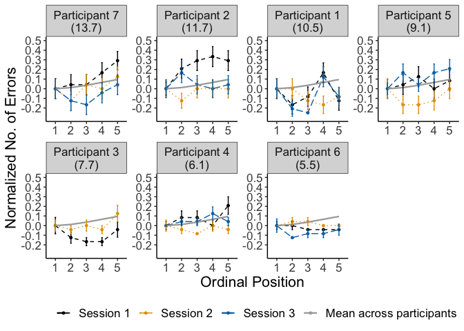<!-- -->

``` r
#plot_rt <- lemon::reposition_legend(plot_rt, "bott1.1.om right",panel='panel-5-5')


filename <- "CSI_online_aphasia_errors_effect_by_participant.pdf"
ggsave(plot_error_subject, filename = 
         here::here("results", "figures", filename),
       width = 18, height = 13, units = "cm", 
       dpi = 300, device = cairo_pdf)
```

    ## Warning: Removed 5 rows containing missing values (geom_point).

``` r
     #embedFonts(file = here::here("results", "figures", filename))
```

### Errors by category

Line graph for each category:

``` r
modeloutput <- coef(m1_error)$category
(means_final_category <- df %>% 
   summarySEwithin(.,"errors",withinvars = c("category","PosOr", "session"), na.rm=T))
```

    ## Automatically converting the following non-factors to factors: category

    ##         category PosOr session N    errors        sd        se        ci
    ## 1   Aufbewahrung     1       1 7 0.1428571 0.3784905 0.1430560 0.3500453
    ## 2   Aufbewahrung     1       2 7 0.4285714 0.5352664 0.2023117 0.4950389
    ## 3   Aufbewahrung     1       3 6 0.6666667 0.5171165 0.2111119 0.5426805
    ## 4   Aufbewahrung     2       1 7 0.2857143 0.4886292 0.1846845 0.4519066
    ## 5   Aufbewahrung     2       2 7 0.2857143 0.4886292 0.1846845 0.4519066
    ## 6   Aufbewahrung     2       3 6 0.6666667 0.5171165 0.2111119 0.5426805
    ## 7   Aufbewahrung     3       1 7 0.2857143 0.4886292 0.1846845 0.4519066
    ## 8   Aufbewahrung     3       2 7 0.2857143 0.4886292 0.1846845 0.4519066
    ## 9   Aufbewahrung     3       3 6 0.1666667 0.4088165 0.1668986 0.4290266
    ## 10  Aufbewahrung     4       1 7 0.2857143 0.4886292 0.1846845 0.4519066
    ## 11  Aufbewahrung     4       2 7 0.4285714 0.5352664 0.2023117 0.4950389
    ## 12  Aufbewahrung     4       3 6 0.1666667 0.4088165 0.1668986 0.4290266
    ## 13  Aufbewahrung     5       1 7 0.4285714 0.5352664 0.2023117 0.4950389
    ## 14  Aufbewahrung     5       2 7 0.2857143 0.4886292 0.1846845 0.4519066
    ## 15  Aufbewahrung     5       3 6 0.1666667 0.4088165 0.1668986 0.4290266
    ## 16     Bauernhof     1       1 7 0.0000000 0.0000000 0.0000000 0.0000000
    ## 17     Bauernhof     1       2 7 0.0000000 0.0000000 0.0000000 0.0000000
    ## 18     Bauernhof     1       3 6 0.0000000 0.0000000 0.0000000 0.0000000
    ## 19     Bauernhof     2       1 7 0.0000000 0.0000000 0.0000000 0.0000000
    ## 20     Bauernhof     2       2 7 0.0000000 0.0000000 0.0000000 0.0000000
    ## 21     Bauernhof     2       3 6 0.1666667 0.4088165 0.1668986 0.4290266
    ## 22     Bauernhof     3       1 7 0.0000000 0.0000000 0.0000000 0.0000000
    ## 23     Bauernhof     3       2 7 0.1428571 0.3784905 0.1430560 0.3500453
    ## 24     Bauernhof     3       3 6 0.0000000 0.0000000 0.0000000 0.0000000
    ## 25     Bauernhof     4       1 7 0.2857143 0.4886292 0.1846845 0.4519066
    ## 26     Bauernhof     4       2 7 0.2857143 0.4886292 0.1846845 0.4519066
    ## 27     Bauernhof     4       3 6 0.1666667 0.4088165 0.1668986 0.4290266
    ## 28     Bauernhof     5       1 7 0.1428571 0.3784905 0.1430560 0.3500453
    ## 29     Bauernhof     5       2 7 0.2857143 0.4886292 0.1846845 0.4519066
    ## 30     Bauernhof     5       3 6 0.0000000 0.0000000 0.0000000 0.0000000
    ## 31        Blumen     1       1 7 0.5714286 0.5352664 0.2023117 0.4950389
    ## 32        Blumen     1       2 7 0.4285714 0.5352664 0.2023117 0.4950389
    ## 33        Blumen     1       3 6 0.3333333 0.5171165 0.2111119 0.5426805
    ## 34        Blumen     2       1 7 0.2857143 0.4886292 0.1846845 0.4519066
    ## 35        Blumen     2       2 7 0.2857143 0.4886292 0.1846845 0.4519066
    ## 36        Blumen     2       3 6 0.1666667 0.4088165 0.1668986 0.4290266
    ## 37        Blumen     3       1 7 0.5714286 0.5352664 0.2023117 0.4950389
    ## 38        Blumen     3       2 7 0.4285714 0.5352664 0.2023117 0.4950389
    ## 39        Blumen     3       3 6 0.3333333 0.5171165 0.2111119 0.5426805
    ## 40        Blumen     4       1 7 0.2857143 0.4886292 0.1846845 0.4519066
    ## 41        Blumen     4       2 7 0.2857143 0.4886292 0.1846845 0.4519066
    ## 42        Blumen     4       3 6 0.6666667 0.5171165 0.2111119 0.5426805
    ## 43        Blumen     5       1 7 0.4285714 0.5352664 0.2023117 0.4950389
    ## 44        Blumen     5       2 7 0.2857143 0.4886292 0.1846845 0.4519066
    ## 45        Blumen     5       3 6 0.8333333 0.4088165 0.1668986 0.4290266
    ## 46          Büro     1       1 7 0.2857143 0.4886292 0.1846845 0.4519066
    ## 47          Büro     1       2 7 0.2857143 0.4886292 0.1846845 0.4519066
    ## 48          Büro     1       3 6 0.0000000 0.0000000 0.0000000 0.0000000
    ## 49          Büro     2       1 7 0.0000000 0.0000000 0.0000000 0.0000000
    ## 50          Büro     2       2 7 0.1428571 0.3784905 0.1430560 0.3500453
    ## 51          Büro     2       3 6 0.1666667 0.4088165 0.1668986 0.4290266
    ## 52          Büro     3       1 7 0.2857143 0.4886292 0.1846845 0.4519066
    ## 53          Büro     3       2 7 0.1428571 0.3784905 0.1430560 0.3500453
    ## 54          Büro     3       3 6 0.1666667 0.4088165 0.1668986 0.4290266
    ## 55          Büro     4       1 7 0.4285714 0.5352664 0.2023117 0.4950389
    ## 56          Büro     4       2 7 0.1428571 0.3784905 0.1430560 0.3500453
    ## 57          Büro     4       3 6 0.3333333 0.5171165 0.2111119 0.5426805
    ## 58          Büro     5       1 7 0.1428571 0.3784905 0.1430560 0.3500453
    ## 59          Büro     5       2 7 0.5714286 0.5352664 0.2023117 0.4950389
    ## 60          Büro     5       3 6 0.1666667 0.4088165 0.1668986 0.4290266
    ## 61        Fische     1       1 7 0.1428571 0.3784905 0.1430560 0.3500453
    ## 62        Fische     1       2 7 0.2857143 0.4886292 0.1846845 0.4519066
    ## 63        Fische     1       3 6 0.0000000 0.0000000 0.0000000 0.0000000
    ## 64        Fische     2       1 7 0.2857143 0.4886292 0.1846845 0.4519066
    ## 65        Fische     2       2 7 0.1428571 0.3784905 0.1430560 0.3500453
    ## 66        Fische     2       3 6 0.0000000 0.0000000 0.0000000 0.0000000
    ## 67        Fische     3       1 7 0.2857143 0.4886292 0.1846845 0.4519066
    ## 68        Fische     3       2 7 0.2857143 0.4886292 0.1846845 0.4519066
    ## 69        Fische     3       3 6 0.1666667 0.4088165 0.1668986 0.4290266
    ## 70        Fische     4       1 7 0.2857143 0.4886292 0.1846845 0.4519066
    ## 71        Fische     4       2 7 0.0000000 0.0000000 0.0000000 0.0000000
    ## 72        Fische     4       3 6 0.1666667 0.4088165 0.1668986 0.4290266
    ## 73        Fische     5       1 7 0.1428571 0.3784905 0.1430560 0.3500453
    ## 74        Fische     5       2 7 0.1428571 0.3784905 0.1430560 0.3500453
    ## 75        Fische     5       3 6 0.3333333 0.5171165 0.2111119 0.5426805
    ## 76       Gebäude     1       1 7 0.4285714 0.5352664 0.2023117 0.4950389
    ## 77       Gebäude     1       2 7 0.2857143 0.4886292 0.1846845 0.4519066
    ## 78       Gebäude     1       3 6 0.1666667 0.4088165 0.1668986 0.4290266
    ## 79       Gebäude     2       1 7 0.1428571 0.3784905 0.1430560 0.3500453
    ## 80       Gebäude     2       2 7 0.0000000 0.0000000 0.0000000 0.0000000
    ## 81       Gebäude     2       3 6 0.3333333 0.5171165 0.2111119 0.5426805
    ## 82       Gebäude     3       1 7 0.2857143 0.4886292 0.1846845 0.4519066
    ## 83       Gebäude     3       2 7 0.0000000 0.0000000 0.0000000 0.0000000
    ## 84       Gebäude     3       3 6 0.0000000 0.0000000 0.0000000 0.0000000
    ## 85       Gebäude     4       1 7 0.2857143 0.4886292 0.1846845 0.4519066
    ## 86       Gebäude     4       2 7 0.4285714 0.5352664 0.2023117 0.4950389
    ## 87       Gebäude     4       3 6 0.3333333 0.5171165 0.2111119 0.5426805
    ## 88       Gebäude     5       1 7 0.4285714 0.5352664 0.2023117 0.4950389
    ## 89       Gebäude     5       2 7 0.4285714 0.5352664 0.2023117 0.4950389
    ## 90       Gebäude     5       3 6 0.3333333 0.5171165 0.2111119 0.5426805
    ## 91        Gemüse     1       1 7 0.1428571 0.3784905 0.1430560 0.3500453
    ## 92        Gemüse     1       2 7 0.0000000 0.0000000 0.0000000 0.0000000
    ## 93        Gemüse     1       3 6 0.3333333 0.5171165 0.2111119 0.5426805
    ## 94        Gemüse     2       1 7 0.2857143 0.4886292 0.1846845 0.4519066
    ## 95        Gemüse     2       2 7 0.1428571 0.3784905 0.1430560 0.3500453
    ## 96        Gemüse     2       3 6 0.1666667 0.4088165 0.1668986 0.4290266
    ## 97        Gemüse     3       1 7 0.0000000 0.0000000 0.0000000 0.0000000
    ## 98        Gemüse     3       2 7 0.0000000 0.0000000 0.0000000 0.0000000
    ## 99        Gemüse     3       3 6 0.1666667 0.4088165 0.1668986 0.4290266
    ## 100       Gemüse     4       1 7 0.2857143 0.4886292 0.1846845 0.4519066
    ## 101       Gemüse     4       2 7 0.0000000 0.0000000 0.0000000 0.0000000
    ## 102       Gemüse     4       3 6 0.0000000 0.0000000 0.0000000 0.0000000
    ## 103       Gemüse     5       1 7 0.2857143 0.4886292 0.1846845 0.4519066
    ## 104       Gemüse     5       2 7 0.1428571 0.3784905 0.1430560 0.3500453
    ## 105       Gemüse     5       3 6 0.0000000 0.0000000 0.0000000 0.0000000
    ## 106   Heimwerker     1       1 7 0.2857143 0.4886292 0.1846845 0.4519066
    ## 107   Heimwerker     1       2 7 0.2857143 0.4886292 0.1846845 0.4519066
    ## 108   Heimwerker     1       3 6 0.3333333 0.5171165 0.2111119 0.5426805
    ## 109   Heimwerker     2       1 7 0.4285714 0.5352664 0.2023117 0.4950389
    ## 110   Heimwerker     2       2 7 0.1428571 0.3784905 0.1430560 0.3500453
    ## 111   Heimwerker     2       3 6 0.1666667 0.4088165 0.1668986 0.4290266
    ## 112   Heimwerker     3       1 7 0.4285714 0.5352664 0.2023117 0.4950389
    ## 113   Heimwerker     3       2 7 0.1428571 0.3784905 0.1430560 0.3500453
    ## 114   Heimwerker     3       3 6 0.1666667 0.4088165 0.1668986 0.4290266
    ## 115   Heimwerker     4       1 7 0.0000000 0.0000000 0.0000000 0.0000000
    ## 116   Heimwerker     4       2 7 0.2857143 0.4886292 0.1846845 0.4519066
    ## 117   Heimwerker     4       3 6 0.3333333 0.5171165 0.2111119 0.5426805
    ## 118   Heimwerker     5       1 7 0.1428571 0.3784905 0.1430560 0.3500453
    ## 119   Heimwerker     5       2 7 0.1428571 0.3784905 0.1430560 0.3500453
    ## 120   Heimwerker     5       3 6 0.3333333 0.5171165 0.2111119 0.5426805
    ## 121     Huftiere     1       1 7 0.1428571 0.3784905 0.1430560 0.3500453
    ## 122     Huftiere     1       2 7 0.0000000 0.0000000 0.0000000 0.0000000
    ## 123     Huftiere     1       3 6 0.0000000 0.0000000 0.0000000 0.0000000
    ## 124     Huftiere     2       1 7 0.0000000 0.0000000 0.0000000 0.0000000
    ## 125     Huftiere     2       2 7 0.0000000 0.0000000 0.0000000 0.0000000
    ## 126     Huftiere     2       3 6 0.1666667 0.4088165 0.1668986 0.4290266
    ## 127     Huftiere     3       1 7 0.1428571 0.3784905 0.1430560 0.3500453
    ## 128     Huftiere     3       2 7 0.1428571 0.3784905 0.1430560 0.3500453
    ## 129     Huftiere     3       3 6 0.1666667 0.4088165 0.1668986 0.4290266
    ## 130     Huftiere     4       1 7 0.1428571 0.3784905 0.1430560 0.3500453
    ## 131     Huftiere     4       2 7 0.1428571 0.3784905 0.1430560 0.3500453
    ## 132     Huftiere     4       3 6 0.1666667 0.4088165 0.1668986 0.4290266
    ## 133     Huftiere     5       1 7 0.4285714 0.5352664 0.2023117 0.4950389
    ## 134     Huftiere     5       2 7 0.1428571 0.3784905 0.1430560 0.3500453
    ## 135     Huftiere     5       3 6 0.1666667 0.4088165 0.1668986 0.4290266
    ## 136     Insekten     1       1 7 0.1428571 0.3784905 0.1430560 0.3500453
    ## 137     Insekten     1       2 7 0.5714286 0.5352664 0.2023117 0.4950389
    ## 138     Insekten     1       3 6 0.3333333 0.5171165 0.2111119 0.5426805
    ## 139     Insekten     2       1 7 0.4285714 0.5352664 0.2023117 0.4950389
    ## 140     Insekten     2       2 7 0.2857143 0.4886292 0.1846845 0.4519066
    ## 141     Insekten     2       3 6 0.3333333 0.5171165 0.2111119 0.5426805
    ## 142     Insekten     3       1 7 0.4285714 0.5352664 0.2023117 0.4950389
    ## 143     Insekten     3       2 7 0.0000000 0.0000000 0.0000000 0.0000000
    ## 144     Insekten     3       3 6 0.0000000 0.0000000 0.0000000 0.0000000
    ## 145     Insekten     4       1 7 0.4285714 0.5352664 0.2023117 0.4950389
    ## 146     Insekten     4       2 7 0.1428571 0.3784905 0.1430560 0.3500453
    ## 147     Insekten     4       3 6 0.1666667 0.4088165 0.1668986 0.4290266
    ## 148     Insekten     5       1 7 0.1428571 0.3784905 0.1430560 0.3500453
    ## 149     Insekten     5       2 7 0.2857143 0.4886292 0.1846845 0.4519066
    ## 150     Insekten     5       3 6 0.3333333 0.5171165 0.2111119 0.5426805
    ## 151  Instrumente     1       1 7 0.0000000 0.0000000 0.0000000 0.0000000
    ## 152  Instrumente     1       2 7 0.2857143 0.4886292 0.1846845 0.4519066
    ## 153  Instrumente     1       3 6 0.1666667 0.4088165 0.1668986 0.4290266
    ## 154  Instrumente     2       1 7 0.0000000 0.0000000 0.0000000 0.0000000
    ## 155  Instrumente     2       2 7 0.0000000 0.0000000 0.0000000 0.0000000
    ## 156  Instrumente     2       3 6 0.0000000 0.0000000 0.0000000 0.0000000
    ## 157  Instrumente     3       1 7 0.2857143 0.4886292 0.1846845 0.4519066
    ## 158  Instrumente     3       2 7 0.1428571 0.3784905 0.1430560 0.3500453
    ## 159  Instrumente     3       3 6 0.1666667 0.4088165 0.1668986 0.4290266
    ## 160  Instrumente     4       1 7 0.7142857 0.4886292 0.1846845 0.4519066
    ## 161  Instrumente     4       2 7 0.2857143 0.4886292 0.1846845 0.4519066
    ## 162  Instrumente     4       3 6 0.3333333 0.5171165 0.2111119 0.5426805
    ## 163  Instrumente     5       1 7 0.2857143 0.4886292 0.1846845 0.4519066
    ## 164  Instrumente     5       2 7 0.0000000 0.0000000 0.0000000 0.0000000
    ## 165  Instrumente     5       3 6 0.3333333 0.5171165 0.2111119 0.5426805
    ## 166       Jacken     1       1 7 0.2857143 0.4886292 0.1846845 0.4519066
    ## 167       Jacken     1       2 7 0.1428571 0.3784905 0.1430560 0.3500453
    ## 168       Jacken     1       3 6 0.3333333 0.5171165 0.2111119 0.5426805
    ## 169       Jacken     2       1 7 0.7142857 0.4886292 0.1846845 0.4519066
    ## 170       Jacken     2       2 7 0.2857143 0.4886292 0.1846845 0.4519066
    ## 171       Jacken     2       3 6 0.3333333 0.5171165 0.2111119 0.5426805
    ## 172       Jacken     3       1 7 0.5714286 0.5352664 0.2023117 0.4950389
    ## 173       Jacken     3       2 7 0.1428571 0.3784905 0.1430560 0.3500453
    ## 174       Jacken     3       3 6 0.5000000 0.5484849 0.2239180 0.5755996
    ## 175       Jacken     4       1 7 0.1428571 0.3784905 0.1430560 0.3500453
    ## 176       Jacken     4       2 7 0.5714286 0.5352664 0.2023117 0.4950389
    ## 177       Jacken     4       3 6 0.5000000 0.5484849 0.2239180 0.5755996
    ## 178       Jacken     5       1 7 0.5714286 0.5352664 0.2023117 0.4950389
    ## 179       Jacken     5       2 7 0.5714286 0.5352664 0.2023117 0.4950389
    ## 180       Jacken     5       3 6 0.3333333 0.5171165 0.2111119 0.5426805
    ## 181       Kochen     1       1 7 0.2857143 0.4886292 0.1846845 0.4519066
    ## 182       Kochen     1       2 7 0.1428571 0.3784905 0.1430560 0.3500453
    ## 183       Kochen     1       3 6 0.1666667 0.4088165 0.1668986 0.4290266
    ## 184       Kochen     2       1 7 0.2857143 0.4886292 0.1846845 0.4519066
    ## 185       Kochen     2       2 7 0.1428571 0.3784905 0.1430560 0.3500453
    ## 186       Kochen     2       3 6 0.6666667 0.5171165 0.2111119 0.5426805
    ## 187       Kochen     3       1 7 0.2857143 0.4886292 0.1846845 0.4519066
    ## 188       Kochen     3       2 7 0.1428571 0.3784905 0.1430560 0.3500453
    ## 189       Kochen     3       3 6 0.1666667 0.4088165 0.1668986 0.4290266
    ## 190       Kochen     4       1 7 0.4285714 0.5352664 0.2023117 0.4950389
    ## 191       Kochen     4       2 7 0.1428571 0.3784905 0.1430560 0.3500453
    ## 192       Kochen     4       3 6 0.3333333 0.5171165 0.2111119 0.5426805
    ## 193       Kochen     5       1 7 0.2857143 0.4886292 0.1846845 0.4519066
    ## 194       Kochen     5       2 7 0.1428571 0.3784905 0.1430560 0.3500453
    ## 195       Kochen     5       3 6 0.0000000 0.0000000 0.0000000 0.0000000
    ## 196  Körperteile     1       1 7 0.1428571 0.3784905 0.1430560 0.3500453
    ## 197  Körperteile     1       2 7 0.0000000 0.0000000 0.0000000 0.0000000
    ## 198  Körperteile     1       3 6 0.1666667 0.4088165 0.1668986 0.4290266
    ## 199  Körperteile     2       1 7 0.0000000 0.0000000 0.0000000 0.0000000
    ## 200  Körperteile     2       2 7 0.1428571 0.3784905 0.1430560 0.3500453
    ## 201  Körperteile     2       3 6 0.0000000 0.0000000 0.0000000 0.0000000
    ## 202  Körperteile     3       1 7 0.2857143 0.4886292 0.1846845 0.4519066
    ## 203  Körperteile     3       2 7 0.1428571 0.3784905 0.1430560 0.3500453
    ## 204  Körperteile     3       3 6 0.1666667 0.4088165 0.1668986 0.4290266
    ## 205  Körperteile     4       1 7 0.2857143 0.4886292 0.1846845 0.4519066
    ## 206  Körperteile     4       2 7 0.2857143 0.4886292 0.1846845 0.4519066
    ## 207  Körperteile     4       3 6 0.3333333 0.5171165 0.2111119 0.5426805
    ## 208  Körperteile     5       1 7 0.5714286 0.5352664 0.2023117 0.4950389
    ## 209  Körperteile     5       2 7 0.1428571 0.3784905 0.1430560 0.3500453
    ## 210  Körperteile     5       3 6 0.0000000 0.0000000 0.0000000 0.0000000
    ## 211        Küche     1       1 7 0.4285714 0.5352664 0.2023117 0.4950389
    ## 212        Küche     1       2 7 0.4285714 0.5352664 0.2023117 0.4950389
    ## 213        Küche     1       3 6 0.1666667 0.4088165 0.1668986 0.4290266
    ## 214        Küche     2       1 7 0.2857143 0.4886292 0.1846845 0.4519066
    ## 215        Küche     2       2 7 0.1428571 0.3784905 0.1430560 0.3500453
    ## 216        Küche     2       3 6 0.3333333 0.5171165 0.2111119 0.5426805
    ## 217        Küche     3       1 7 0.5714286 0.5352664 0.2023117 0.4950389
    ## 218        Küche     3       2 7 0.7142857 0.4886292 0.1846845 0.4519066
    ## 219        Küche     3       3 6 0.3333333 0.5171165 0.2111119 0.5426805
    ## 220        Küche     4       1 7 0.1428571 0.3784905 0.1430560 0.3500453
    ## 221        Küche     4       2 7 0.2857143 0.4886292 0.1846845 0.4519066
    ## 222        Küche     4       3 6 0.6666667 0.5171165 0.2111119 0.5426805
    ## 223        Küche     5       1 7 0.1428571 0.3784905 0.1430560 0.3500453
    ## 224        Küche     5       2 7 0.2857143 0.4886292 0.1846845 0.4519066
    ## 225        Küche     5       3 6 0.5000000 0.5484849 0.2239180 0.5755996
    ## 226         Obst     1       1 7 0.1428571 0.3784905 0.1430560 0.3500453
    ## 227         Obst     1       2 7 0.0000000 0.0000000 0.0000000 0.0000000
    ## 228         Obst     1       3 6 0.3333333 0.5171165 0.2111119 0.5426805
    ## 229         Obst     2       1 7 0.0000000 0.0000000 0.0000000 0.0000000
    ## 230         Obst     2       2 7 0.1428571 0.3784905 0.1430560 0.3500453
    ## 231         Obst     2       3 6 0.0000000 0.0000000 0.0000000 0.0000000
    ## 232         Obst     3       1 7 0.0000000 0.0000000 0.0000000 0.0000000
    ## 233         Obst     3       2 7 0.0000000 0.0000000 0.0000000 0.0000000
    ## 234         Obst     3       3 6 0.3333333 0.5171165 0.2111119 0.5426805
    ## 235         Obst     4       1 7 0.2857143 0.4886292 0.1846845 0.4519066
    ## 236         Obst     4       2 7 0.1428571 0.3784905 0.1430560 0.3500453
    ## 237         Obst     4       3 6 0.0000000 0.0000000 0.0000000 0.0000000
    ## 238         Obst     5       1 7 0.1428571 0.3784905 0.1430560 0.3500453
    ## 239         Obst     5       2 7 0.1428571 0.3784905 0.1430560 0.3500453
    ## 240         Obst     5       3 6 0.3333333 0.5171165 0.2111119 0.5426805
    ## 241    Raubtiere     1       1 7 0.4285714 0.5352664 0.2023117 0.4950389
    ## 242    Raubtiere     1       2 7 0.4285714 0.5352664 0.2023117 0.4950389
    ## 243    Raubtiere     1       3 6 0.3333333 0.5171165 0.2111119 0.5426805
    ## 244    Raubtiere     2       1 7 0.1428571 0.3784905 0.1430560 0.3500453
    ## 245    Raubtiere     2       2 7 0.5714286 0.5352664 0.2023117 0.4950389
    ## 246    Raubtiere     2       3 6 0.3333333 0.5171165 0.2111119 0.5426805
    ## 247    Raubtiere     3       1 7 0.1428571 0.3784905 0.1430560 0.3500453
    ## 248    Raubtiere     3       2 7 0.5714286 0.5352664 0.2023117 0.4950389
    ## 249    Raubtiere     3       3 6 0.1666667 0.4088165 0.1668986 0.4290266
    ## 250    Raubtiere     4       1 7 0.4285714 0.5352664 0.2023117 0.4950389
    ## 251    Raubtiere     4       2 7 0.0000000 0.0000000 0.0000000 0.0000000
    ## 252    Raubtiere     4       3 6 0.3333333 0.5171165 0.2111119 0.5426805
    ## 253    Raubtiere     5       1 7 0.2857143 0.4886292 0.1846845 0.4519066
    ## 254    Raubtiere     5       2 7 0.2857143 0.4886292 0.1846845 0.4519066
    ## 255    Raubtiere     5       3 6 0.3333333 0.5171165 0.2111119 0.5426805
    ## 256      Schmuck     1       1 7 0.4285714 0.5352664 0.2023117 0.4950389
    ## 257      Schmuck     1       2 7 0.4285714 0.5352664 0.2023117 0.4950389
    ## 258      Schmuck     1       3 6 0.5000000 0.5484849 0.2239180 0.5755996
    ## 259      Schmuck     2       1 7 0.8571429 0.3784905 0.1430560 0.3500453
    ## 260      Schmuck     2       2 7 0.2857143 0.4886292 0.1846845 0.4519066
    ## 261      Schmuck     2       3 6 0.1666667 0.4088165 0.1668986 0.4290266
    ## 262      Schmuck     3       1 7 0.2857143 0.4886292 0.1846845 0.4519066
    ## 263      Schmuck     3       2 7 0.4285714 0.5352664 0.2023117 0.4950389
    ## 264      Schmuck     3       3 6 0.0000000 0.0000000 0.0000000 0.0000000
    ## 265      Schmuck     4       1 7 0.1428571 0.3784905 0.1430560 0.3500453
    ## 266      Schmuck     4       2 7 0.1428571 0.3784905 0.1430560 0.3500453
    ## 267      Schmuck     4       3 6 0.3333333 0.5171165 0.2111119 0.5426805
    ## 268      Schmuck     5       1 7 0.5714286 0.5352664 0.2023117 0.4950389
    ## 269      Schmuck     5       2 7 0.5714286 0.5352664 0.2023117 0.4950389
    ## 270      Schmuck     5       3 6 0.6666667 0.5171165 0.2111119 0.5426805
    ## 271       Sitzen     1       1 7 0.2857143 0.4886292 0.1846845 0.4519066
    ## 272       Sitzen     1       2 7 0.4285714 0.5352664 0.2023117 0.4950389
    ## 273       Sitzen     1       3 6 0.3333333 0.5171165 0.2111119 0.5426805
    ## 274       Sitzen     2       1 7 0.2857143 0.4886292 0.1846845 0.4519066
    ## 275       Sitzen     2       2 7 0.1428571 0.3784905 0.1430560 0.3500453
    ## 276       Sitzen     2       3 6 0.3333333 0.5171165 0.2111119 0.5426805
    ## 277       Sitzen     3       1 7 0.1428571 0.3784905 0.1430560 0.3500453
    ## 278       Sitzen     3       2 7 0.1428571 0.3784905 0.1430560 0.3500453
    ## 279       Sitzen     3       3 6 0.0000000 0.0000000 0.0000000 0.0000000
    ## 280       Sitzen     4       1 7 0.4285714 0.5352664 0.2023117 0.4950389
    ## 281       Sitzen     4       2 7 0.2857143 0.4886292 0.1846845 0.4519066
    ## 282       Sitzen     4       3 6 0.3333333 0.5171165 0.2111119 0.5426805
    ## 283       Sitzen     5       1 7 0.5714286 0.5352664 0.2023117 0.4950389
    ## 284       Sitzen     5       2 7 0.4285714 0.5352664 0.2023117 0.4950389
    ## 285       Sitzen     5       3 6 0.5000000 0.5484849 0.2239180 0.5755996
    ## 286      Strasse     1       1 7 0.2857143 0.4886292 0.1846845 0.4519066
    ## 287      Strasse     1       2 7 0.1428571 0.3784905 0.1430560 0.3500453
    ## 288      Strasse     1       3 6 0.1666667 0.4088165 0.1668986 0.4290266
    ## 289      Strasse     2       1 7 0.1428571 0.3784905 0.1430560 0.3500453
    ## 290      Strasse     2       2 7 0.2857143 0.4886292 0.1846845 0.4519066
    ## 291      Strasse     2       3 6 0.0000000 0.0000000 0.0000000 0.0000000
    ## 292      Strasse     3       1 7 0.1428571 0.3784905 0.1430560 0.3500453
    ## 293      Strasse     3       2 7 0.1428571 0.3784905 0.1430560 0.3500453
    ## 294      Strasse     3       3 6 0.3333333 0.5171165 0.2111119 0.5426805
    ## 295      Strasse     4       1 7 0.2857143 0.4886292 0.1846845 0.4519066
    ## 296      Strasse     4       2 7 0.0000000 0.0000000 0.0000000 0.0000000
    ## 297      Strasse     4       3 6 0.0000000 0.0000000 0.0000000 0.0000000
    ## 298      Strasse     5       1 7 0.1428571 0.3784905 0.1430560 0.3500453
    ## 299      Strasse     5       2 7 0.0000000 0.0000000 0.0000000 0.0000000
    ## 300      Strasse     5       3 6 0.0000000 0.0000000 0.0000000 0.0000000
    ## 301 Süssigkeiten     1       1 7 0.1428571 0.3784905 0.1430560 0.3500453
    ## 302 Süssigkeiten     1       2 7 0.1428571 0.3784905 0.1430560 0.3500453
    ## 303 Süssigkeiten     1       3 6 0.0000000 0.0000000 0.0000000 0.0000000
    ## 304 Süssigkeiten     2       1 7 0.2857143 0.4886292 0.1846845 0.4519066
    ## 305 Süssigkeiten     2       2 7 0.1428571 0.3784905 0.1430560 0.3500453
    ## 306 Süssigkeiten     2       3 6 0.1666667 0.4088165 0.1668986 0.4290266
    ## 307 Süssigkeiten     3       1 7 0.2857143 0.4886292 0.1846845 0.4519066
    ## 308 Süssigkeiten     3       2 7 0.1428571 0.3784905 0.1430560 0.3500453
    ## 309 Süssigkeiten     3       3 6 0.1666667 0.4088165 0.1668986 0.4290266
    ## 310 Süssigkeiten     4       1 7 0.1428571 0.3784905 0.1430560 0.3500453
    ## 311 Süssigkeiten     4       2 7 0.1428571 0.3784905 0.1430560 0.3500453
    ## 312 Süssigkeiten     4       3 6 0.1666667 0.4088165 0.1668986 0.4290266
    ## 313 Süssigkeiten     5       1 7 0.5714286 0.5352664 0.2023117 0.4950389
    ## 314 Süssigkeiten     5       2 7 0.2857143 0.4886292 0.1846845 0.4519066
    ## 315 Süssigkeiten     5       3 6 0.0000000 0.0000000 0.0000000 0.0000000
    ## 316 Trinkgefässe     1       1 7 0.1428571 0.3784905 0.1430560 0.3500453
    ## 317 Trinkgefässe     1       2 7 0.4285714 0.5352664 0.2023117 0.4950389
    ## 318 Trinkgefässe     1       3 6 0.1666667 0.4088165 0.1668986 0.4290266
    ## 319 Trinkgefässe     2       1 7 0.4285714 0.5352664 0.2023117 0.4950389
    ## 320 Trinkgefässe     2       2 7 0.2857143 0.4886292 0.1846845 0.4519066
    ## 321 Trinkgefässe     2       3 6 0.3333333 0.5171165 0.2111119 0.5426805
    ## 322 Trinkgefässe     3       1 7 0.4285714 0.5352664 0.2023117 0.4950389
    ## 323 Trinkgefässe     3       2 7 0.4285714 0.5352664 0.2023117 0.4950389
    ## 324 Trinkgefässe     3       3 6 0.1666667 0.4088165 0.1668986 0.4290266
    ## 325 Trinkgefässe     4       1 7 0.2857143 0.4886292 0.1846845 0.4519066
    ## 326 Trinkgefässe     4       2 7 0.2857143 0.4886292 0.1846845 0.4519066
    ## 327 Trinkgefässe     4       3 6 0.3333333 0.5171165 0.2111119 0.5426805
    ## 328 Trinkgefässe     5       1 7 0.4285714 0.5352664 0.2023117 0.4950389
    ## 329 Trinkgefässe     5       2 7 0.2857143 0.4886292 0.1846845 0.4519066
    ## 330 Trinkgefässe     5       3 6 0.5000000 0.5484849 0.2239180 0.5755996
    ## 331        Vögel     1       1 7 0.0000000 0.0000000 0.0000000 0.0000000
    ## 332        Vögel     1       2 7 0.4285714 0.5352664 0.2023117 0.4950389
    ## 333        Vögel     1       3 6 0.1666667 0.4088165 0.1668986 0.4290266
    ## 334        Vögel     2       1 7 0.1428571 0.3784905 0.1430560 0.3500453
    ## 335        Vögel     2       2 7 0.1428571 0.3784905 0.1430560 0.3500453
    ## 336        Vögel     2       3 6 0.0000000 0.0000000 0.0000000 0.0000000
    ## 337        Vögel     3       1 7 0.0000000 0.0000000 0.0000000 0.0000000
    ## 338        Vögel     3       2 7 0.1428571 0.3784905 0.1430560 0.3500453
    ## 339        Vögel     3       3 6 0.1666667 0.4088165 0.1668986 0.4290266
    ## 340        Vögel     4       1 7 0.4285714 0.5352664 0.2023117 0.4950389
    ## 341        Vögel     4       2 7 0.2857143 0.4886292 0.1846845 0.4519066
    ## 342        Vögel     4       3 6 0.0000000 0.0000000 0.0000000 0.0000000
    ## 343        Vögel     5       1 7 0.2857143 0.4886292 0.1846845 0.4519066
    ## 344        Vögel     5       2 7 0.0000000 0.0000000 0.0000000 0.0000000
    ## 345        Vögel     5       3 6 0.1666667 0.4088165 0.1668986 0.4290266
    ## 346       Wasser     1       1 7 0.2857143 0.4886292 0.1846845 0.4519066
    ## 347       Wasser     1       2 7 0.1428571 0.3784905 0.1430560 0.3500453
    ## 348       Wasser     1       3 6 0.3333333 0.5171165 0.2111119 0.5426805
    ## 349       Wasser     2       1 7 0.1428571 0.3784905 0.1430560 0.3500453
    ## 350       Wasser     2       2 7 0.4285714 0.5352664 0.2023117 0.4950389
    ## 351       Wasser     2       3 6 0.1666667 0.4088165 0.1668986 0.4290266
    ## 352       Wasser     3       1 7 0.2857143 0.4886292 0.1846845 0.4519066
    ## 353       Wasser     3       2 7 0.2857143 0.4886292 0.1846845 0.4519066
    ## 354       Wasser     3       3 6 0.0000000 0.0000000 0.0000000 0.0000000
    ## 355       Wasser     4       1 7 0.2857143 0.4886292 0.1846845 0.4519066
    ## 356       Wasser     4       2 7 0.0000000 0.0000000 0.0000000 0.0000000
    ## 357       Wasser     4       3 6 0.5000000 0.5484849 0.2239180 0.5755996
    ## 358       Wasser     5       1 7 0.2857143 0.4886292 0.1846845 0.4519066
    ## 359       Wasser     5       2 7 0.7142857 0.4886292 0.1846845 0.4519066
    ## 360       Wasser     5       3 6 0.0000000 0.0000000 0.0000000 0.0000000

``` r
(means_final<- df %>%  
   Rmisc::summarySEwithin(.,"errors",idvar = "category",
                          withinvars = c("PosOr", "session"), na.rm = T))
```

    ##    PosOr session   N    errors        sd         se         ci
    ## 1      1       1 168 0.2321429 0.4256864 0.03284242 0.06483983
    ## 2      1       2 168 0.2559524 0.4373401 0.03374152 0.06661490
    ## 3      1       3 144 0.2291667 0.4260924 0.03550770 0.07018779
    ## 4      2       1 168 0.2440476 0.4231742 0.03264860 0.06445719
    ## 5      2       2 168 0.1904762 0.4015536 0.03098053 0.06116396
    ## 6      2       3 144 0.2152778 0.4154880 0.03462400 0.06844099
    ## 7      3       1 168 0.2678571 0.4418090 0.03408631 0.06729561
    ## 8      3       2 168 0.2142857 0.4108795 0.03170004 0.06258447
    ## 9      3       3 144 0.1666667 0.3940491 0.03283743 0.06490949
    ## 10     4       1 168 0.2976190 0.4884490 0.03768466 0.07439973
    ## 11     4       2 168 0.2083333 0.4180973 0.03225691 0.06368388
    ## 12     4       3 144 0.2777778 0.4450265 0.03708554 0.07330671
    ## 13     5       1 168 0.3273810 0.4828012 0.03724892 0.07353946
    ## 14     5       2 168 0.2738095 0.4500696 0.03472362 0.06855384
    ## 15     5       3 144 0.2638889 0.4320706 0.03600588 0.07117254

``` r
(means_grand<- df %>%  
   Rmisc::summarySEwithin(.,"errors",idvar = "category",
                          withinvars = c("PosOr", "session"),
                          na.rm = T))
```

    ##    PosOr session   N    errors        sd         se         ci
    ## 1      1       1 168 0.2321429 0.4256864 0.03284242 0.06483983
    ## 2      1       2 168 0.2559524 0.4373401 0.03374152 0.06661490
    ## 3      1       3 144 0.2291667 0.4260924 0.03550770 0.07018779
    ## 4      2       1 168 0.2440476 0.4231742 0.03264860 0.06445719
    ## 5      2       2 168 0.1904762 0.4015536 0.03098053 0.06116396
    ## 6      2       3 144 0.2152778 0.4154880 0.03462400 0.06844099
    ## 7      3       1 168 0.2678571 0.4418090 0.03408631 0.06729561
    ## 8      3       2 168 0.2142857 0.4108795 0.03170004 0.06258447
    ## 9      3       3 144 0.1666667 0.3940491 0.03283743 0.06490949
    ## 10     4       1 168 0.2976190 0.4884490 0.03768466 0.07439973
    ## 11     4       2 168 0.2083333 0.4180973 0.03225691 0.06368388
    ## 12     4       3 144 0.2777778 0.4450265 0.03708554 0.07330671
    ## 13     5       1 168 0.3273810 0.4828012 0.03724892 0.07353946
    ## 14     5       2 168 0.2738095 0.4500696 0.03472362 0.06855384
    ## 15     5       3 144 0.2638889 0.4320706 0.03600588 0.07117254

``` r
for(i in 1:nrow(means_final_category)) {
  means_final_category$grandmean[i] <- means_grand$errors[
    means_grand$PosOr == means_final_category$PosOr[i]] -
    means_grand$errors[means_grand$PosOr== 1]
  means_final_category$normalizederror[i] <- means_final_category$errors[i] -
    means_final_category$errors[
        means_final_category$category == means_final_category$category[i] & means_final_category$PosOr == 1 &
        means_final_category$session ==
        means_final_category$session[i]]
  # prepare for ordering
  means_final_category$effect[i] <-
    modeloutput$PosOr.cont[means_final_category$category[i]] 
}


means_final_category <- means_final_category[
  order(desc(means_final_category$effect)),] 
means_final_category$effect <- as.factor(
  round(means_final_category$effect*100, 2))
means_final_category$effect <- factor(
  means_final_category$effect, levels=rev(levels(means_final_category$effect )))


# order category levels by effect size
means_final_category$category <- factor(
  means_final_category$category, levels=c("Bauernhof","Huftiere","Körperteile", "Büro","Obst",
"Gebäude","Süssigkeiten","Instrumente","Jacken","Fische",
"Gemüse","Wasser","Sitzen","Blumen","Heimwerker","Vögel",
"Schmuck","Trinkgefässe", "Strasse","Kochen","Küche",
"Insekten","Raubtiere","Aufbewahrung"))

# give categories English names and combine with effect size
means_final_category <- means_final_category %>% 
  mutate(category_en = case_when(
    category == "Aufbewahrung" ~ paste0(
      "Storage\n\n(", effect, ")", sep=''), 
    category == "Bauernhof" ~ paste0(
      "Farming\ntools\n(", effect, ")", sep=''), 
    category == "Blumen" ~ paste0(
      "Flowers\n\n(", effect, ")", sep=''),
    category == "Büro" ~ paste0(
      "Office\ntools\n(", effect, ")", sep=''),
    category == "Fische" ~ paste0(
      "Fish\n\n(", effect, ")", sep=''),
    category == "Gebäude" ~ paste0(
      "Buildings\n\n(", effect, ")", sep=''),
    category == "Gemüse" ~ paste0(
      "Vegetables\n\n(", effect, ")", sep=''),
    category == "Heimwerker" ~ paste0(
      "Carpenter.s\ntools\n(", effect, ")", sep=''),
    category == "Huftiere" ~ paste0(
      "Hoofed\nanimals\n(", effect, ")", sep=''),
    category == "Insekten" ~ paste0(
      "Insects\n\n(", effect, ")", sep=''),
    category == "Instrumente" ~ paste0(
      "Instruments\n\n(", effect, ")", sep=''),
    category == "Jacken" ~ paste0(
      "Jackets\n\n(", effect, ")", sep=''),
    category == "Kochen" ~ paste0(
      "Cooking\nequipment\n(", effect, ")", sep=''),
    category == "Körperteile" ~ paste0(
      "Body parts\n\n(", effect, ")", sep=''),
    category == "Küche" ~ paste0(
      "Kitchen\nfurniture\n(", effect, ")", sep=''),
    category == "Obst" ~ paste0(
      "Fruits\n\n(", effect, ")", sep=''),
    category == "Raubtiere" ~ paste0(
      "Predators\n\n(", effect, ")", sep=''),
    category == "Schmuck" ~ paste0(
      "Jewelry\n\n(", effect, ")", sep=''),
    category == "Sitzen" ~ paste0(
      "Seating\nfurniture\n(", effect, ")", sep=''),
    category == "Strasse" ~ paste0(
      "Street\nvehicles\n(", effect, ")", sep=''),
    category == "Süssigkeiten" ~ paste0(
      "Sweets\n\n(", effect, ")", sep=''),
    category == "Trinkgefässe" ~ paste0(
      "Drinking\nvessels\n(", effect, ")", sep=''),
    category == "Vögel" ~ paste0(
      "Birds\n\n(", effect, ")", sep=''),
    category == "Wasser" ~ paste0(
      "Water\nvehicles\n(", effect, ")", sep=''))) %>%
    mutate(category_en=factor(category_en,levels=c(
    "Farming\ntools\n(21.79)","Hoofed\nanimals\n(19.27)","Body parts\n\n(16.25)",
    "Office\ntools\n(14.8)","Fruits\n\n(14.39)","Buildings\n\n(14.35)",
    "Sweets\n\n(13.91)","Instruments\n\n(12.64)","Jackets\n\n(11.62)",
    "Fish\n\n(10.6)","Vegetables\n\n(10.4)","Water\nvehicles\n(10.01)",
    "Seating\nfurniture\n(8.59)","Flowers\n\n(6.08)","Carpenter.s\ntools\n(5.67)",
    "Birds\n\n(5.61)","Jewelry\n\n(5.42)","Drinking\nvessels\n(5.4)",
    "Street\nvehicles\n(5.13)","Cooking\nequipment\n(5.11)",
    "Kitchen\nfurniture\n(4.61)","Insects\n\n(0)","Predators\n\n(-3.15)",
    "Storage\n\n(-4.33)")))

# Plotting
(plot_error_category <- means_final_category %>% 
    ggplot(., aes(x=PosOr,y=normalizederror,
                  group=session, color = session, na.rm=T)) +
    geom_point(size =1) +
    geom_line(aes(x=PosOr,y=normalizederror,
                  color=session, linetype=session),
              size = 0.5) +
    geom_line(aes(x=PosOr,y=grandmean, color="b", linetype="d"), 
              group = 1,size = 0.8)+
    geom_errorbar(aes(ymin=normalizederror-se, ymax=normalizederror+se, 
                       group=session, color=session), width =.1) +
    scale_color_manual(name="",
                       values=c("1"="#000000", "2"="#E69F00",
                                "3"="#0072B2", "b"="dark gray"),
                       labels=c("Session 1", "Session 2", 
                                "Session 3",  
                                "Mean across participants"))+
    scale_linetype_manual(name="",
                          values=c("1"="dashed", "2"="dotted", 
                                   "3" = "longdash","d"="solid"),
                          labels=c("Session 1", "Session 2", 
                                "Session 3", 
                                   "Mean across participants"))+
    apatheme+
    labs(x="Ordinal Position",y ="Normalized No. of Errors") +
    facet_wrap(means_final_category$category_en, scales='free', ncol=6)+
    scale_y_continuous(limits = c(-0.9, 1.0),
                       breaks = c(-0.8, -0.4, 0, 0.4, 0.8)) +
    scale_x_discrete(breaks=c(1,2,3,4,5))+
    theme(legend.position = "bottom"))
```

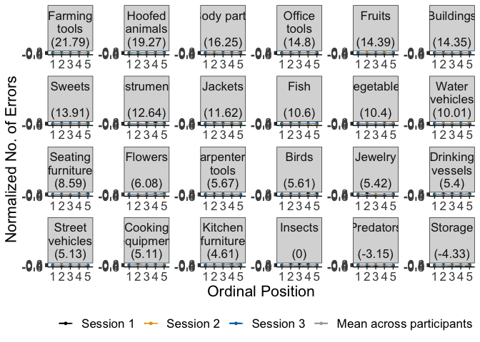<!-- -->

``` r
#plot_rt <- lemon::reposition_legend(plot_rt, "bott1.1.om right",panel='panel-5-5')

filename <- "CSI_online_aphasia_errors_by_category.pdf"
ggsave(plot_error_category, filename = 
         here::here("results", "figures", filename),
       width = 26, height = 23, units = "cm", 
       dpi = 300, device = cairo_pdf)
#embedFonts(file = here::here("data", "verbal_CSI", "Plots", filename))
```

Make plot grid
